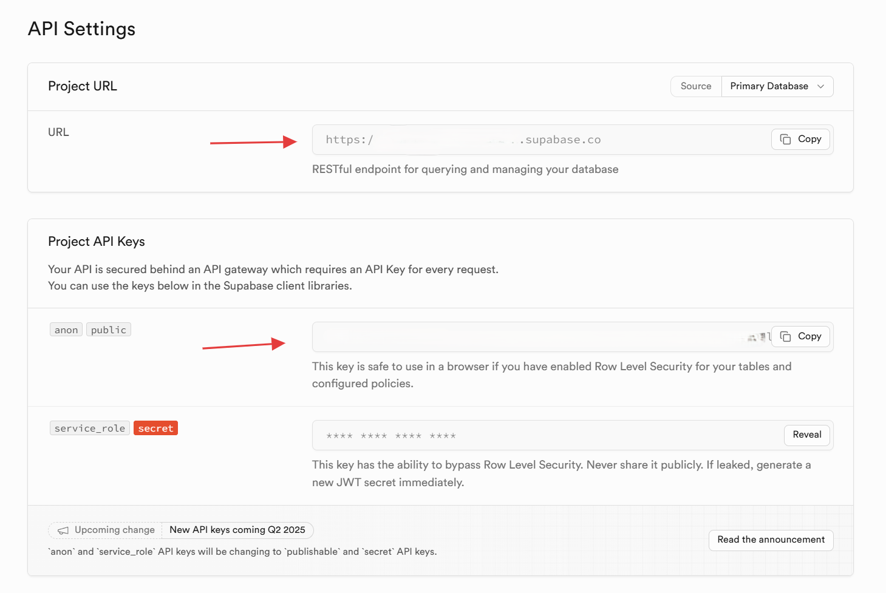

## 开发测试中

## 密钥获取

- 智普ai               （free）

[智谱AI开放平台](https://www.bigmodel.cn/usercenter/proj-mgmt/apikeys)

- supabase           (free)

https://supabase.com/dashboard/org         -> 创建一个 project , 将 `backend\test\db.sql`中的代码复制到 SQL Editor ,然后 run, 数据库就搭建好了。

然后在对应 project 的设置的 Data API 中可以获取 URL 和 API keys 。

- 贝锐花生壳   （内网穿透映射到公网）

  
  
  

