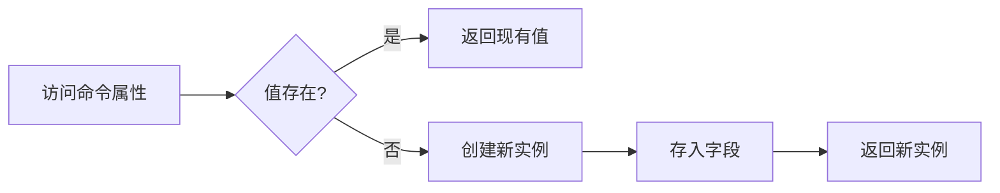
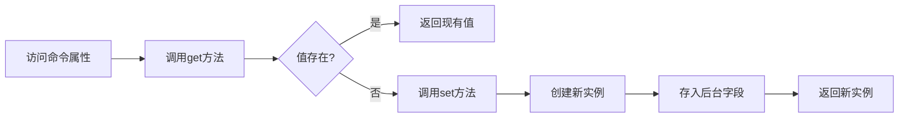
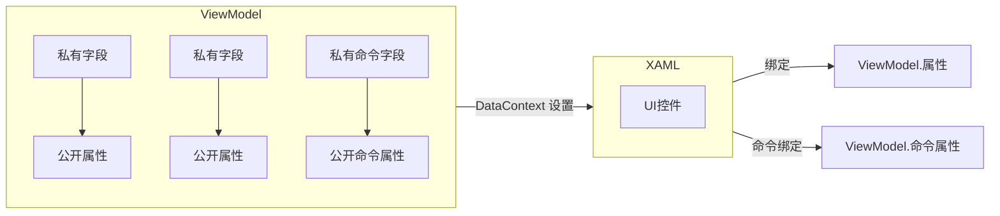
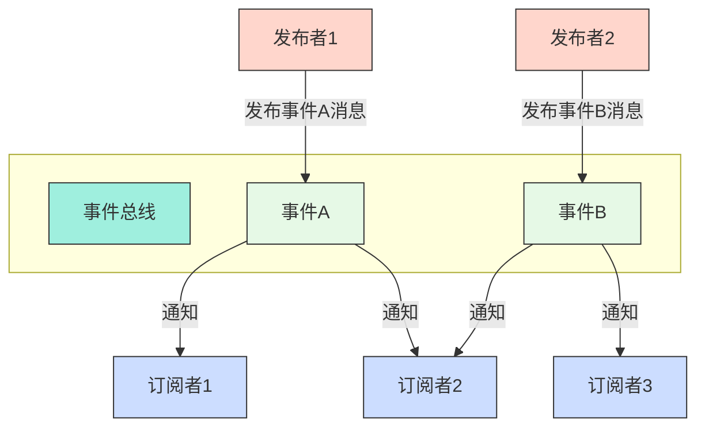

## 字段、属性


```c#
private DelegateCommand _temp;
public ICommand Temp => _temp ??= new DelegateCommand(func);
```


字段




```c#
public DelegateCommand _temp {get; set;}
public ICommand Temp => _temp??= new DelegateCommand(func);
// public ICommand Temp => _temp?? (_temp = new DelegateCommand(func));
```


属性





对两种方案执行100万次访问的性能对比：

|   场景   | 字段方案 | 属性方案 | 性能差异 |
| :------: | :------: | :------: | :------: |
| 首次访问 |  15 ms   |  38 ms   |  +153%   |
| 后续访问 |   8 ms   |  24 ms   |  +200%   |
| 内存分配 | 0 bytes  |  48 MB   | 显著增加 |





## 异步执行


```c#
// 同时执行多个异步任务
var tasks = new Task[] { task1, task2, task3 };

// 任务工厂，感觉像线程池
// 所有任务完成后执行回调
Task.Factory.ContinueWhenAll(tasks, t => 
{
    Application.Current.Dispatcher.Invoke(() => 
    {
        Refresh();
    });
});
```

> 意思是，多线程异步执行 tasks ，都执行结束后会执行  Refresh()， 没有 Dispatcher的话还是其他的线程
>
> 有 Dispatcher 的话会用主线程执行，这样就避免的非 UI 线程 修改绑定到 UI 控件的 `ObservableCollection` 的问题

> ```c#
> Invoke() 		同步阻塞调用，等待UI线程完成操作
> BeginInvoke() 	异步非阻塞调用，将操作加入UI消息队列
> ```


## 发布订阅模式

> 基于Prism.Events

定义事件类

```c#
using Prism.Events;
public class MessageSentEvent : PubSubEvent { }			  // 无参数
public class UserLoggedInEvent : PubSubEvent<string> { }  // 有参数
```


发布事件

```c#
public class PublisherViewModel
{
    private readonly IEventAggregator _eventAggregator;

    // 通过依赖注入获取事件聚合器
    public PublisherViewModel(IEventAggregator eventAggregator)
    {
        _eventAggregator = eventAggregator;
    }

    public void SendMessage()
    {
        _eventAggregator.GetEvent<MessageSentEvent>().Publish();
        _eventAggregator.GetEvent<UserLoggedInEvent>().Publish("Alice");
    }
}
```


订阅事件

```c#
public class SubscriberViewModel : IDisposable
{
    private SubscriptionToken _messageToken;
    private SubscriptionToken _userToken;

    public SubscriberViewModel(IEventAggregator eventAggregator)
    {
        var messageEvent = eventAggregator.GetEvent<MessageSentEvent>();
        _messageToken = messageEvent.Subscribe(OnMessageReceived);

        var userEvent = eventAggregator.GetEvent<UserLoggedInEvent>();
        _userToken = userEvent.Subscribe(
            userName => OnUserLoggedIn(userName),
            ThreadOption.UIThread, 					// 指定在 UI 线程执行
            keepSubscriberReferenceAlive: false,    // 避免内存泄漏
            filter: name => name.StartsWith("A")    // 只处理用户名以 A 开头的事件
        );
    }

    private void OnMessageReceived()
    {
        Console.WriteLine("Message received!");
    }

    private void OnUserLoggedIn(string userName)
    {
        Console.WriteLine($"User logged in: {userName}");
    }
	
    // Dispose 函数需要手动调用，确保资源被正确释放
    public void Dispose()
    {
        eventAggregator.GetEvent<MessageSentEvent>().Unsubscribe(_messageToken);
        eventAggregator.GetEvent<MessageSentEvent>().Unsubscribe(_userToken);
    }
}
```

> Prism 框架提供了事件总线，在这个框架下使用发布-订阅模式，实现松耦合，跨模块通信的目的





## Summary


### 知识点总结

#### （1）MVVM模式总结

> 部分组件前后端都进行更改的话，前后端的值可能要单独进行设置

例如 ： TreeView 的 IsSelected 的项，如果需要后端设置默认的值，但是前端初始化是没有选择的项的，需要手动设置


> 多个子模块的大型程序，子模块的初始化时机

prism 通信，某些模块未初始化，而且首次启动、初始化有明显时延，影响用户体验


> 静态类、单例模式、DI + 单例模式


> Parallel.For 并行化

```c#
using System;
using System.Threading;
using System.Threading.Tasks;

class Program
{
    static void Main()
    {
        const int N = 10000000;
        long total = 0;

        // 顺序执行版本
        var watch = System.Diagnostics.Stopwatch.StartNew();
        for (int i = 0; i < N; i++)
        {
            total += (long)i * i;
        }
        watch.Stop();
        Console.WriteLine($"顺序执行: 总和 = {total}, 耗时 = {watch.ElapsedMilliseconds}ms");

        total = 0; // 重置计数器

        // 并行执行版本（线程不安全示例 - 仅用于演示错误结果）
        watch.Restart();
        Parallel.For(0, N, i =>
        {
            // 警告：这是线程不安全的操作！
            // 多个线程同时修改total会导致数据竞争和错误结果
            total += (long)i * i;
        });
        watch.Stop();
        Console.WriteLine($"并行执行（不安全）: 总和 = {total}, 耗时 = {watch.ElapsedMilliseconds}ms");
        Console.WriteLine($"注意：不安全版本的结果 {total} 是错误的（应接近 {3333332833333330000})");

        total = 0; // 重置计数器

        // 解决方案1：使用Interlocked实现原子操作（适合简单操作）
        watch.Restart();
        Parallel.For(0, N, i =>
        {
            long square = (long)i * i;
            Interlocked.Add(ref total, square); // 原子加法操作
        });
        watch.Stop();
        Console.WriteLine($"\n方案1 (Interlocked): 总和 = {total}, 耗时 = {watch.ElapsedMilliseconds}ms");

        total = 0; // 重置计数器

        // 解决方案2：使用锁（适合复杂操作）
        object lockObj = new object();
        watch.Restart();
        Parallel.For(0, N, i =>
        {
            long square = (long)i * i;
            lock (lockObj) // 确保每次只有一个线程访问total
            {
                total += square;
            }
        });
        watch.Stop();
        Console.WriteLine($"方案2 (Lock): 总和 = {total}, 耗时 = {watch.ElapsedMilliseconds}ms");

        total = 0; // 重置计数器

        // 解决方案3：使用线程本地存储（最高效的方法）
        watch.Restart();
        Parallel.For<long>( // 指定线程本地状态类型为long
            0,              // 起始索引（包含）
            N,              // 结束索引（不包含）
            () => 0,        // 初始化每个线程的本地状态（初始值0）
            (i, loopState, localSum) => // 循环体委托
            {
                // 使用线程本地变量进行计算（无竞争）
                return localSum + (long)i * i; 
            },
            (finalLocalSum) => // 合并每个线程的最终结果
            {
                // 原子操作合并结果
                Interlocked.Add(ref total, finalLocalSum);
            }
        );
        watch.Stop();
        Console.WriteLine($"方案3 (线程本地存储): 总和 = {total}, 耗时 = {watch.ElapsedMilliseconds}ms");
    }
}
```

#### （2）

$\color{red} \text{问题：需要由执行函数去调用下一个执行，这样栈内存的占用就一直没释放}$ ，执行函数长回调，递归深度问题，栈溢出风险

> 初始版本循环查询IsCancellationRequested，长回调，递归深度可能很深，栈迟迟不释放，可能导致栈溢出风险

```c#
private async Task ProcessTaskQueueAsync(CancellationToken token)
{
    while (!token.IsCancellationRequested)
    {
        TaskInfoModel task;
        if (pendingTasks.Count == 0) return;
        task = pendingTasks.Dequeue();

        try
        {
            var taskError = await TaskExecuteService.TaskExecute(task, token);
            await ExecuteSingleTask(task, token);
        }
        catch (Exception ex)
        {
            _logger.LogError(ex, "Task failed");
        }
    }
}
```

> 初步优化，  `Task.Run`包装递归调用，转移栈的需求到线程池中

```c#
private async Task ProcessTaskQueueAsync(CancellationToken token)
{
    TaskInfoModel task;
    if (pendingTasks.Count == 0) return;
    task = pendingTasks.Dequeue();

    try
    {
		var taskError = await TaskExecuteService.TaskExecute()
        TaskInfoModel next = pendingTasks.FirstOrDefault();
        await Task.Run(() => ExecuteTaskInBackground(next, token));
    }
    catch (Exception ex)
    {
        _logger.LogError(ex, "Task failed");
    }
}
```

> 上述始终没有解决一个问题，需要由执行函数去调用下一个执行，这样栈内存的占用就一直没释放
>
> 最终

```c#
public class TaskProcessor : IDisposable
{
    private readonly Channel；
```


Channel 本质上是一个线程安全的队列，它改变了任务处理的方式：

传统递归 vs Channel 方案对比

| 特性     | 递归方案   | Channel 方案           |
| -------- | ---------- | ---------------------- |
| 调用结构 | 嵌套调用   | 循环迭代               |
| 栈行为   | 深度增长   | 恒定深度               |
| 内存占用 | O(n) 增长  | O(1) 恒定              |
| 任务处理 | 链式执行   | 队列消费               |
| 资源释放 | 任务完成后 | 每个任务完成后立即释放 |


```c#
await foreach (var task in _taskQueue.Reader.ReadAllAsync(globalToken))
{
    await ProcessSingleTask(task);
}
```

1. 异步状态机工作原理：

    • 编译器将 `async/await` 转换为状态机

    • 每次 `await` 时，当前方法"返回"，释放栈帧

    • 任务完成后，从上次中断处继续执行


2. 栈帧复用：

    • 每个任务完成后，整个调用栈完全释放

    • 处理下一个任务时，重用相同的调用层级

    • 无论处理多少任务，栈深度保持恒定


3. 内存效率：

    ```mermaid
    graph LR
    A[任务1开始] --> B[await 任务1]
    B --> C[栈释放]
    C --> D[任务2开始]
    D --> E[await 任务2]
    E --> F[栈释放]
    F --> G[...]
    ```


1. 内置异步支持：

    ```c#
    // 等待新任务到达（不阻塞线程）
    await foreach (var task in channel.Reader.ReadAllAsync())
    ```

2. 背压控制：

    • 当队列满时，自动阻塞添加操作

    • 防止内存无限增长


3. 取消集成：

    ```c#
    await channel.Reader.ReadAsync(cancellationToken);
    ```


简化版 Channel 处理器：

```c#
public class SimpleTaskProcessor
{
    private readonly Channel<TaskInfoModel> _channel = 
        Channel.CreateUnbounded<TaskInfoModel>();
    
    public async Task StartProcessing(CancellationToken token)
    {
        await foreach (var task in _channel.Reader.ReadAllAsync(token))
        {
            await ProcessTask(task, token);
        }
    }
    
    private async Task ProcessTask(TaskInfoModel task, CancellationToken token)
    {
        await Task.Delay(100, token);
    }
    
    public void AddTask(TaskInfoModel task) => 
        _channel.Writer.TryWrite(task);
}
```

#### （3）

需求变更，需要往MVVM 模式中添加对外的服务功能接口


### 设计文档说明

#### adb 

[代码](https://jzc12.site/articles/adb)


##### 一、整体架构

设计分为三个核心文件：

1. AdbService：静态类，作为对外服务的接口层。它负责ADB服务的启动与关闭、设备连接管理以及操作命令的转发。其他模块通过调用AdbService提供的方法来使用ADB功能。
2. DevicesManager：设备管理类，负责记录和管理已连接的设备信息，包括当前选中的设备序列号（_currentDeviceSerial）以及设备列表（ConnectedDevices）。
3. DevicesOperate：设备操作类，封装了具体的ADB设备操作。它依赖于 DevicesManager 来获取当前操作的设备。

> 注意：AdbService 依赖于 DevicesManager 和 DevicesOperate 来实现功能，而 DevicesOperate 又依赖于 DevicesManager 来获取当前设备。

##### 二、详细设计

（1）ADB服务管理（启动与关闭）

• 启动服务：在AdbService.Initialize()方法中调用StartAdbServerAsync()来启动ADB服务。该方法使用信号量（SemaphoreSlim）进行节流，确保同一时间只有一个启动操作。启动成功后会设置_isStopped标志为false。

• 关闭服务：通过StopServer()方法同步关闭ADB服务。关闭后设置_isStopped为true。


> 注意：启动ADB服务可能需要10秒左右的时间，因此采用异步方式。关闭服务在程序退出时调用。


（2）$\color {red} \text{注意}$ 设备连接管理

设备连接有两种方式：网络连接和USB连接。连接状态通过事件ConnectionStatusChanged通知前端。

1. 网络连接：
    • 调用ConnectDeviceAsync(ipAddress, port, code)方法进行连接（如果提供配对码code，则使用配对模式）。

    • 连接成功后，设备序列号（serial）格式为ip:port（如192.168.1.100:5555），并记录到_NetSerials列表中（用于区分USB设备）。

    • 然后调用 RefreshDevices(serial, isUsb: false) 更新设备列表并设置当前设备。

2. USB连接：
    • USB设备由ADB自动检测和连接。当用户选择USB设备时，调用RefreshDevices(serial, isUsb: true)来更新当前设备。

    • 在RefreshDevices中，通过GetDeviceData方法查找设备。对于USB设备，如果传入的序列号不在_NetSerials中，则默认选择第一个USB设备（因为USB设备通常只有一个，而且没有其他方法）。

3. 设备状态通知：
    • 无论连接成功或失败，都通过NotifyConnectionStatus方法触发ConnectionStatusChanged事件，传递ConnectStatus结构体（包含成功标志、设备名、序列号和结果消息）。


> 关键点：RefreshDevices方法用于更新设备列表并设置当前设备。adb.exe 连接后，程序需要记录信息，RefreshDevices 函数会 调用_devicesManager 记录


（3）功能实现

1. 需要 DevicesManager 获取当前的设备信息（连接的时候已经实现）
2. 具体详细的功能实现在 DevicesOperate 类中
3. AdbService 进行封装，对外提供接口


#### AspNet

1. Gateway 网关服务，实现请求路由转发，后端启动

