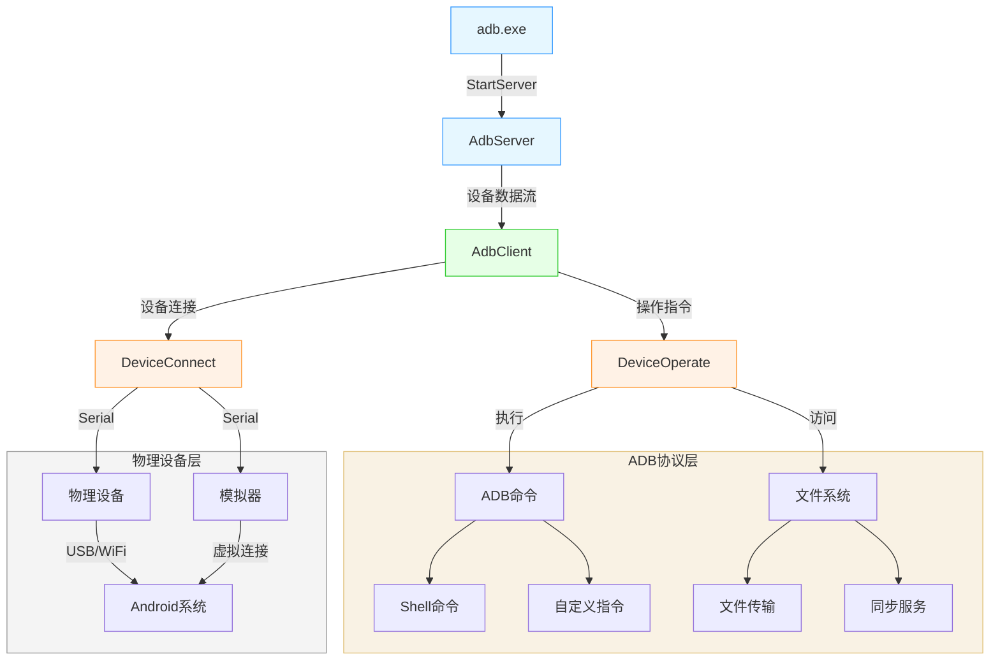

# adb 使用记录说明

## 连接

> 手机需要打开开发者模式，并且打开USB调试选项
> 无线连接和有线连接都行，但是无线连接配对码进行配对好像还是需要打开USB调试的选项，否则很容易连接就断开(我也不知道为什么)

> 连接后 
> ```bash
> adb devices
> List of devices attached
> adb-5204d4a9-iq9Cok._adb-tls-connect._tcp       device    
> # 设备的       Serial                             状态      
> ```
> 可以看到连接的设备


## 将命令发送到选择的设备

如果是多个设备的话需要进行设备的选择, 举个栗子：
```bash
adb -s adb-5204d4a9-iq9Cok._adb-tls-connect._tcp shell screencap -p /sdcard/temp.png
# 只有一个设备的话
adb shell screencap -p /sdcard/temp.png
```

> 有一些命令运行的环境是手机设备的，有一些是电脑的

• 电脑端命令


```bash
# 不带 shell
adb pull {remote} {local}
adb push {local} {remote}
```

• 移动端命令


```bash
# adb shell：会启动设备中的 Unix 命令行工具，并运行后续命令
adb shell {command}
```

## 常见指令

• 基础

```bash
# ===== 输入操作 =====

# 1. 输入文本 (自动转义特殊字符)
adb shell input text "hello_1234\$"

# 2. 输入键盘按键 (KEYCODE列表见注释)
adb shell input keyevent KEYCODE_ENTER        # 回车
adb shell input keyevent KEYCODE_BACK         # 返回键
adb shell input keyevent KEYCODE_HOME         # 主页键
adb shell input keyevent KEYCODE_POWER        # 电源键


# ===== 触摸操作 =====

# 3. 点击
adb shell input tap 500 700 

# 4. 长按
adb shell input swipe 500 500 500 500 1000

# 5. 双击
adb shell input tap 300 400; Start-Sleep -Milliseconds 200; adb shell input tap 300 400

# 6. 拖拽 
adb shell input swipe 100 200 400 600 800 

# 7. 滑动
adb shell input swipe 800 1000 200 1000 200 

# ===== 其他 =====

# 8. 截屏
adb shell screencap -p /sdcard/temp.png

# 9.日期
adb shell date

# 10.屏幕尺寸(从左上角为原点，向右为x轴正方向，向下为y轴正方向)
adb shell wm size 

```

• 电池


```bash

# 1. 查看电池信息
adb shell dumpsys battery
# (显示的电池温度要除以10    temperature: 282 = 28.2°C)


# 2. 设置电池信息

adb shell dumpsys battery set level 12  # 设置电量百分比
adb shell dumpsys battery set ac 1      # 设置是否充电
adb shell dumpsys battery reset         # 重置电池信息
# 没用的知识增加了
```


• activity 管理


```bash

# 1. 查看当前界面的Activity：
adb shell dumpsys activity top | findstr ACTIVITY

# 2. 打开Activity
adb shell am start -n {应用名}/{activity名}
adb shell am start -n com.coloros.gallery3d/.app.MainActivity
adb shell am start -a android.intent.action.VIEW -d "https://baidu.com"
adb shell am start -a android.intent.action.DIAL -d tel:10086

# 3. 关闭Activity
adb shell am force-stop {应用名}

```

## 栗子

> ```bash
> # csharp 安装
> dotnet add package AdvancedSharpAdbClient --version 3.4.14
> ```

> 我自己的理解是有一些需要异步执行，传输安全，中断，恢复继续传输，这个包提供了这些功能
> 并且封装了一些常用的命令，可以在满足开闭原则的基础上进行开发。



> 我没有使用 AdvancedSharpAdbClient 封装的DeviceClient , 设备很可能断连，DeviceClient 封装的功能也很少，而不是虚基类或者接口类，主要就是封装功能，就利用adbClient 实现就好了。
>
> AdbServer 提供检查本地的adb.exe, 建立socket 节点让adb.exe与设备进行通信，提供启动服务、关闭服务的功能
>
> AdbClient  提供连接、断连、配对及发送操作指令对手机进行操作的基本接口，提供自定义的指令功能函数
>
> 所以，需要维护连接的设备，设备的序列号来实例化DeviceData, 通过AdbClient  利用 DeviceData对手机进行操作


### 对外服务接口

```c#
using System.Net.Sockets;
using AdvancedSharpAdbClient;
using AdvancedSharpAdbClient.DeviceCommands;
using AdvancedSharpAdbClient.Models;
using System;
using Microsoft.Extensions.Logging;
using System.Collections.ObjectModel;
using System.Windows;

namespace AdbDevice
{
    /// <summary>
    /// 设备连接状态信息
    /// </summary>
    public struct ConnectStatus
    {
        public string Result { get; set; }
        public string DeviceName { get; set; }
        public string DeviceSerial { get; set; }
        public bool IsSuccess { get; set; }
    }

    public static class AdbService
    {
        private static AdbClient _adbClient;
        private static AdbServer _adbServer;
        private static DevicesManager _devicesManager;
        private static DevicesOperate _devicesOperate;
        private static ILogger _logger;

        private static List<string> _NetSerials;
        public static string _adbPath = @"Adb\adb.exe";

        static AdbService()
        {
            // 
        }

        public static void Initialize(ILogger logger)
        {
            _logger = logger;
            _adbClient = new AdbClient();
            _adbServer = new AdbServer();
            _ = StartAdbServerAsync();
            _devicesManager = new DevicesManager(_adbClient);
            _devicesOperate = new DevicesOperate(_adbClient, _devicesManager);
            _NetSerials = new List<string>();
        }


        #region 服务启动关闭
        // =================== ADB 服务管理 ===================== //
        /// <summary>
        /// 启动ADB服务才能运行， 节流避免多次调用
        /// </summary>
        private static readonly SemaphoreSlim _adbServerLock = new SemaphoreSlim(1, 1);
        
        public static async Task<bool> StartAdbServerAsync()
        {
            await _adbServerLock.WaitAsync();
            try
            {
                var result = await _adbServer.StartServerAsync(_adbPath);
                bool isStarted = (result == StartServerResult.Started || result == StartServerResult.AlreadyRunning);
                _isStopped = !isStarted;
                return isStarted;
            }
            catch (Exception ex)
            {
                _logger?.LogError(ex, "ADB服务启动失败");
                return false;
            }
            finally
            {
                _adbServerLock.Release();
            }
        }

        /// <summary>
        /// ADB 服务重启
        /// </summary>
        public static async Task RestartAdbServerAsync()
        {
            try
            {
                await _adbServer.RestartServerAsync(_adbPath);
            }
            catch (Exception ex)
            {
                _logger?.LogError(ex, "ADB服务重启失败");
            }
        }

        private static bool _isStopped = true;
        
        /// <summary>
        /// 关闭ADB服务
        /// </summary>
        public static void StopServer()
        {
            if (_isStopped) return;
            try
            {
                _adbClient.KillAdbAsync().GetAwaiter().GetResult();
                _isStopped = true;
                _devicesManager.SetCurrentDevice(string.Empty);
            }
            catch (Exception ex)
            {
                _logger?.LogError(ex, "ADB服务关闭失败");
            }
        }
        #endregion

        // =================== 设备连接管理 ===================== //
        #region 设备连接
        /// <summary>
        /// 当连接的设备信息更改时，传递信息给Setting部分的前端
        /// </summary>
        public static event EventHandler<ConnectStatus> ConnectionStatusChanged;

        /// <summary>
        /// 设备连接异步处理
        /// </summary>
        public static async Task ConnectDeviceAsync(string ipAddress, int port, string code = "")
        {
            try
            {
                if (_isStopped)
                {
                    NotifyConnectionStatus(false, "Adb服务未启动");
                    return;
                }
                string result = !string.IsNullOrEmpty(code)
                    ? await _adbClient.PairAsync(ipAddress, port, code)
                    : await _adbClient.ConnectAsync(ipAddress, port);

                if (!result.Contains("connected") && !result.Contains("success"))
                {
                    NotifyConnectionStatus(false, result);
                    return;
                }
                string serial = $"{ipAddress}:{port.ToString()}";
                RefreshDevices(serial, false);
                
            }
            catch (Exception ex)
            {
                _logger?.LogError(ex, "ADB连接失败");
                NotifyConnectionStatus(false, ex.Message);
            }
        }

        /// <summary>
        /// 根据参数获取连接的设备
        /// </summary>
        /// <param name="serial"></param>
        /// <param name="isUsb"></param>
        /// <returns></returns>
        private static DeviceData GetDeviceData(string serial, bool isUsb = false)
        {
            _devicesManager.RefreshDevicesAsync();
            var devices = _devicesManager.ConnectedDevices;
            if (devices.Count > 0)
            {
                if (isUsb)
                {
                    if (!_NetSerials.Contains(serial))
                        return devices[0];
                }
                else
                {
                    var device = devices.FirstOrDefault(d => d.Serial == serial);
                    return device;
                }
            }
            return default(DeviceData);
        }

        /// <summary>
        /// 刷新设备列表
        /// </summary>
        public static void RefreshDevices(string serial = "", bool isUsb = false)
        {
            try
            {
                if (_isStopped)
                {
                    NotifyConnectionStatus(false, "Adb服务未启动");
                    return;
                }
                var device = GetDeviceData(serial, isUsb);
                if (device != default(DeviceData))
                {
                    if (!isUsb) _NetSerials.Add(serial);
                    _devicesManager.SetCurrentDevice(device.Serial);
                    string testMessage = "USB: " + device.Usb + "  Model: " + device.Model + " Serial: " + device.Serial;
                    NotifyConnectionStatus(true, device, testMessage);
                }
                else
                {
                    NotifyConnectionStatus(false, isUsb ? "未找到可用的USB设备" : "设备连接异常");
                }
            }
            catch (Exception ex)
            {
                _logger?.LogError(ex, "设备刷新失败");
                NotifyConnectionStatus(false, ex.Message);
            }
        }

        private static void NotifyConnectionStatus(bool success, DeviceData device = default, string message = "")
        {
            var status = new ConnectStatus
            {
                IsSuccess = success,
                Result = message,
                DeviceName = (device == default) ? "Unknown" : device.Name,
                DeviceSerial = (device == default) ? "Unknown" : device.Serial
            };
            ConnectionStatusChanged?.Invoke(null, status);
        }

        private static void NotifyConnectionStatus(bool success, string message)
        {
            ConnectionStatusChanged?.Invoke(null, new ConnectStatus
            {
                IsSuccess = success,
                Result = message,
                DeviceName = "None",
                DeviceSerial = "None"
            });
        }

        #endregion

        // =================== 设备操作管理 ===================== //

        #region 设备操作
        /// <summary>
        /// 执行远程命令
        /// </summary>
        public static async Task ExecuteRemoteCommandAsync(string command)
        {
            try
            {
                await _devicesOperate.ExecuteRemoteCommandAsync(command);
            }
            catch (Exception ex)
            {
                _logger?.LogError(ex, "命令执行失败");
            }
        }

        /// <summary>
        /// 从设备拉取文件
        /// </summary>
        public static async Task PullFileAsync(string remotePath, string localPath)
        {
            try
            {
                await _devicesOperate.PullFileAsync(remotePath, localPath);
            }
            catch (Exception ex)
            {
                _logger?.LogError(ex, "文件拉取失败");
            }
        }

        /// <summary>
        /// 推送文件到设备
        /// </summary>
        public static async Task PushFileAsync(string localPath, string remotePath)
        {
            try
            {
                await _devicesOperate.PushFileAsync(localPath, remotePath);
            }
            catch (Exception ex)
            {
                _logger?.LogError(ex, "文件推送失败");
            }
        }

        public static async void HomeAsync()
        {
            try
            {
                await _devicesOperate.HomeAsync();
            }
            catch (Exception ex)
            {
                _logger?.LogError(ex, "操作失败");
            }
        }

        public static async Task<string> GetLogcatAsync()
        {
            try
            {
                return await _devicesOperate.GetLogcatAsync();
            }
            catch (Exception ex)
            {
                _logger?.LogError(ex, "设备日志获取失败");
                return string.Empty;
            }
        }

        public static async Task ScreenshotAsync(string savePath, bool deviceSave = false)
        {
            try
            {
                await _devicesOperate.ScreenshotAsync(savePath);
            }
            catch (Exception ex)
            {
                _logger?.LogError(ex, "设备日志获取失败");
            }
        }
        
        #endregion
    }
}

```


### 设备管理

```c#
using System.Collections.Concurrent;
using System.Collections.ObjectModel;
using AdvancedSharpAdbClient;
using AdvancedSharpAdbClient.DeviceCommands;
using AdvancedSharpAdbClient.Models;

namespace AdbDevice
{
    public class DevicesManager
    {
        private readonly AdbClient _adbClient;
        // 当前选择设备的序列号 与前端对接
        private string _currentDeviceSerial = string.Empty;
        public void SetCurrentDevice(string serial)
        {
            _currentDeviceSerial = serial;
        }
        public List<DeviceData> ConnectedDevices { get; } = new();
        public DevicesManager(AdbClient adbClient)
        {
            _adbClient = adbClient;
        }

        /// <summary>
        /// 获取连接的设备
        /// </summary>
        /// <returns></returns>
        public void RefreshDevicesAsync()
        {
            var devices = _adbClient.GetDevices();
            var newSerials = new HashSet<string>(devices.Select(d => d.Serial));

            ConnectedDevices.Clear();
            foreach (var device in devices)
            {
                ConnectedDevices.Add(device);
            }
        }

        /// <summary>
        /// 获取与 _currentDeviceSerial 名相同的 DeviceData， 否则返回 default(DeviceData)
        /// </summary>
        /// <returns></returns>
        public DeviceData GetCurrentDeviceData()
        {
            if (ConnectedDevices.Count == 0)
            {
                return default(DeviceData);
            }
            if (!string.IsNullOrEmpty(_currentDeviceSerial))
            {
                foreach (var device in ConnectedDevices)
                {
                    if (device.Serial == _currentDeviceSerial)
                    {
                        return device;
                    }
                }
            }
            return default(DeviceData);
        }
    }

}

```


### 服务功能实现

```c#
using System.IO;
using AdvancedSharpAdbClient;
using AdvancedSharpAdbClient.DeviceCommands;
using AdvancedSharpAdbClient.Exceptions;
using AdvancedSharpAdbClient.Models;
using AdvancedSharpAdbClient.Receivers;

namespace AdbDevice
{
    public class DevicesOperate
    {
        private readonly AdbClient _adbClient;
        private readonly DevicesManager _devicesManager;
        public DevicesOperate(AdbClient adbClient, DevicesManager devicesManager)
        {
            _adbClient = adbClient;
            _devicesManager = devicesManager;
        }
        #region 底层函数抽象

        /// <summary>
        /// 先获取选择的连接的设备，执行没有返回结果的指令
        /// </summary>
        /// <param name="action"></param>
        /// <returns></returns>
        /// <exception cref="InvalidOperationException"></exception>
        private async Task ExecuteForCurrentDeviceAsync(Func<DeviceData, Task> action)
        {
            var device = _devicesManager.GetCurrentDeviceData();
            if (device == default(DeviceData))
            {
                throw new InvalidOperationException("No device is connected.");
            }
            await action(device);
        }

        /// <summary>
        /// 先获取选择的连接的设备，执行有返回结果的指令
        /// </summary>
        /// <typeparam name="T"></typeparam>
        /// <param name="func"></param>
        /// <returns></returns>
        /// <exception cref="InvalidOperationException"></exception>
        private async Task<T> ExecuteForCurrentDeviceAsync<T>(Func<DeviceData, Task<T>> func)
        {
            var device = _devicesManager.GetCurrentDeviceData();
            if (device == default(DeviceData))
            {
                throw new InvalidOperationException("No device is connected.");
            }
            return await func(device);
        }

        /// <summary>
        /// 在手机或者车机上执行的指令，在电脑端实例化 receiver 接收
        /// </summary>
        /// <param name="command"></param>
        /// <returns></returns>
        public async Task<string> ExecuteRemoteCommandAsync(string command)
        {
            return await ExecuteForCurrentDeviceAsync(async device =>
            {
                var receiver = new ConsoleOutputReceiver();
                await _adbClient.ExecuteRemoteCommandAsync(
                    command,
                    device,
                    receiver,
                    CancellationToken.None
                );
                return receiver.ToString();
            });
        }

        #endregion


        // ============================ Adb 具体功能函数 ========================== // 

        #region 具体的功能
        // 从设备拉取文件
        public async Task PullFileAsync(string remotePath, string localPath)
        {
            if (string.IsNullOrWhiteSpace(remotePath))
                throw new ArgumentException("远程路径不能为空", nameof(remotePath));

            if (!remotePath.StartsWith("/"))
                throw new ArgumentException("远程路径必须是绝对路径", nameof(remotePath));

            if (string.IsNullOrWhiteSpace(localPath))
                throw new ArgumentException("本地路径不能为空", nameof(localPath));

            await ExecuteForCurrentDeviceAsync(async device =>
            {
                try
                {
                    using var syncService = new SyncService(_adbClient, device);
                    await using var stream = File.Create(localPath);
                    await syncService.PullAsync(remotePath, stream, null, CancellationToken.None);
                }
                catch (FileNotFoundException)
                {
                    throw new ArgumentException($"文件在设备上不存在: {remotePath}");
                }
                catch (AdbException ex)
                {
                    throw new IOException($"从设备拉取文件失败: {remotePath}", ex);
                }
            });
        }

        // 推送文件到设备
        public async Task PushFileAsync(string localPath, string remotePath)
        {
            if (string.IsNullOrWhiteSpace(remotePath))
                throw new ArgumentException("远程路径不能为空", nameof(remotePath));

            if (string.IsNullOrWhiteSpace(localPath))
                throw new ArgumentException("本地路径不能为空", nameof(localPath));

            if (!File.Exists(localPath))
                throw new FileNotFoundException("本地文件不存在", localPath);

            await ExecuteForCurrentDeviceAsync(async device =>
            {
                try
                {
                    using var syncService = new SyncService(_adbClient, device);
                    await using var stream = File.OpenRead(localPath);
                    await syncService.PushAsync(stream, remotePath, default, DateTime.Now, null, CancellationToken.None);
                }
                catch (AdbException ex)
                {
                    throw new IOException($"推送文件到设备失败: {ex.Message}", ex);
                }
            });
        }
        public async Task HomeAsync()
        {
            await ExecuteForCurrentDeviceAsync(device =>
            {
                _adbClient.SendKeyEvent(device, "KEYCODE_HOME");
                return Task.CompletedTask;
            });
        }

        // 锁屏
        public async Task LockScreenAsync()
        {
            await ExecuteForCurrentDeviceAsync(device =>
            {
                _adbClient.SendKeyEvent(device, "KEYCODE_POWER");
                return Task.CompletedTask;
            });
        }

        // 解锁
        public async Task UnlockScreenAsync(string password)
        {
            await ExecuteForCurrentDeviceAsync(async device =>
            {
                // 唤醒屏幕
                _adbClient.SendKeyEvent(device, "KEYCODE_WAKEUP");
                await Task.Delay(300);

                // 滑动解锁
                _adbClient.ExecuteRemoteCommand("input swipe 500 1800 500 1000", device);
                await Task.Delay(500);

                // 输入密码
                _adbClient.ExecuteRemoteCommand($"input text \"{password}\"", device);
                await Task.Delay(300);

                // 确认解锁
                _adbClient.SendKeyEvent(device, "KEYCODE_ENTER");
            });
        }

        // 点击坐标
        public async Task ClickAsync(int x, int y)
        {
            await ExecuteForCurrentDeviceAsync(device =>
            {
                _adbClient.ExecuteRemoteCommand($"input tap {x} {y}", device);
                return Task.CompletedTask;
            });
        }

        // 获取设备日志
        /// <summary>
        /// 获取设备日志
        /// </summary>
        /// <returns>返回最近100条日志记录</returns>
        /// <exception cref="InvalidOperationException">设备未连接时抛出</exception>
        public async Task<string> GetLogcatAsync()
        {
            return await ExecuteForCurrentDeviceAsync(async device =>
            {
                try
                {
                    var receiver = new ConsoleOutputReceiver();
                    await _adbClient.ExecuteRemoteCommandAsync(
                        "logcat -t 100",  // 获取最近100条日志
                        device,
                        receiver,
                        CancellationToken.None
                    );
                    return !string.IsNullOrEmpty(receiver.ToString()) ?
                        receiver.ToString() :
                        "未获取到日志内容";
                }
                catch (AdbException ex)
                {
                    throw new InvalidOperationException("获取设备日志失败", ex);
                }
            });
        }

        /// <summary>
        /// 按时间段获取设备日志
        /// </summary>
        /// <param name="startTime">开始时间(格式: MM-DD hh:mm:ss)</param>
        /// <param name="endTime">结束时间(格式: MM-DD hh:mm:ss)</param>
        public async Task<string> GetLogcatByTimeAsync(string startTime, string endTime)
        {
            return await ExecuteForCurrentDeviceAsync(async device =>
            {
                try
                {
                    var receiver = new ConsoleOutputReceiver();
                    await _adbClient.ExecuteRemoteCommandAsync(
                        $"logcat -t '{startTime}' -t '{endTime}'",
                        device,
                        receiver,
                        CancellationToken.None
                    );
                    return !string.IsNullOrEmpty(receiver.ToString()) ?
                        receiver.ToString() :
                        $"未获取到{startTime}至{endTime}时间段的日志";
                }
                catch (AdbException ex)
                {
                    throw new InvalidOperationException($"获取时间段日志失败", ex);
                }
            });
        }

        /// <summary>
        /// 获取指定应用的日志
        /// </summary>
        /// <param name="packageName">应用包名</param>
        public async Task<string> GetAppLogcatAsync(string packageName)
        {
            return await ExecuteForCurrentDeviceAsync(async device =>
            {
                try
                {
                    var receiver = new ConsoleOutputReceiver();
                    await _adbClient.ExecuteRemoteCommandAsync(
                        $"logcat --pid=$(pidof {packageName})",
                        device,
                        receiver,
                        CancellationToken.None
                    );
                    return !string.IsNullOrEmpty(receiver.ToString()) ?
                        receiver.ToString() :
                        $"未获取到{packageName}应用的日志";
                }
                catch (AdbException ex)
                {
                    throw new InvalidOperationException($"获取应用日志失败", ex);
                }
            });
        }

        // 设备截图
        public async Task ScreenshotAsync(string savePath, bool deviceSave = false)
        {
            await ExecuteForCurrentDeviceAsync(async device =>
            {
                // 在设备上生成临时截图文件路径
                string tempFile = $"/sdcard/Pictures/Screenshots/screenshot_{DateTime.Now:yyyyMMdd_HHmmssfff}.png";

                try
                {
                    await _adbClient.ExecuteRemoteCommandAsync($"screencap -p \"{tempFile}\"", device);
                }
                catch (AdbException ex) when (ex.Message.Contains("unknown option", StringComparison.OrdinalIgnoreCase))
                {
                    await _adbClient.ExecuteRemoteCommandAsync($"screencap \"{tempFile}\"", device);
                }

                // 使用ADB同步服务将截图拉取到本地
                using var syncService = new SyncService(_adbClient, device);
                await using var stream = File.Create(savePath);
                await syncService.PullAsync(tempFile, stream, null, CancellationToken.None);

                // 清理设备上的临时文件
                if (!deviceSave)
                    await _adbClient.ExecuteRemoteCommandAsync($"rm \"{tempFile}\"", device);
            });
        }
        
        #endregion

    }
}

```