> 这是偷别人的，哈哈哈

## 1.1 操作系统的基本概念

### 1.1.1 操作系统的概念

+   操作系统 （OperatinggSystem ，OS ）是指控制和管理整个计算机系统的硬件与软件资源 ，合理地组织、调度计算机的工作与资源的分配 ，进而为用户和其他软件提供方便接口与环境的程序集合。
+   操作系统是计算机系统中最基本的系统软件。

### 1.1.2 操作系统的特征

### 1.1.3 操作系统的目标和功能

+   作为系统资源的管理者

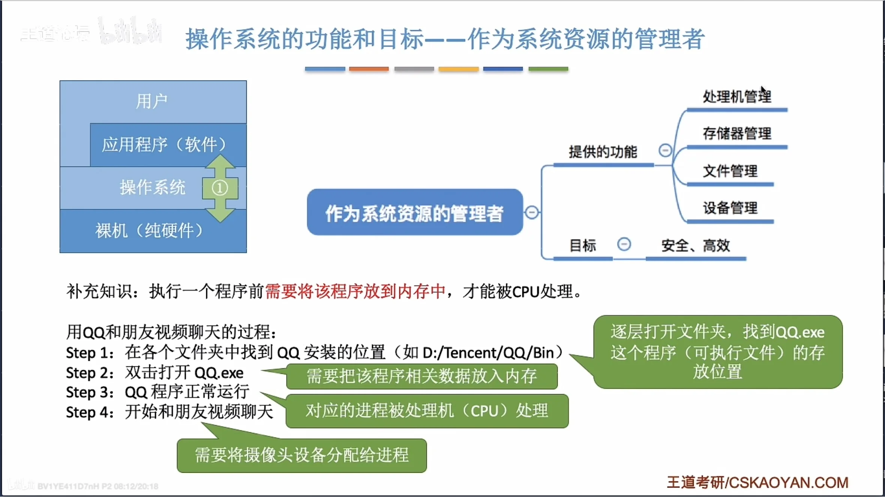

+   向上层提供方便易用的服务

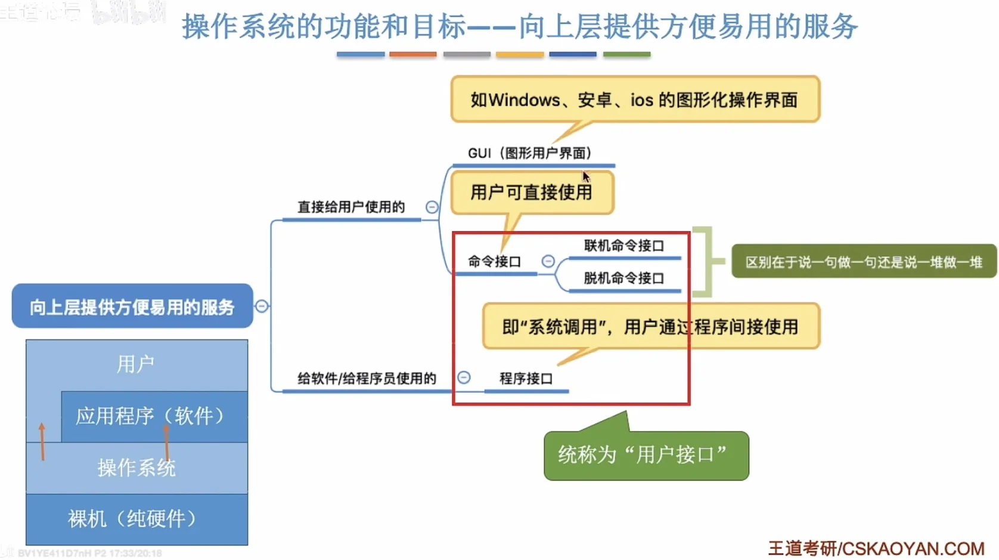

+   作为最接近硬件的层次

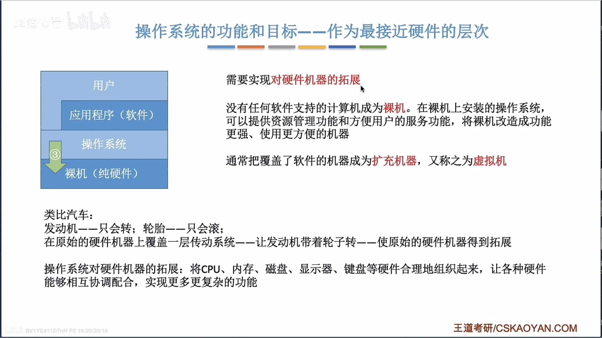

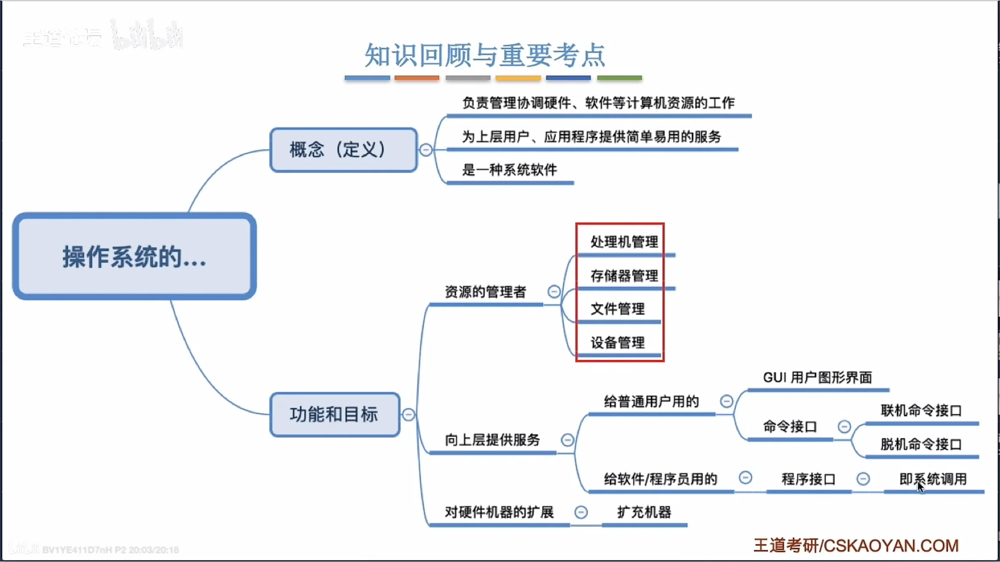

## 1.2 操作系统的发展与分类

### 1.2.1 手工操作阶段 （此阶段无操作系统 ）

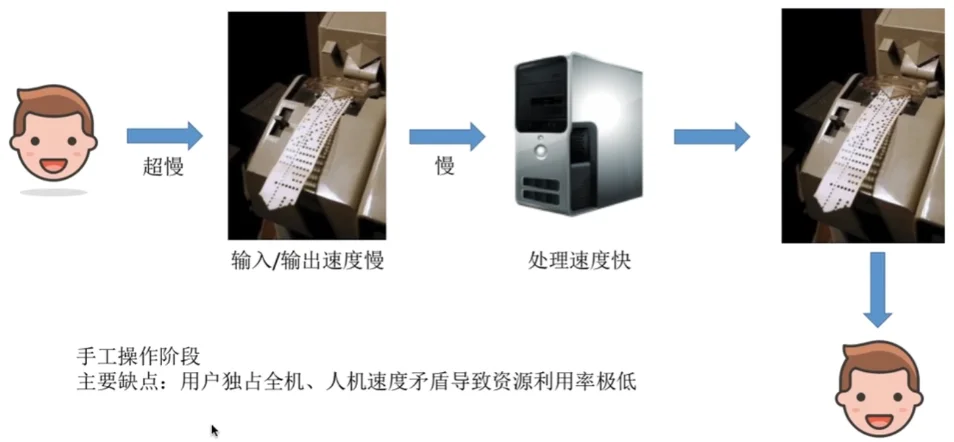

### 1.2.2 批处理阶段 （操作系统开始出现 ）

引入脱机输入/输出技术 （用磁带完成 ），并监督程序 负责控制作业的输入、输出。

 

### 1.2.3 分时操作系统

计算机以时间片为单位轮流为各个用户/作业服务 ，各个用户可通过终端与计算机进行交互。

多个用户通过终端同时共享一台主机 ，用户可以同时与主机进行交互操作而互不干扰。

+   同时性 ：同时性也称多路性 ，指允许多个终端用户同时使用一台计算机 ，即一台计算机与若干台终端相连接 ，终端上的这些用户可以同时或基本同时使用计算机。
+   交互性 ：用户能够方便地与系统进行人机对话 ，即用户通过终端采用人机对话的方式直接控制程序运行 ，与同程序进行交互。
+   独立性 ：系统中多个用户可以彼此独立地进行操作 ，互不干扰 ，单个用户感觉不到别人也在使用这台计算机 ，好像只有自己单独使用这台计算机一样。
+   及时性 ：用户请求能在很短时间内获得响应。分时系统采用时间片轮转方式使一台计算机同时为多个终端服务 ，使用户能够对系统的及时响应感到满意。
+   优点 ：
    +   用户请求可以被即时响应 ，解决了人机交互问题。
    +   允许多个用户同时使用一台计算机 ，并且用户对计算机的操作相互独立 ，感受不到别人的存在。
+   缺点 ：无法优先处理紧急任务

### 1.2.4 实时操作系统

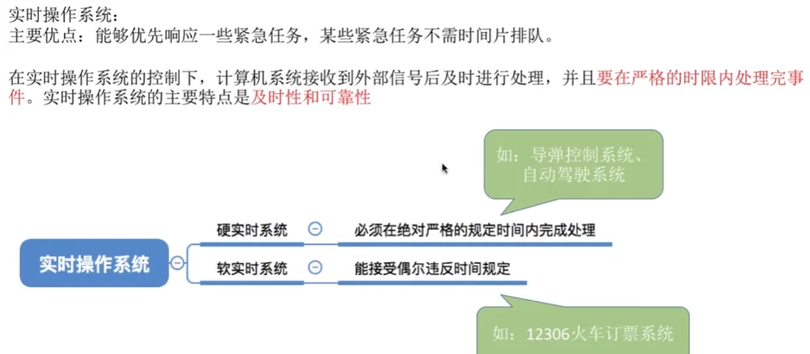

### 1.2.5 网络操作系统和分布式计算机系统

### 1.2.6 个人计算机操作系统

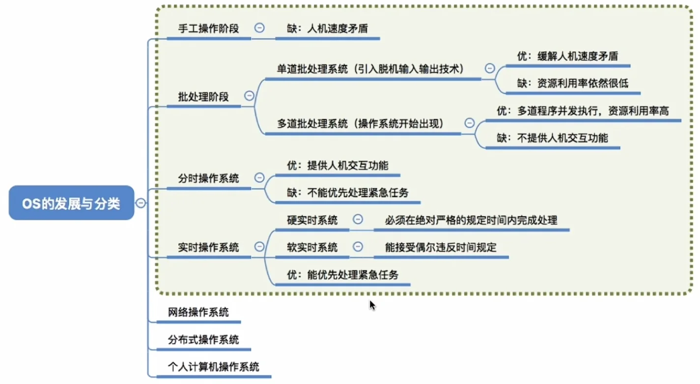

## 1.3 操作系统的运行环境

### 1.3.1 操作系统的运行机制

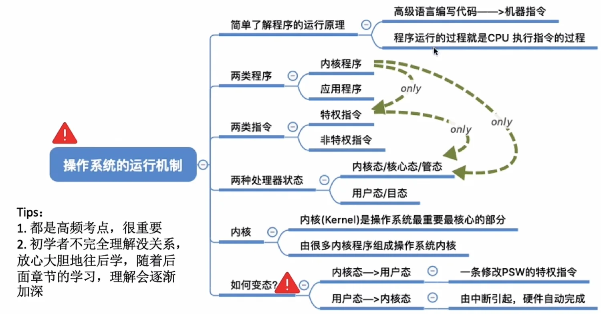

### 1.3.2 中断和异常的概念

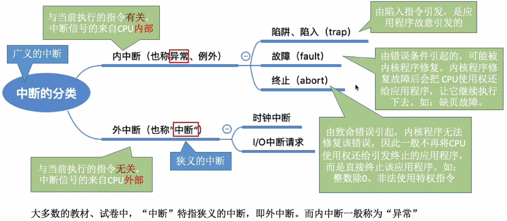 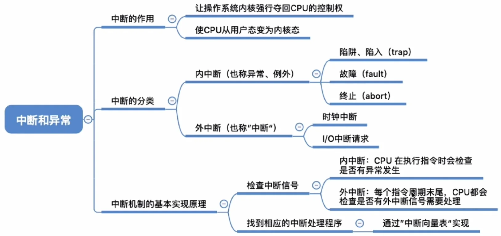

### 1.3.3 系统调用

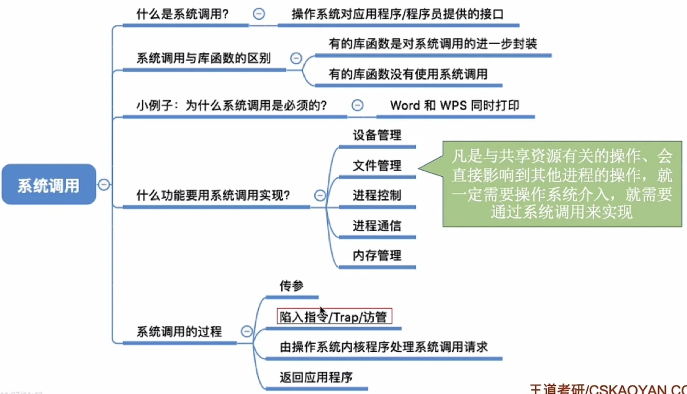

## 1.4 操作系统结构

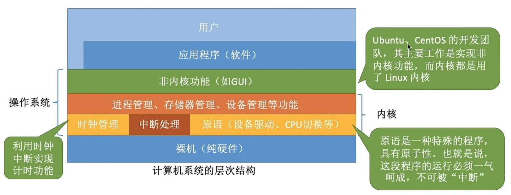 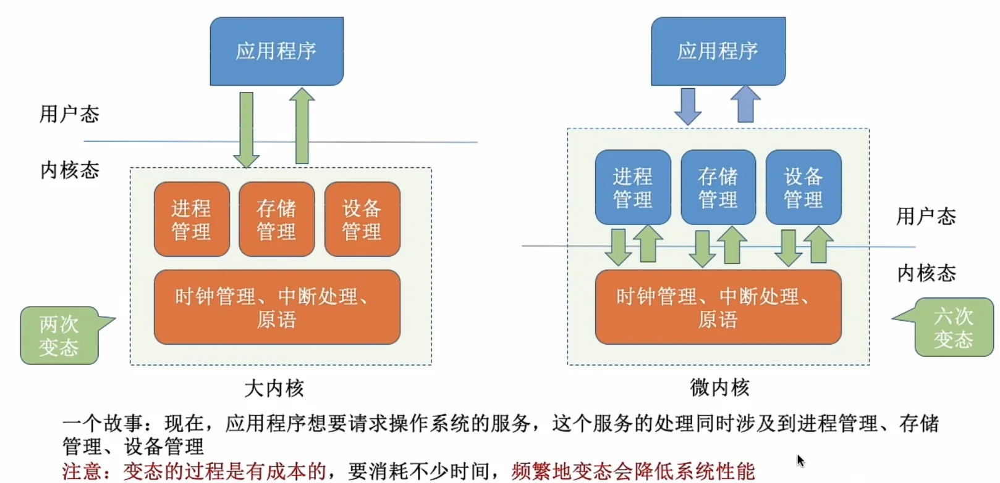 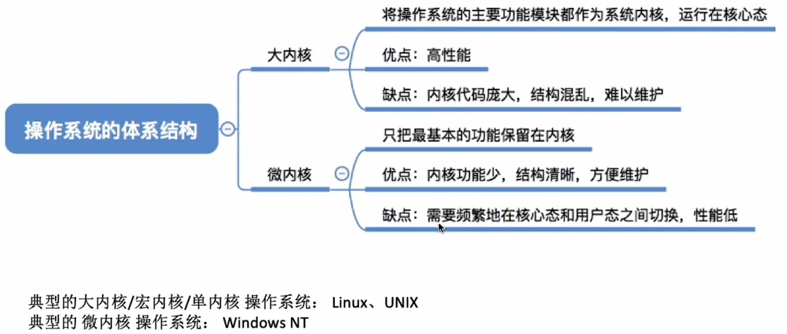

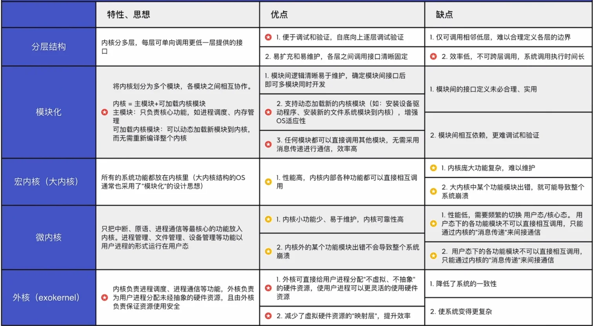

## 1.5 操作系统引导

1.  激活CPU ：激活的CPU读取ROM中的boot程序 ，将指令寄存器置为BIOS （基本输入/输出系统 ）的第一条指令 ，即开始执行BIOS的指令。
2.  硬件自检 ：BIOS程序在内存最开始的空间构建中断向量表 ，接下来的POST过程要用到中断功能。然后进行通电自检 ，检查硬件是否出现故障。如有故障 ，主板会发出不同含义的蜂鸣 ，启动中止 ；如无故障 ，屏幕会显示CPU、内存、硬盘等信息。
3.  加载带有操作系统的硬盘 ：通电自检后 ，BIOS开始读取BootSequence （通过CMOS里保存的启动顺序 ，或者通过与用户交互的方式 ），将控制权交给启动顺序排在第一位的存储设备 ，然后CPU将该存储设备引导扇区的内容加载到内存中。
4.  加载主引导记录 （MBR ） ：硬盘以特定的标识符区分引导硬盘和非引导硬盘。如果发现一个存储设备不是可引导盘 ，就检查下一个存储设备。如无其他启动设备 ，就会死机。主引导记录MBR的作用是告诉CPU去硬盘的哪个主分区去找操作系统。
5.  扫描硬盘分区表 ，并加载硬盘活动分区 ：MBR包含硬盘分区表 ，硬盘分区表以特定的标识符区分活动分区和非活动分区。主引导记录扫描硬盘分区表 ，进而识别含有操作系统的硬盘分区 （活动分区 ）。找到硬盘活动分区后 ，开始加载硬盘活动分区 ，将控制权交给活动分区。
6.  加载分区引导记录 （PBR ） ：读取活动分区的第一个扇区 ，这个扇区称为分区引导记录 （PBR ），其作用是寻找并激活分区根目录下用于引导操作系统的程序 （启动管理器 ）。
7.  加载启动管理器 ：分区引导记录搜索活动分区中的启动管理器 ，加载启动管理器。
8.  加载操作系统 ：将操作系统的初始化程序加载到内存中执行。

## 1.6 虚拟机

### 1.6.1 虚拟机的基本概念

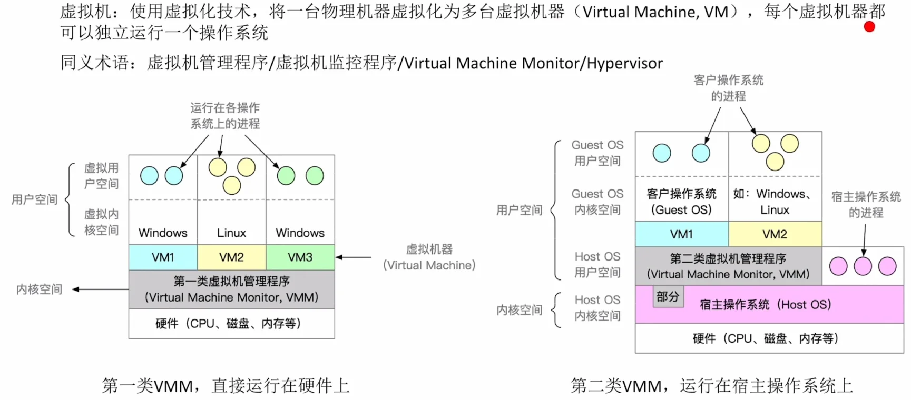

## 1.7 本章疑难点

### 1 并行性与并发性的区别和联系

> 并行性和并发性是既相似又有区别的两个概念。并行性是指两个或多个事件在同一时刻发生 ，并发性是指两个或多个事件在同一时间间隔内发生。 
> 在多道程序环境下 ，并发性是指在一段时间内 ，宏观上有多个程序同时运行 ，但在单处理器系统中每个时刻却仅能有一道程序执行 ，因此微观上这些程序只能分时地交替执行。若在计算机系统中有多个处理器 ，则这些可以并发执行的程序便被分配到多个处理器上 ，实现并行执行 ，即利用每个处理器来处理一个可并发执行的程序。

### 2 特权指令与非特权指令

> 特权指令是指有特殊权限的指令 ，由于这类指令的权限最大 ，使用不当将导致整个系统溃如清内存、置时钟、分配系统资源、修改虚存的段表或页表、修改用户的访问权限等。若所有程序都能使用这些指令 ，则系统一天死机次就不足为奇。为保证系统安全 ，这类指令不能直接提供给用户使用 ，因此特权指令必须在核心态执行。实际上 ，CPU在核心态下可以执行指令系统的全集。形象地说 ，特权指令是那些儿童不宜的东西 ，而非特权指令是老少皆宜的东西。 
> 为了防止用户程序中使用特权指令 ，用户态下只能使用非特权指令 ，核心态下可以使用全部指令。在用户态下使用特权指令时 ，将产生中断以阻止用户使用特权指令。所以将用户程序放在用户态下运行 ，而操作系统中必须使用特权指令的那部分程序在核心态下运行 ，从而保证了系统的安全性和可靠性。从用户态转换为核心态的唯一途径是中断或异常。

### 3、访管指令与访管中断

> 访管指令是一条可以在用户态下执行的指令。在用户程序中 ，因要求操作系统提供服务而有意识地使用访管指令 ，从而产生一个中断事件 （自愿中断 ），将操作系统转换为核心态 ，称为访管中断。访管中断由访管指令产生 ，程序员使用访管指令向操作系统请求服务。 
> 为什么要在程序中引入访管指令呢 ？这是因为用户程序只能在用户态下运行。若用户程序想要完成在用户态下无法完成的工作 ，该怎么办 ？解决这个问题要靠访管指令。访管指令本身不是特权指令 ，其基本功能是让程序拥有“自愿进管”的手段 ，从而引起访管中断。

### 4 定义微内核结构OS的四个方面

> 1.  足够小 的内核 。
> 2.  基于客户/服务器 模式
> 3.  应用“机制与策略分离” 原理。机制是指实现某一功能的具体执行机构。策略则是在机制的基础上借助于某些参数和算法来实现该功能的优化 ，或达到不同的功能目标。在传统的OS中 ，将机制放在OS内核的较低层中 ，将策略放在内核的较高层中。而在微内核OS中 ，通常将机制放在OS的微内核中。正因如此 ，才可以将内核做得很小。
> 4.  采用面向对象 技术。基于面向对象技术中的“抽象”和“隐蔽”原则能控制系统的复杂性 ，进一步利用“对象”“封装”和“继承”等概念还能确保操作系统的正确性、可靠性、易扩展性等。正因如此 ，面向对象技术被广泛应用于现代操作系统的设计之中。

