## 绪论

### 算法数据结构

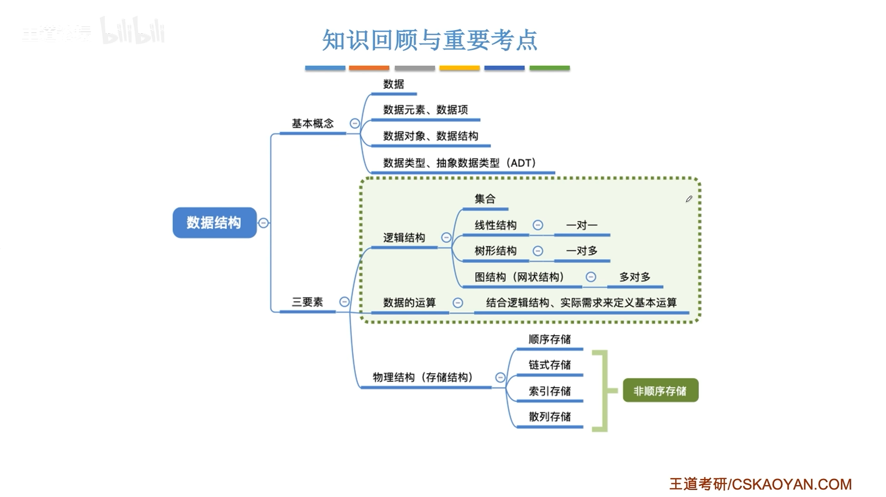

### 算法基本概念

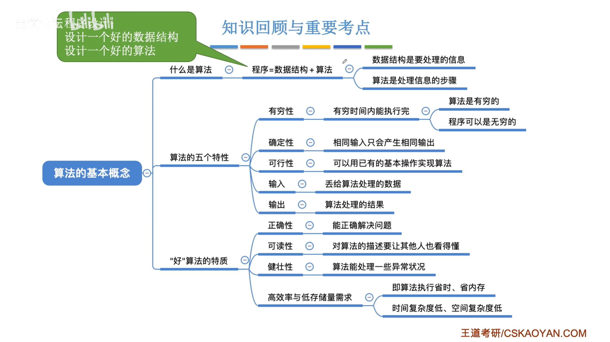

### 时间复杂度

### 空间复杂度

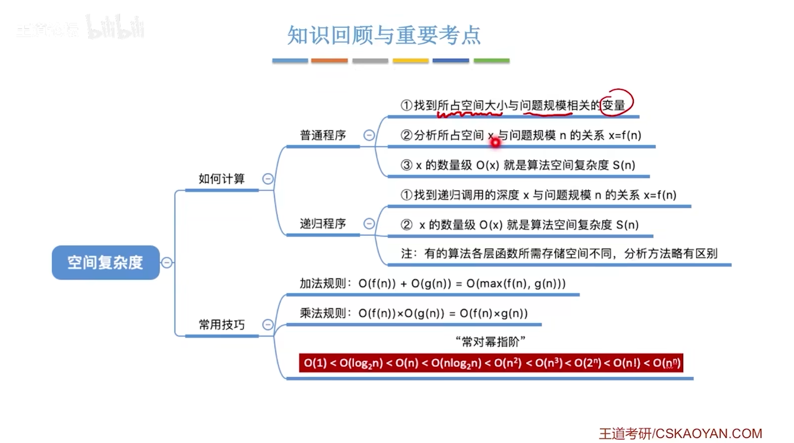

## 线性表

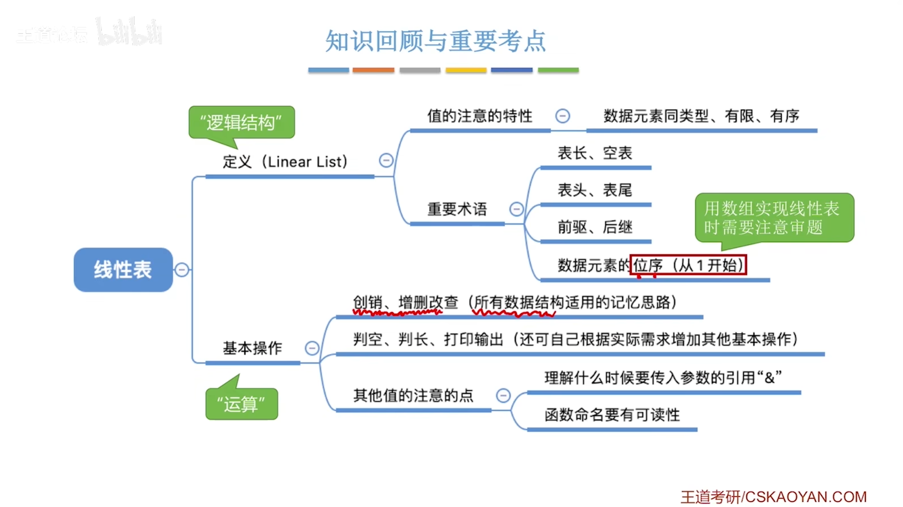

### 顺序表

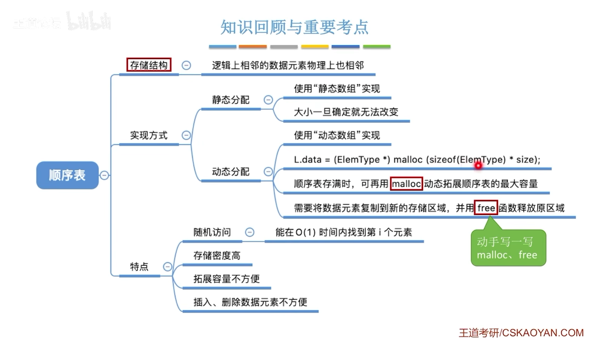

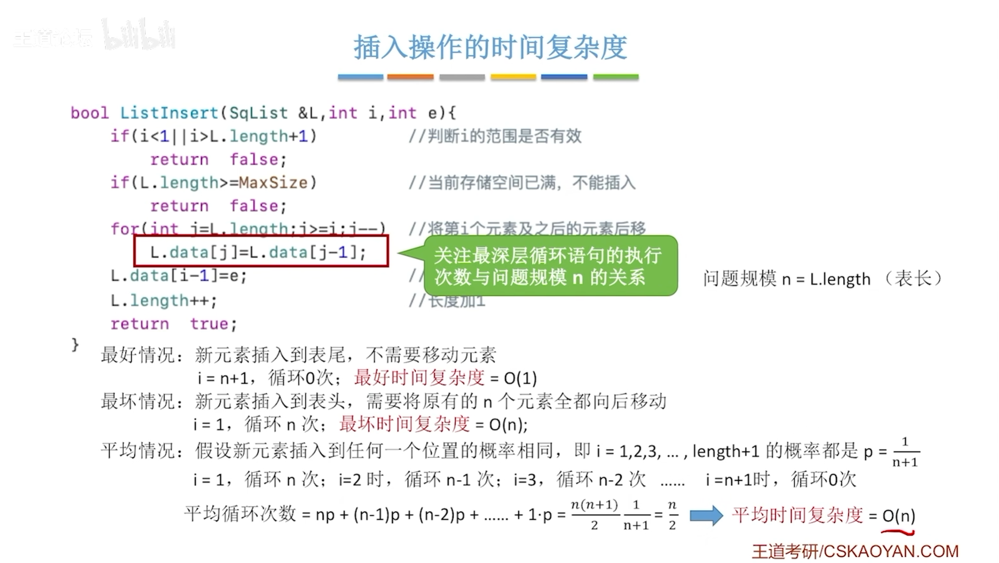

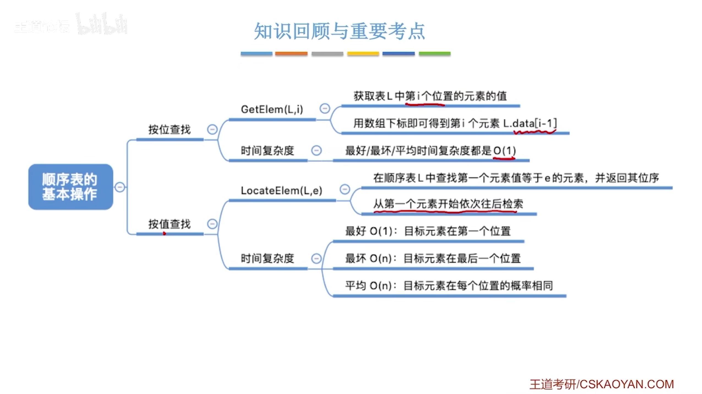

### 单链表

### 双链表

### 循环列表

### 算法

#### 1、数组左右移动

> 2010年

```c
// 数组 R 中的元素进行左右移动，如 abcde----(左移两位)--->cdeab
void Reverse(int R[], int from, int to){
    int i, temp;
    for ( i = 0; i < (to - from + 1) / 2; i++ ){
        temp = R[from + i];
        R[from + i] = R[to - i];
        R[to - i] = temp;
    }
}
// 数组长度 n, 左移动 p 位 
void Converse(int R[], int n, int p){
    Reverse(R, 0, p-1);
    Reverse(R, p-1, n-1);
    Reverse(R, 0, n - 1);
}
```

#### 2、单链表的倒数第K个

> 2009年

```c
typedef struct LNode{
    int data;
    LNode * Next;
}LNode, *LinkList;

int Search_K(LinkList list, int k){
    LNode* p = list->Next;
    LNode* q = list->Next;
    int count = 0;
    while(p != null){
        if(count < k)count++;
        else{
            q = q->Next;
	}
        p = p->Next;
    }
    if(count == k){
        // 存在
    }else{
        // 不存在
    }
}
```

## 栈、队列、数组

### 队列

> 双端队列、顺序队列、链表队列

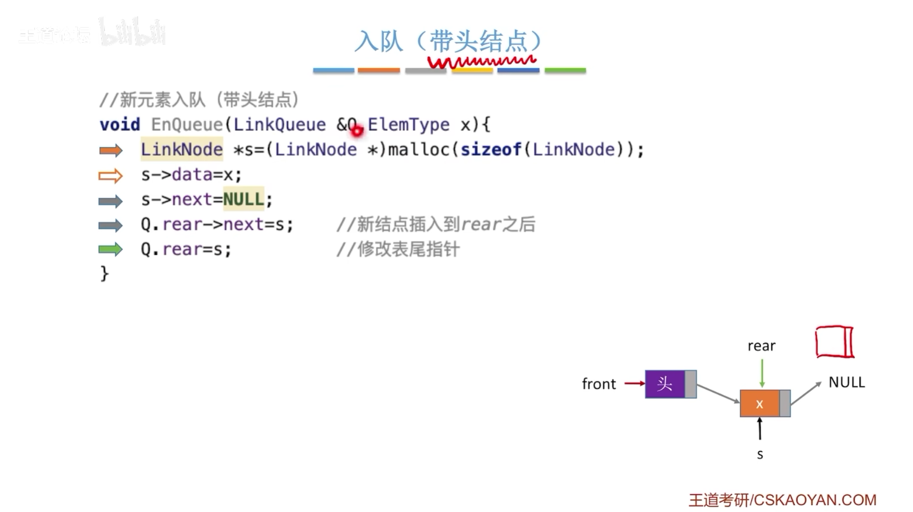

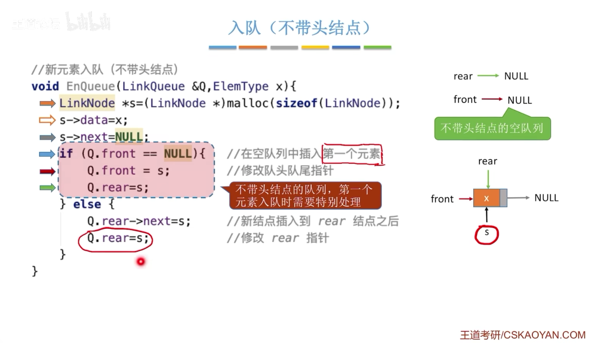

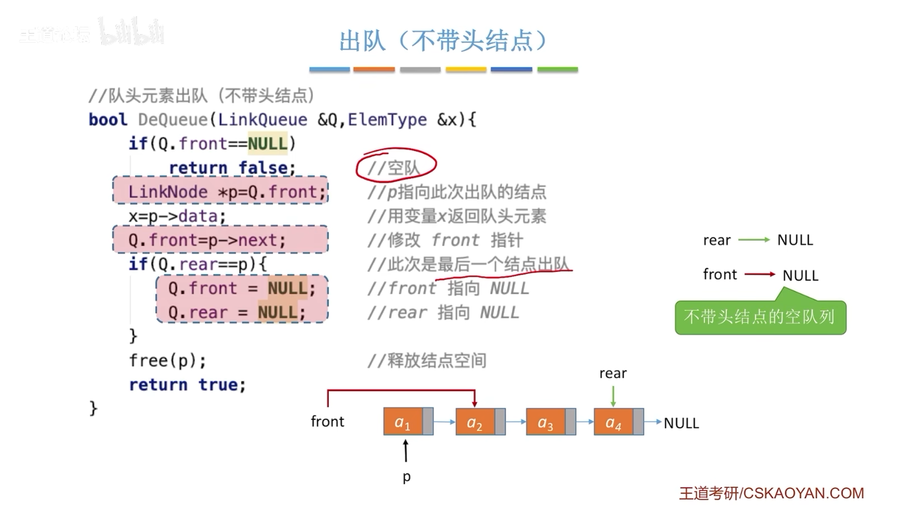

> 循环队列
>
> rear 指向末尾元素、执行末尾元素下一个

### 栈表达式中的运用

> ！！！

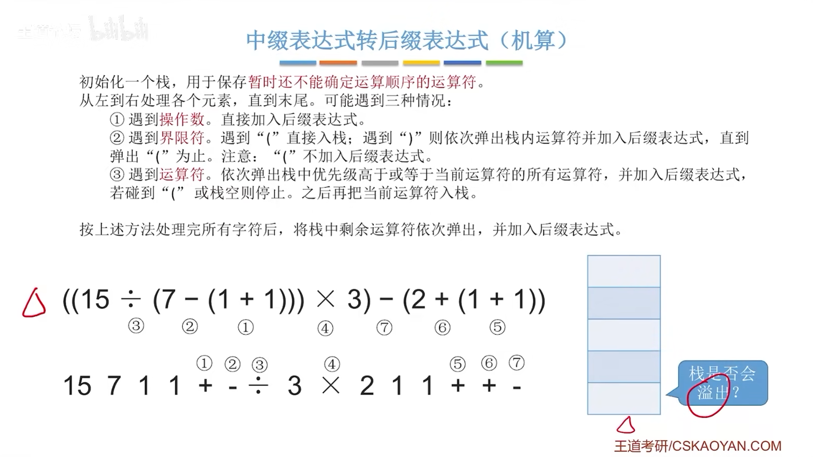

### 特殊矩阵

#### 二维数组

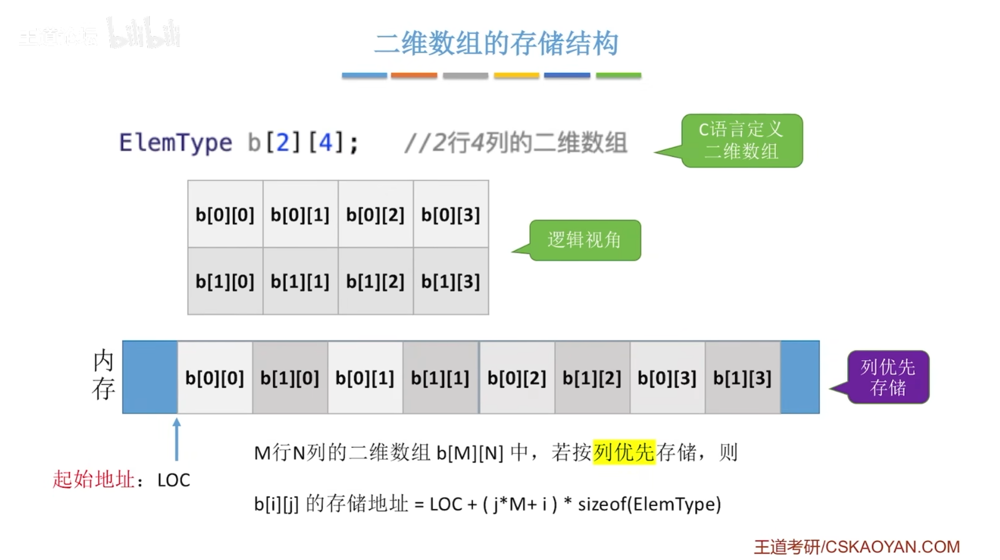

#### 对称矩阵

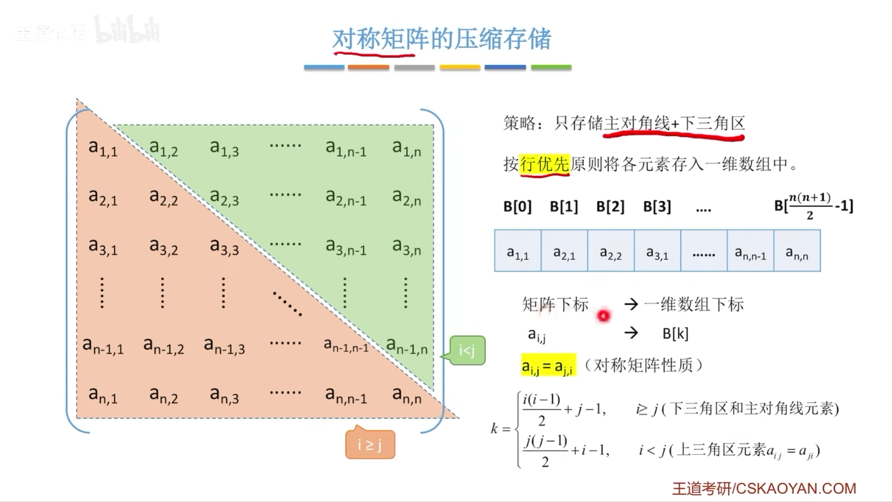

#### 三对角矩阵

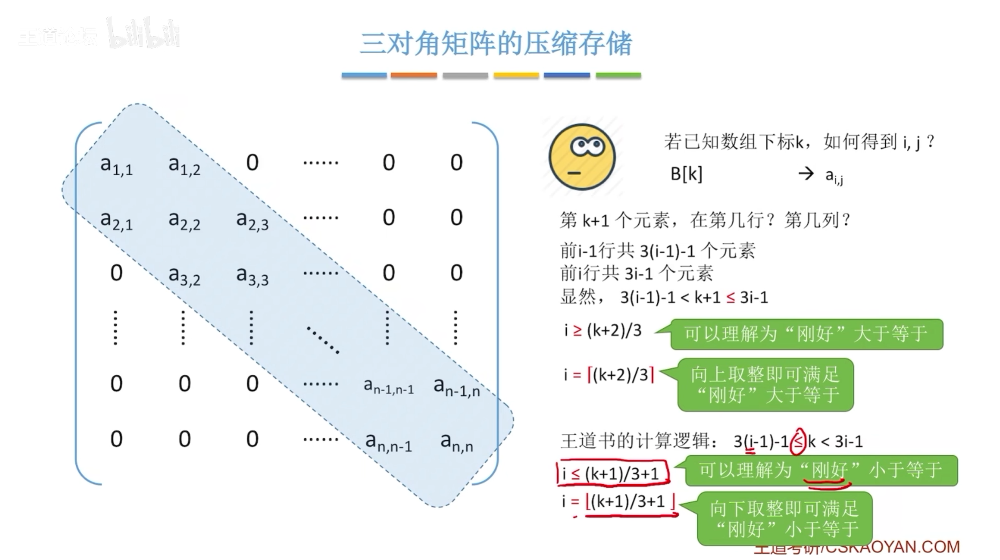

#### 稀疏矩阵

> 三元组和十字链表

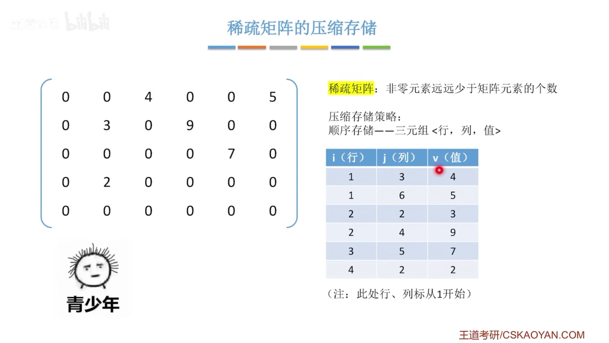

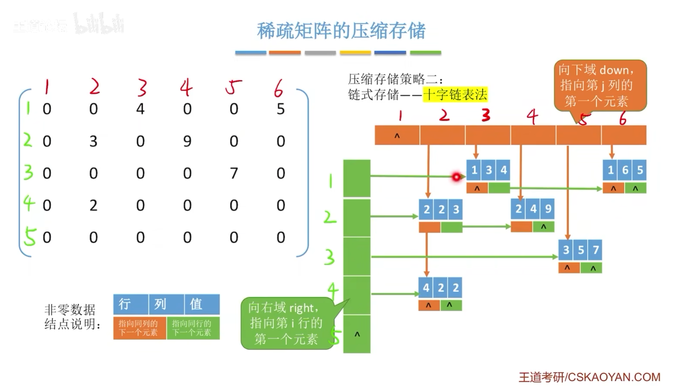

### 算法

#### 1、四则运算匹配

#### 2、括号匹配

## 串

> 模式匹配

### KMP匹配算法

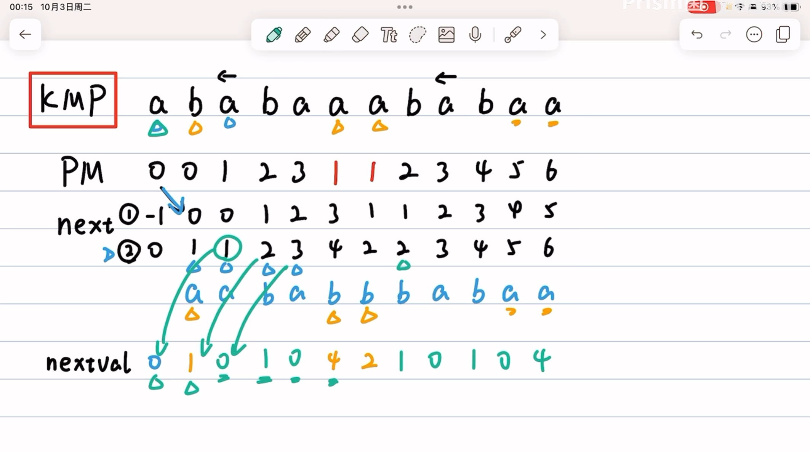

> 1. PM指的是最长前后缀，不包括本身的 1， 例如 ： “a” = 0、 “ab” = 0、“aba” = 1、“abab” = 2，方向是一样的，前面k个，和末尾的k个字符一样
> 2. next 的 -1 和 0 两种起始表达方式都代表着 ，i、j 都需要往下移动了
> 3. nextval 由 next 获得

```c++

/**
 * @brief 计算模式串 t 的部分匹配表（next 数组）
 * next[i] 表示：t[0..i-1] 的最长相等前后缀长度
 */
void get_next(string t, int next[]) {
    int i = 0;     // i 指向当前后缀末尾
    int j = -1;    // j 指向当前前缀末尾
    next[0] = -1;  // 初始化，表示没有相同前后缀
    while (i < t.length() - 1) {
        if (j == -1 || t[i] == t[j]) {
            i++，j++;
            next[i] = j;  // 记录当前匹配到的最长前后缀长度
        } else {
            j = next[j];  // 回溯到上一个匹配位置
        }
    }
}

/**
 * @brief 改进版 next 数组（nextval），用于减少不必要的比较
 * 若 t[i] == t[next[i]]，则 nextval[i] = nextval[next[i]]，避免重复比较
 */
void get_nextval(string t, int nextval[]) {
    int i = 0;
    int j = -1;
    nextval[0] = -1;
    while (i < t.length() - 1) {
        if (j == -1 || t[i] == t[j]) {
            i++， j++；
            // 当两个字符相等时，避免下次无效匹配
            if (t[i] != t[j])
                nextval[i] = j;
            else
                nextval[i] = nextval[j];
        } else {
            j = nextval[j];
        }
    }
}

/**
 * @brief KMP 字符串匹配算法
 * @param s 主串
 * @param t 模式串
 * @param next 模式串对应的 next 数组
 * @return 若匹配成功，返回匹配的起始下标（从 0 开始）；否则返回 -1
 */
int index_kmp(string s, string t, int next[]) {
    int i = 0;  // 主串指针
    int j = 0;  // 模式串指针
    while (i < s.length() && j < t.length()) {
        if (j == -1 || s[i] == t[j]) {
            i++， j++;
        } else {
            j = next[j];  // 模式串回溯
        }
    }
    if (j == t.length()) {
        return i - j;  // 匹配成功，返回起始下标
    }
    return -1;  // 匹配失败
}


```


