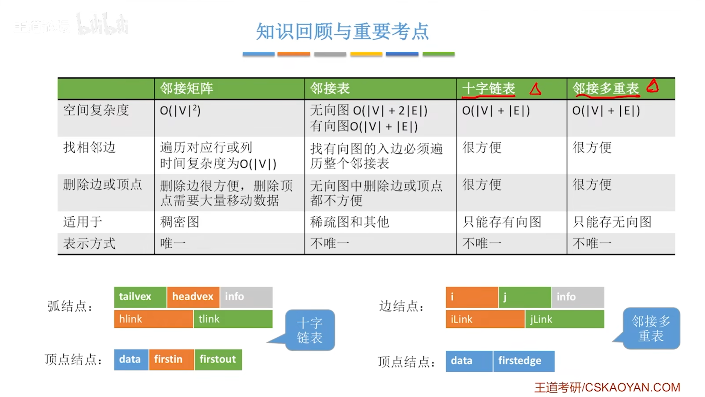

## 5.树

### 二叉树

#### 定义

#### 满二叉树、完全二叉树

#### 二叉排序树

#### 平衡二叉树

#### 正则二叉树

> 二叉树前序、中序、后序遍历

#### 线索二叉树

> 中序线索化

> 先序线索化

### 树、森林

### 树的应用

#### 哈夫曼树

> 加权平均长度 = $\frac{\displaystyle\sum_{i=1}^n w_i * l_i}{\displaystyle\sum_{i=1}^n w_i}$

> 哈夫曼编码集和定长编码集

#### 并查集

> 基本并查集
>
> 优化的思路都是尽可能让树变矮

> Union优化

> Find 优化 路径压缩
>
> 第一次循环找到根节点、第二次循环将查找路径下的节点直接挂在在根结点下

## 6.图

### 基本概念

### 图的存储

#### 邻接矩阵

> 有权图更改表中数值即可

#### 邻接表

#### 邻接多重表

#### 十字链表

### 图的遍历

#### BFS

> 广度优先生成树、广度优先生成森林

#### DFS

> 复杂度分析

> 深度优先生成树

### 最小生成树

#### Prim普里姆算法

> 图示

#### Kruskal算法

> 时间度、复杂度分析

### 最短路径

> 单源最短路径、每对顶点最短路径

#### Dijkstra算法

> 时间复杂度 $O(|V|^2)$
>
> 类似Prim算法，每次找最短的那个节点，从这个结点出发，更新这一轮的最小距离
>
> BFS 也能使用，但是要求权值都相同

#### Floyd算法

> BFS的时间复杂度：邻接表、邻接矩阵

### 拓扑排序

