## 顺序查找

### 基本实现

### ASL分析

## 折半查找

### 基本实现

> 基本只适合有序数组

### ASL分析

> 失败节点数量 $n + 1$
>
> $h = \left\lceil \log_{2} (n + 1) \right\rceil$ 
>
> 折半查找不一定比顺序查找更优
>
> 任意的一个子树的左子树的节点数小于等于右子树数量或者反过来取决于mid = (low + high) / 2 是向上还是向下取整

### 分块查找

> 链式

## 树形查找

### 二叉排序树

#### 查找

> 查找成功

> 查找失败

#### 插入

#### 删除

### 平衡二叉树

> AVL树：对二叉排序树的优化

#### 定义

> 插入
>
> ！！！！！！！ LR和RL的旋转容易出错

#### LL

#### RR

#### LR

#### RL

#### 删除

> 时间复杂度 ： $O(log_2 (n))$
>
> 删除节点需要找到前驱或者后继进行替换，这样删除的节点就会往下降，然后恢复平衡就可以了

### 红黑树

> RBT
>
> 平衡二叉树的插入删除容易频繁调整树的形态，为解决这一问题引入了红黑树

#### 定义

> 从根节点到叶节点最长路径不大于最短路径的两倍
>
> 

#### 插入

## B树

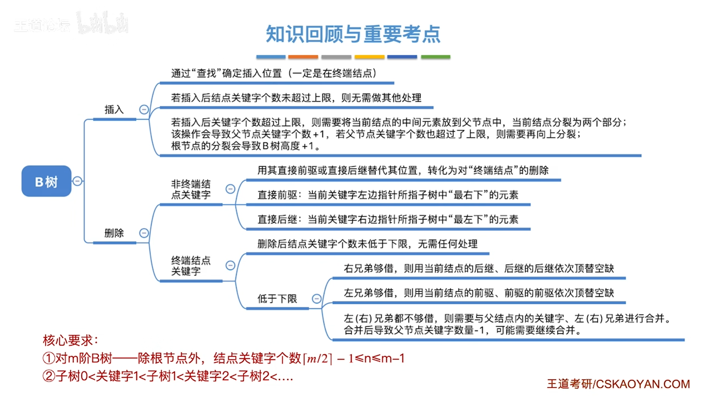

### 定义

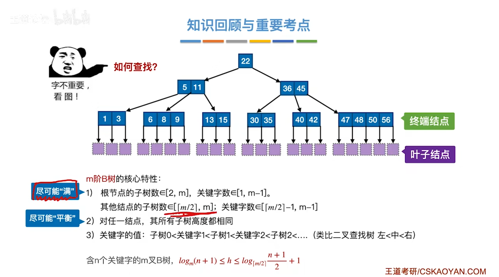

### 插入

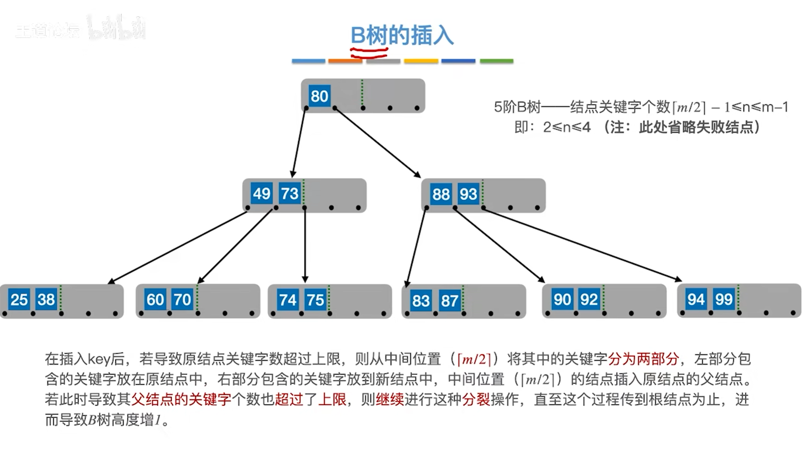

### 删除

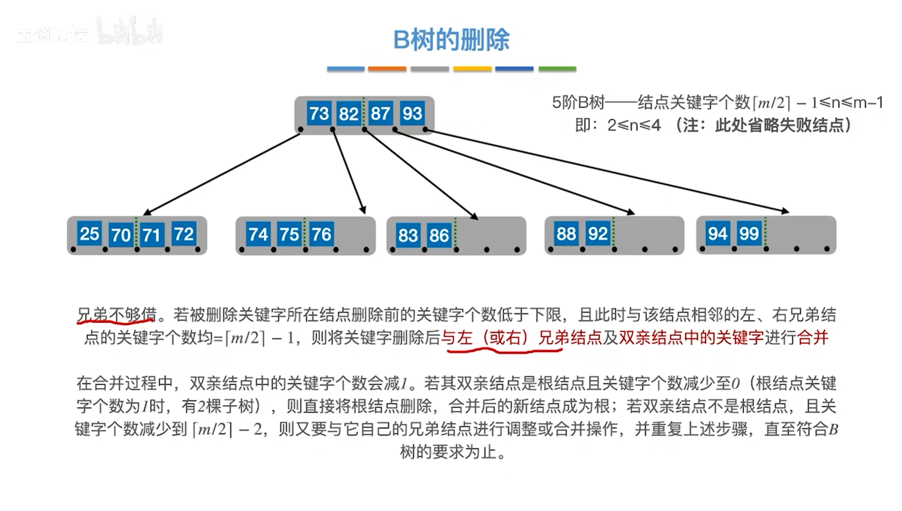

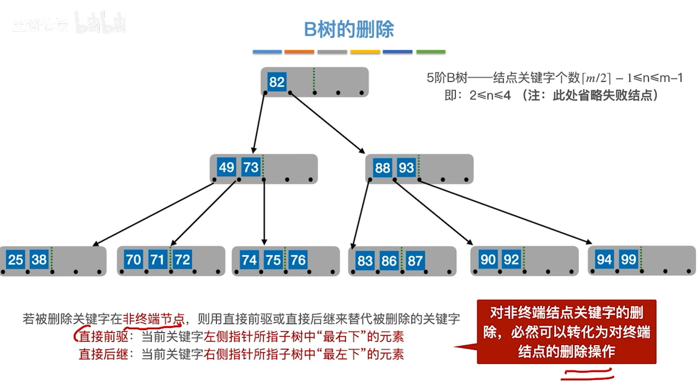

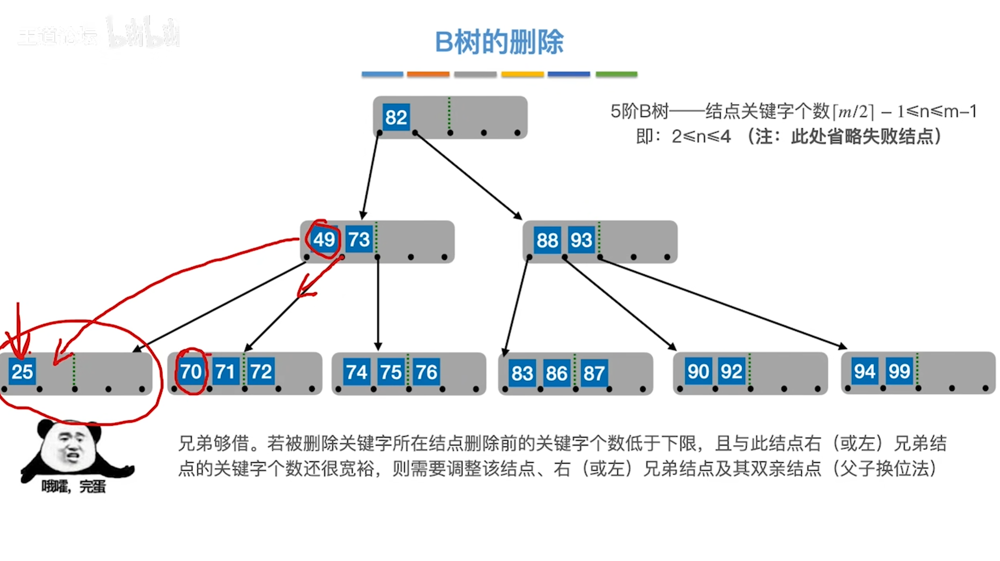

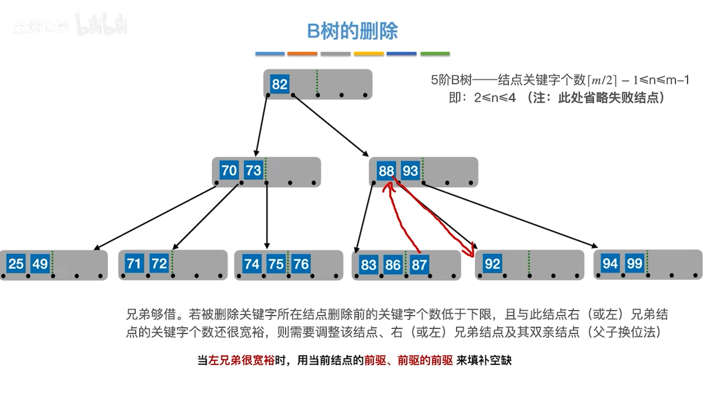

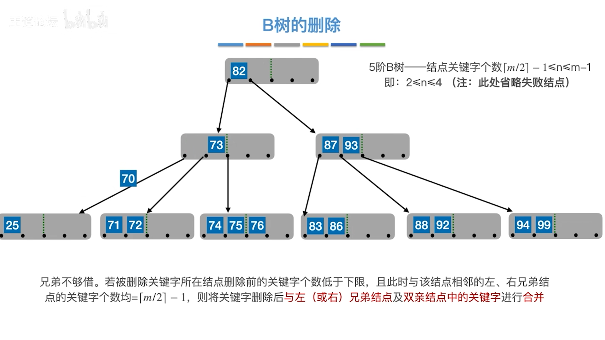

---

## B+树

### 定义

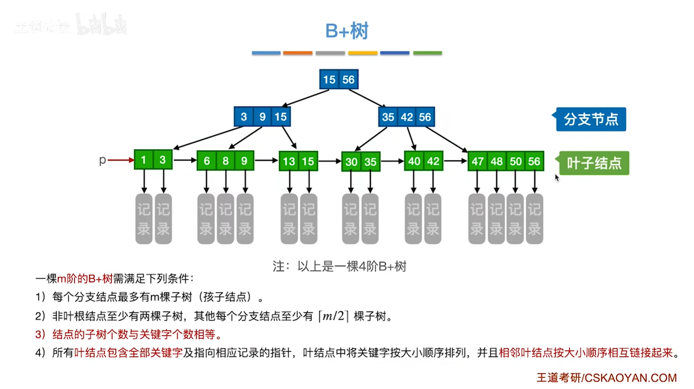

### 与B树异同

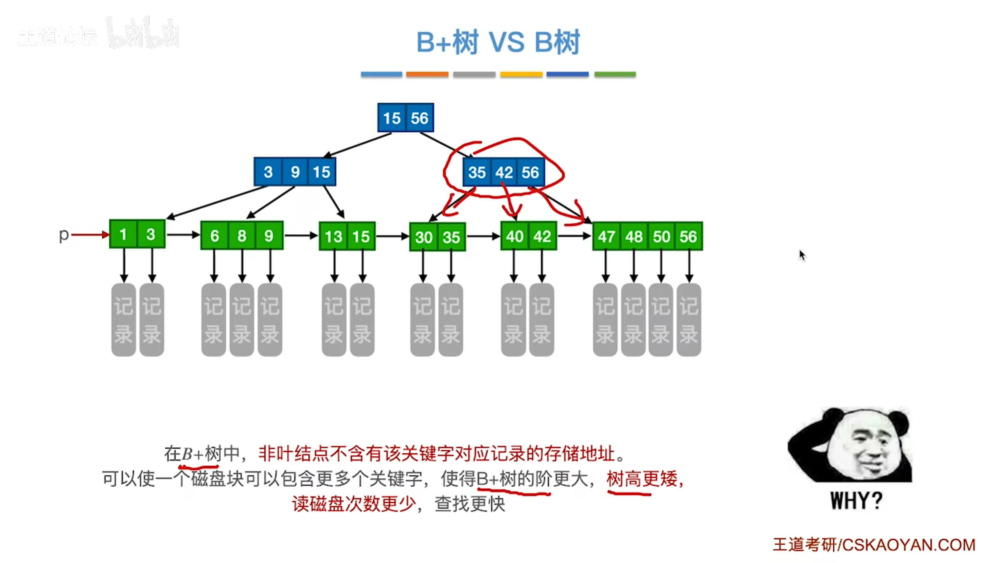

## 散列表

### 概念

### 函数

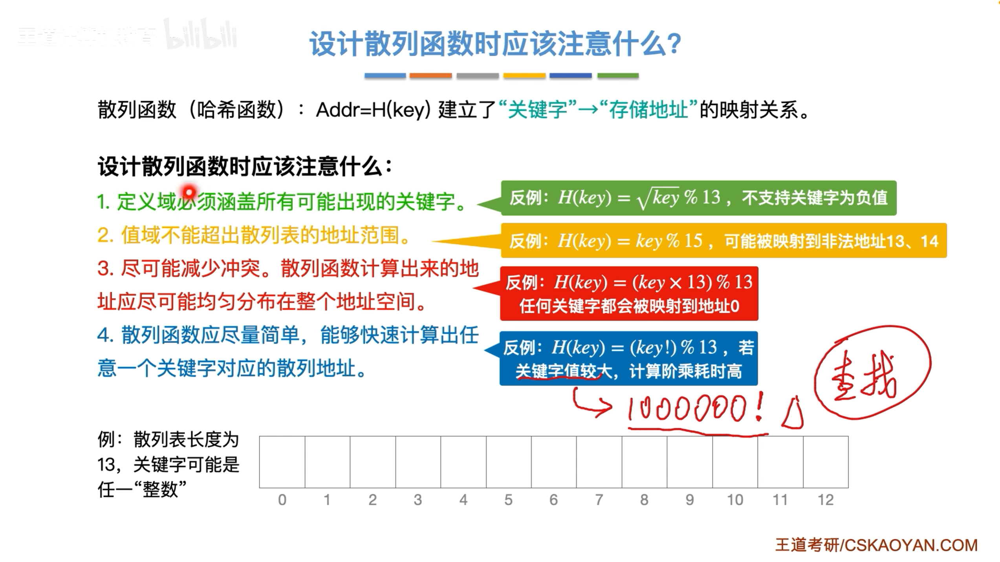

#### 直接定址法

#### 除留余数法

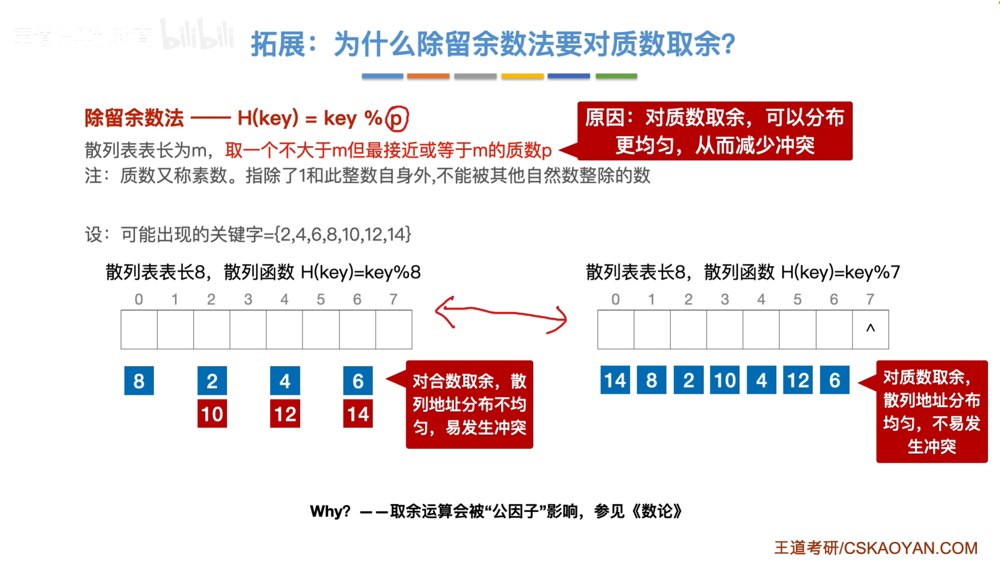

#### 数字分析法

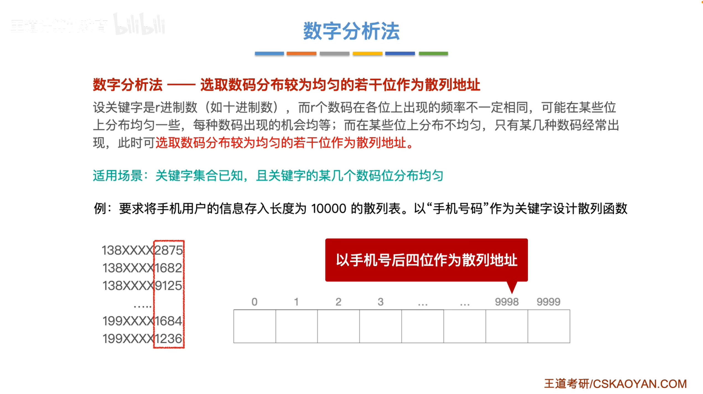

#### 平方取中法

### 处理冲突

#### 开放地址法

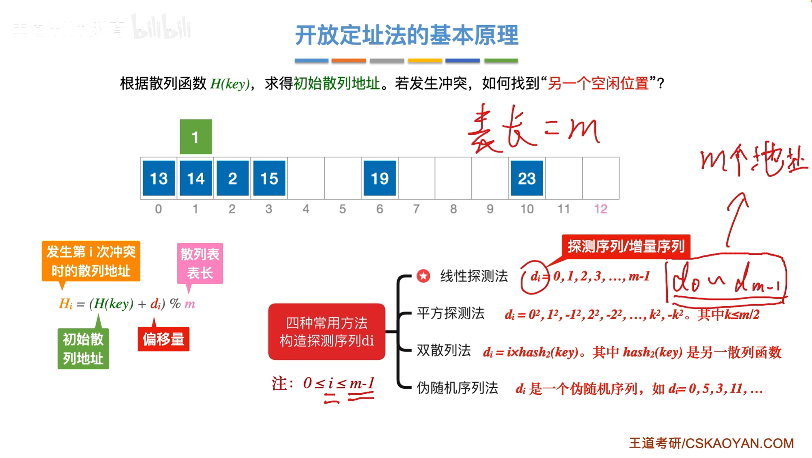

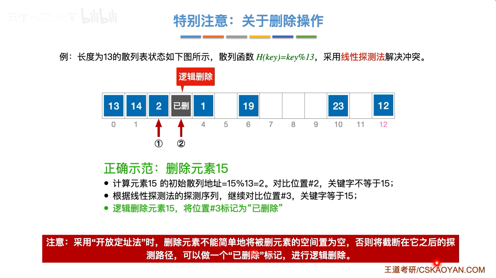

> 插入时遇到逻辑删除的位置，可以将数据加入这个位置中

#### 拉链法

### 散列查找的性能分析

> ASL
>
> 散列表的装填因子 $\alpha = \frac{\text{表中记录数 n }}{\text{散列表长度  m }}$ 
>
> 平均查找长度依赖于散列表的装填因子 $\alpha$

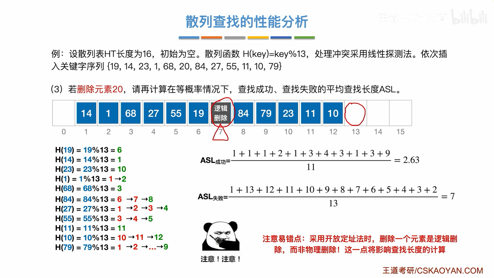

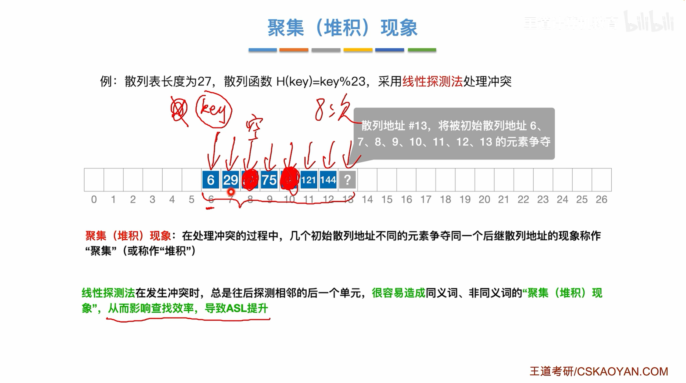

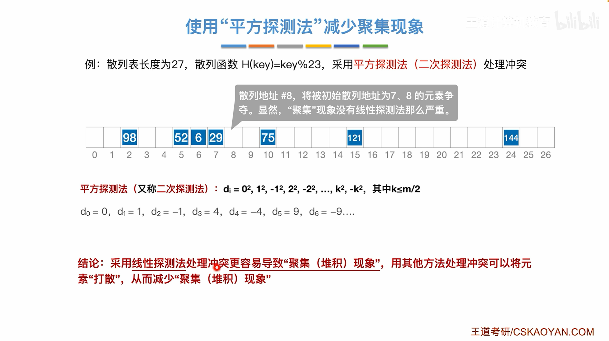

