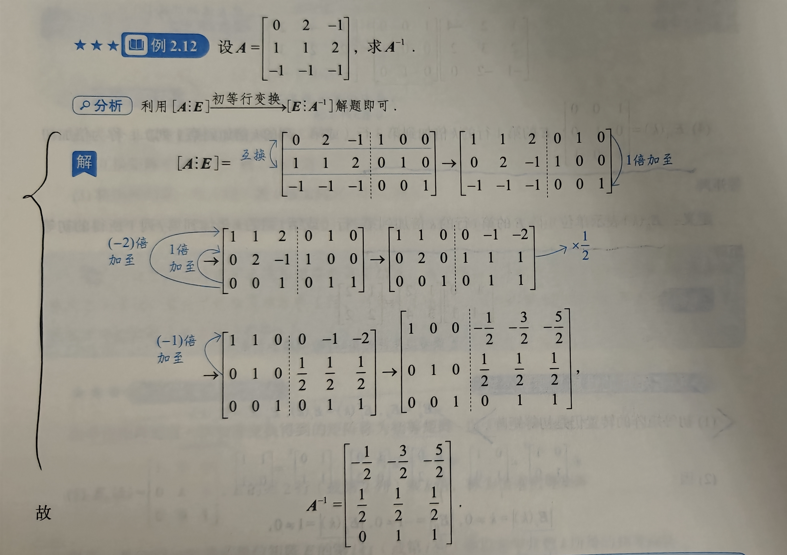
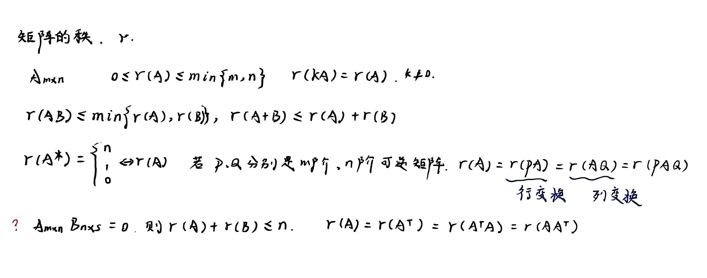

# 线性代数

> 正常情况下数学还是多写，多练就够了，但是线性代数真忘了好多，基本概念都忘了。

## 行列式

暂时会记录一些

### 概念、性质

> 线性相关

> 矩阵与行列式    []    &  | |

> 转置矩阵

> $kA$  与  $k|A|$   的区别， 既然  $k|A| = k|A'|$ ，  那么某一行或者一列全为 0 时，将 $k$ 看作为 0 

> 有两行或者列成倍数的话，说明至少有两个向量在相同维度，就降维了，高维体积就为 0 了

> 只有一行 、 或者一列不同的情况下  $|A + B| = |A| + |B|$， 多行或者多列不同时就不一定了， 可用余子式证明

> 逆序、逆序数、用法

> 余子式、代数余子式

> 对角、三角行列式   

### 拉普拉斯展开式

$\begin{vmatrix} A & 0 \\ 0 & B \\ \end{vmatrix} = |A| \times |B|$

$A$ 为 $m$ 阶， $B$ 为 $n$ 阶

$\begin{vmatrix} 0 & A \\ B & C \\ \end{vmatrix} = (-1)^{mn} \times |A| \times |B|$

### 范德蒙德行列式

$\begin{vmatrix} 1 & x_1 & \dots & x_1^{n-1}  \\ 1 & x_2 & \dots & x_2^{n-1}\\ \dots & \dots & \dots & \dots\\ 1 & x_n & \dots & x_n^{n-1} \end{vmatrix} = \displaystyle\prod_{1 \le i < j \le n} (x_j - x_i)$

> 交换行列式的任意两行或者任意两列

！ 这个之后证明一下

> 克拉默法则

## 矩阵

### 矩阵的基本运算

### 逆矩阵

> 1. 什么样的矩阵才能有逆矩阵？矩阵的逆存在的充要条件、
> 2. 如何证明矩阵可逆
>     1.  $A_{n \times n}, \text{存在} $
>     2. $A = $ 多个可逆矩阵的乘积

### 伴随矩阵

### 初等变换

### 初等矩阵

### 行阶梯形矩阵与行最简阶梯形矩阵

### 对角矩阵

> 需要每一个对角上的矩阵都可逆了

$A = \begin{bmatrix}
A_1 \\ & A_2 \\ &&  \ddots \\&&& A_s
\end{bmatrix}$   则  $A^{-1} = \begin{bmatrix}
A_1^{-1} \\ & A_2^{-1} \\
  && \ddots & \\ &&& A_s^{-1}
\end{bmatrix}$

$\because$

$ A \times A^{-1} = \begin{bmatrix}
I_1 \\
  & I_2 \\
  && \ddots \\ &&& I_s
\end{bmatrix}$

---

若 $B = \begin{bmatrix}
&&&B_1 \\
  && B_2 \\
  & \vdots \\
  B_s
\end{bmatrix} $   则  $B^{-1} = \begin{bmatrix}
&&&B_s^{-1} \\&& B_2^{-1} \\
  & \vdots \\ B_1^{-1} \\
\end{bmatrix}$

$\because$

$ B \times B^{-1} = \begin{bmatrix}
I_1^{-1} \\& I_2^{-1} \\
  && \ddots \\&&& I_s^{-1}
\end{bmatrix}$

> 简单直接相乘就能证明了
>
> 
>
>
> $A_1=\begin{bmatrix} B & D \\ O & C \end{bmatrix}^{-1} = \begin{bmatrix} B^{-1} & -B^{-1}DC^{-1} \\ O & C^{-1} \end{bmatrix}  $
>
> 同理这个的计算方法

### 矩阵方程

> $AX = B$， $XA = B$， $AXB = C$  等

### 公式

$A^* = |A| \times A^{-1}$、 $|A^*| = |A|^{n-1}$

$(A^*)^{-1} = (A^{-1})^* $、 $(A^*)^{T} = (A^{T})^*$

$ (A^*)^* = |A|^{n-2} \times A$、 $(A \times B)^* = B^* \times A^*$、 $(kA)^* = k^{n - 1}A^*$

### 等价矩阵和矩阵的标准型

> $A_{m \times n}$  、 $B_{m \times n}$  ，若存在可逆矩阵  $P_{m \times m}$ ，$Q_{n \times n}$  使得 $PAQ = B$   ， AB是等价矩阵，  $A$

| 关系类型 |  符号   |  定义条件  |
| :------: | :-----: | :--------: |
|   等价   | $A \sim B$ |   $B=PAQ$  |
|   相似   | $A \sim B$ | $B=P^{−1}AP$ |
|   合同   | $A \cong B$ | $B=P^TAP$ |

$\color {fuchsia} {标准型}$      $PAQ = B = \begin{bmatrix} E_r & 0\\  0 & 0 \end{bmatrix}$    若 $r(A) = r$

### 矩阵的秩

## 向量组

### 向量与向量组的线性相关性

### 极大线性无关组与向量组的秩

### 等价向量组

### 向量空间

## 线性方程组

## 特征值与特征向量

## 二次型

