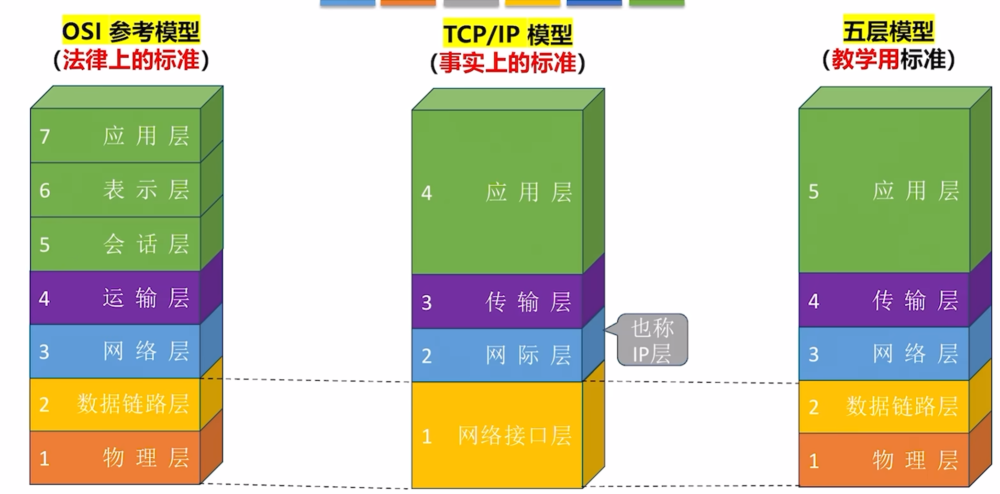

# 第一章  计算机网络体系结构

## 1.1 计算机网路概述

## 1.2 网络体系结构与参考模型

### 概念

- 实体
- 协议
- 接口
- 服务
- 

# 第二章 物理层

## 2.1 通信基础

### 2.1.1 基本概念

- 数据、信号、码元
- 信源、信道、信宿
- 速率、波特、带宽

### 2.1.2 信道的极限容量

- 奈氏准则
- 香农定理

### 2.1.3 编码与调制

## 2.2 传输介质

### 双绞线

### 同轴电缆

### 光纤

### 无线传输介质

### 物理接口的特性

## 2.3 物理层设备

### 2.3.1 中继器

### 2.3.2 集线器

# 第三章 数据链路层

# 第四章 网络层

# 第五章 传输层

# 第六章 应用层

