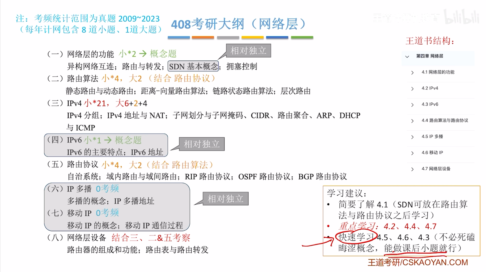

## 4.1网络层的功能

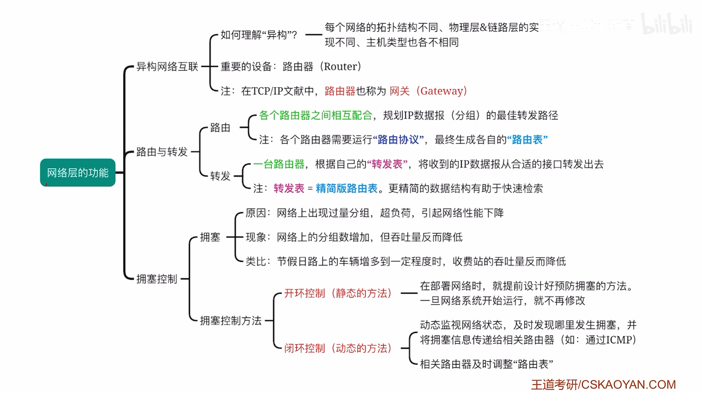

## 4.2IPv4

### 分组

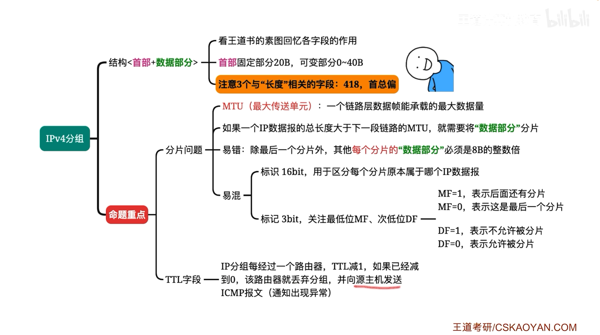

### 路由

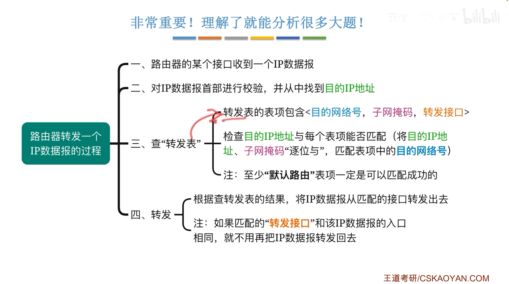

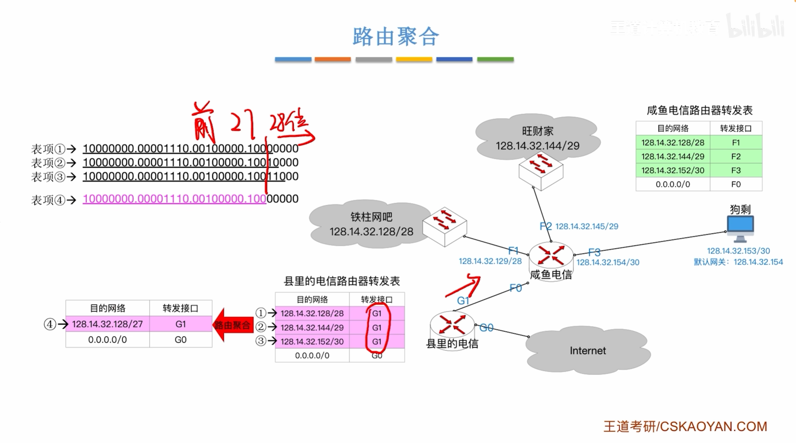

### CDIR

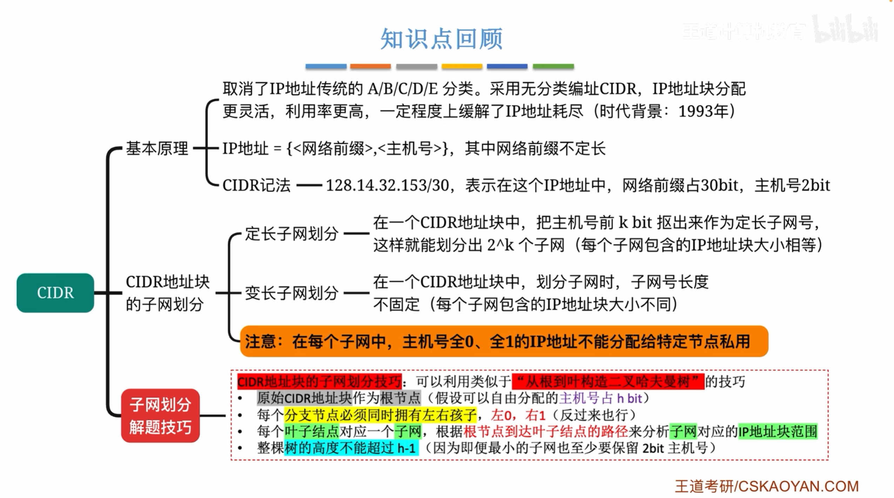

> 变长子网划分

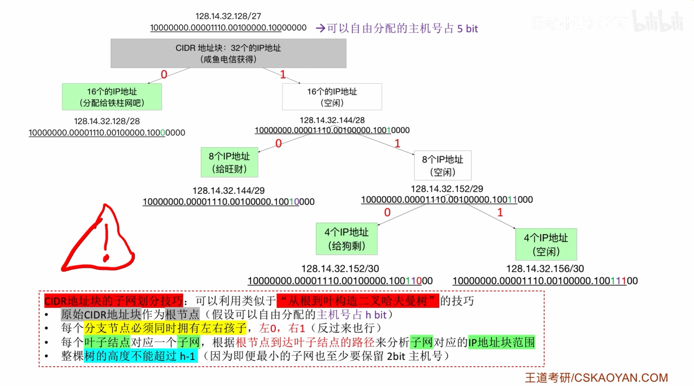

### NAT

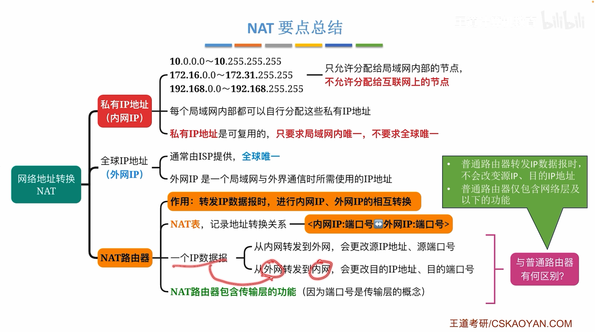

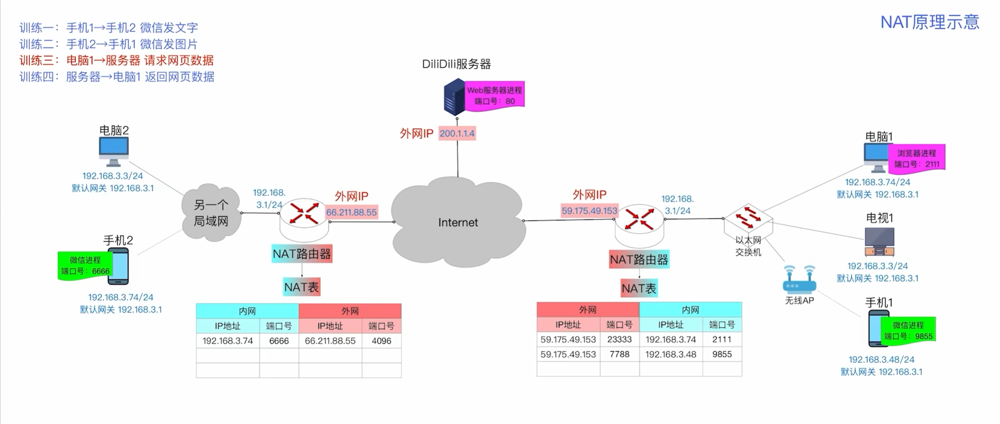

### ARP

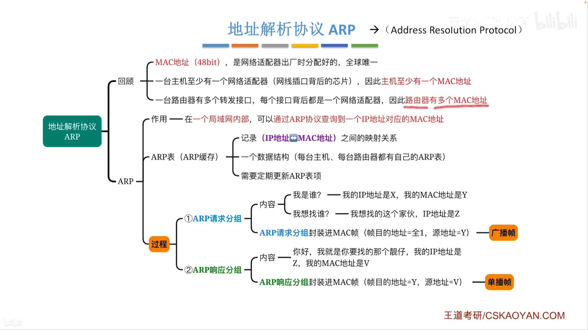

### DHCP

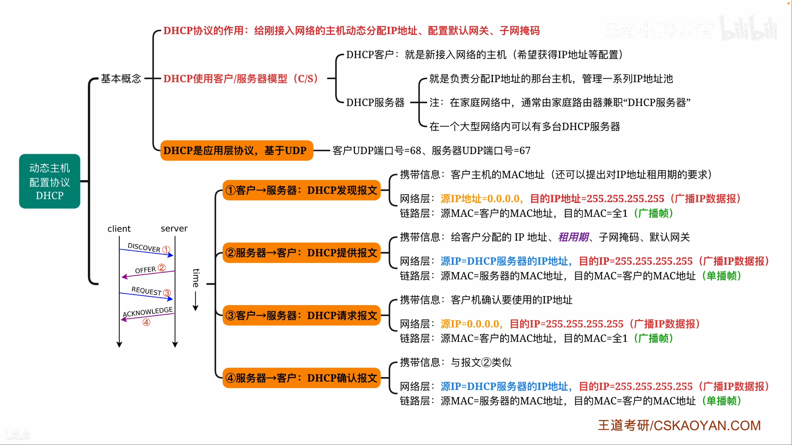

> 例子

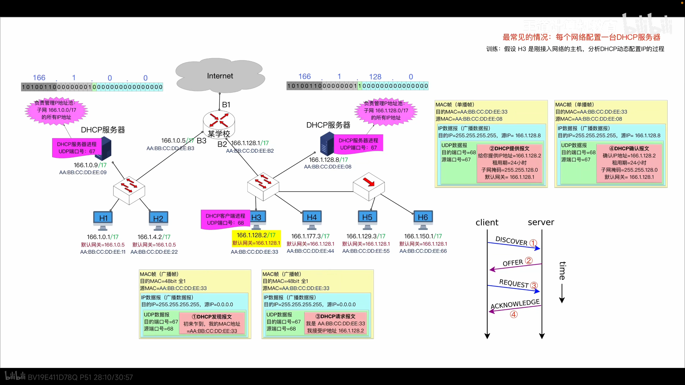

## 路由协议与算法

### RIP

> 例子

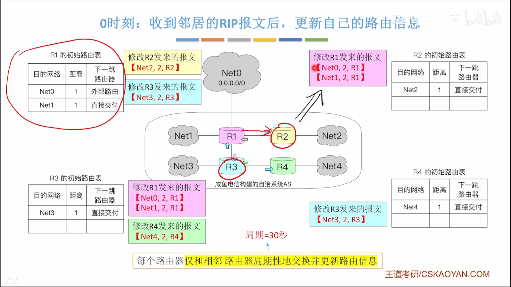

> Bell-man 算法

### OSPF

> 特点

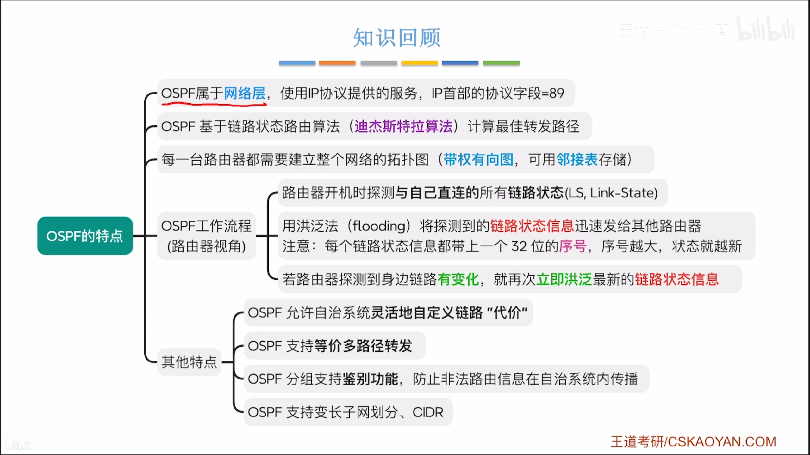

> 工作原理

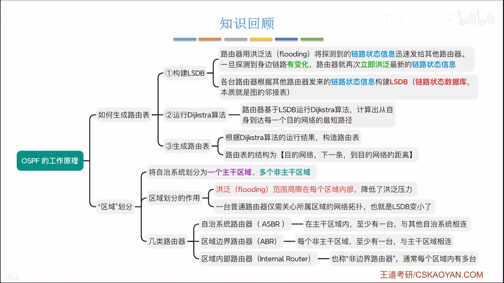

> 分组类型

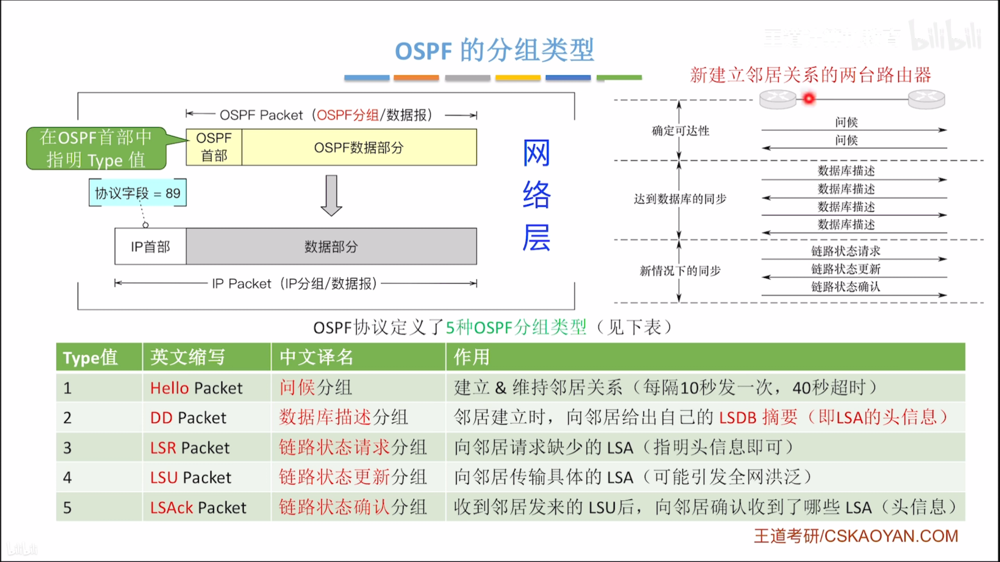
