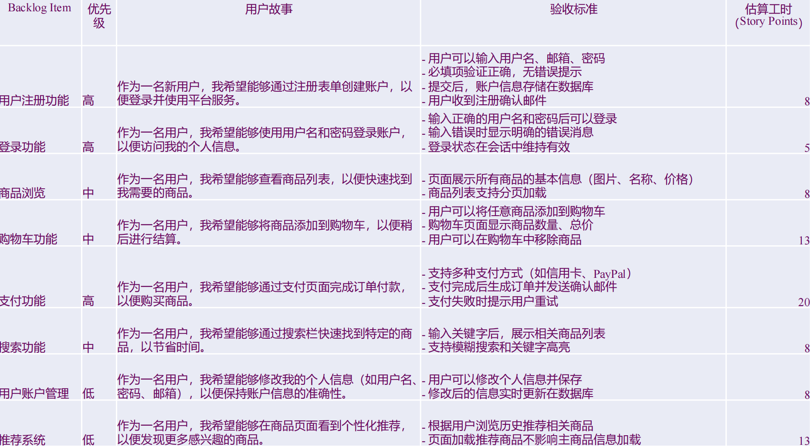
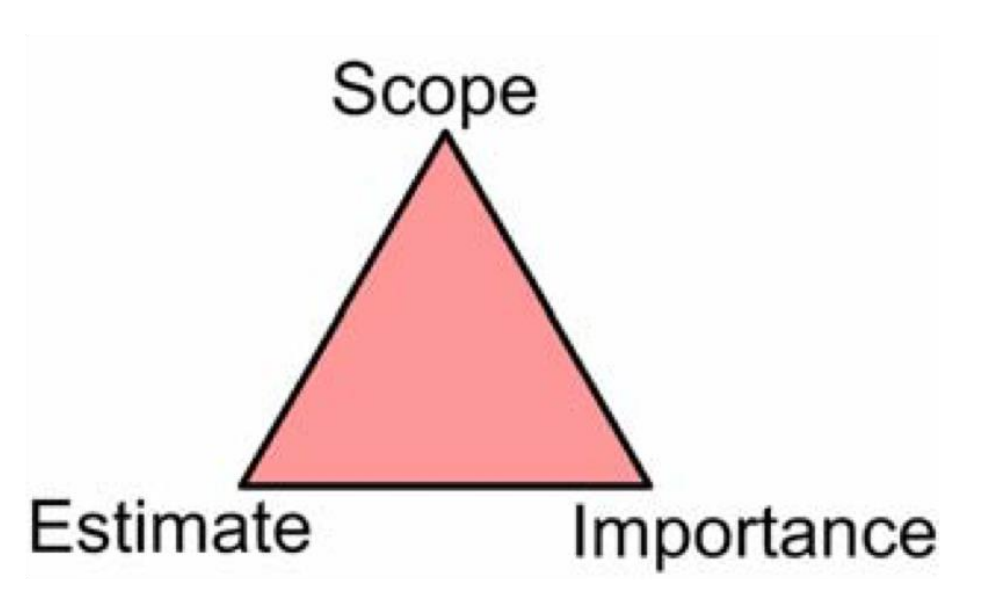
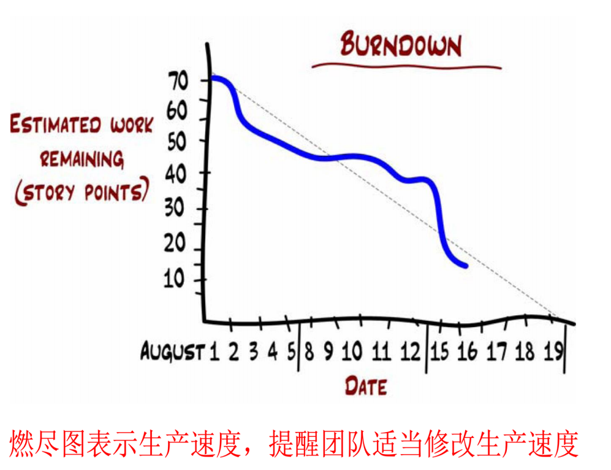

## Scrum

### 1.结构

### 2.    “33355”

- 三大支柱：

> 透明：过程与工作成果对团队和利益相关者可见
>
> 检视：定期审查进展，识别偏差（通过5大事件实现
>
> 适应：根据检视结果进行调整、优化过程和产品方向

- 五个价值：

> 承诺
>
> 专注
>
> 开放
>
> 尊重
>
> 勇气

- 三个角色：

> PO：负责最大化产品价值和开发团队的工作价值，管理产品Backlog
>
>  Scrum Master:按照Scrum 指南的规则建立Scrum ，服务Scrum Team、PO、组织;确保框架实施，移除障碍
>
> 开发人员:跨职能开发，交付可用增量

- 三个工件：

> 产品Backlog、Sprint Backlog、增量

- 五个事件

> Sprint :固定周期（≤1个月），不可变更目标与质
>
> Sprint 每日计划
>
> 每日Scrum 会议:  15分钟每日站会，调整当日计划
>
> Sprint 评审会议:  展示增量，调整Backlog
>
> Sprint 回顾会议:  改进流程与效能

### 3.需求——用户故事模板

> 作为 < >			——用户画像
>
> 我想 < >			——预期功能
>
> 从而 < >			——为什么用户想要这个功能

### 4.Ron Jeffries 的 3C 原则

> 卡片：在一堆卡片上写下期望的软件特性
>
> 交谈：聚在一起对要开发的软件进行深入讨论
>
> 确认：对完工条件进行确认

- DOD （完成的定义）   ——Definition of Done
- BDD    (行为驱动开发)  ——Behavior-Driven Development
    - 核心思想是通过定义软件的行为来驱动开发过程
    - 重点是增强团队对需求的理解，并确保开发的软件满足业务目标
    - 强调在开发开始之前，用自然语言描述软件应如何行为

### 5. 用户故事 INVEST原则

> 独立性
>
> 可协商性
>
> 有价值
>
> 可以估算性
>
> 短小
>
> 可测试性
>
> 每个用户故事都有应该像标准的快递箱——独立封装、地址清晰、体积适中、明确、可追踪、允许改派等

### 6. 用户故事SMART原则

> S——Specific(具体)
>
> M——Measurable(可衡量)：用户故事的结果必须能用明确的指标或验收标准验证
>
> A——Achievable(可实现)
>
> R——Relevant(相关性)：用户故事与当前项目或者用户需求相关
>
> T——Time-bound(有时限)：明确截至时间或者优先级

### 7.产品Backlog

- 产品 Backlog 是Scrum 的核心，按照重要性排序的需求或者故事的分列表

### 8.Product Backlog（动态需求池）

> 是一份涌现的和有序的清单，它列出了改进产品所需的内容。它是 Scrum Team 所承担工作的唯一来源。

### 9.用户故事地图

### 10.Sprint

- 是 Scrum 的核心，在这里创意（idea）转化为价值。
- 固定时长的事件，为期一个月或更短，以保持一致性。前一个 Sprint 结束后，下一个新的Sprint 紧接着立即开始
    - 时间短：“敏捷”，短反馈周期=频繁交付=频繁客户反馈=错误方向=持续时间短=学习改进速度快
    - 时间长：更多时间作充分准备、解决问题、达成目标，不会被接二连三的会议压的不堪重负
    - 当前，Scrum 周期通常为2个星期
- Sprint计划会议目标

> sprint目标、团队成员名单、Sprint backlog、确定好sprint演示日期、确定好时间地点,供举行每日scrum会议

### 11.估算

> 据收益递减原理，不应在估算上花太多的时间。可以做出一个快速但不那么准确的估计，也可以再多花一点时间做一个更准确的估计

#### 估算单位(story point)

- 计划扑克
- 卡片队列估算法

#### 故事与任务

Story是可以交付的东西，Task是不可以交付的，Product Owner对Task不关心

| **Scrum工件**   | **定义**                          | **对应的承诺**                 |
| --------------- | --------------------------------- | ------------------------------ |
| Product Backlog | 产品需求动态清单                  | Product Goal（产品愿景）       |
| Sprint Backlog  | Sprint任务计划（目标+选定的条目） | Sprint Goal（迭代目标）        |
| Increment       | 符合完成标准的可交付成果          | Definition of Done（完成标准） |

### 12.燃尽图

### 13.Scrum 优势与局限

> 轻量灵活：仅定义必要规则，兼容多种实践
>
> 持续改进：通过事件循环实现经验反馈
>
> 价值驱动：以Product Goal为导向，确保交付有效性
>
> 协作透明：跨角色协作，信息共享最大化

> 没有技术实践
>
> 可以使用极限编程技术实践：测试驱动开发、简单设计、重构、持续集成等等

## XP

> Extreme Programming  这一名称体现了其核心理念：把有益的实践做到极致

## Kanban

## DevOps

## 敏捷

