## Scrum

### 1.结构

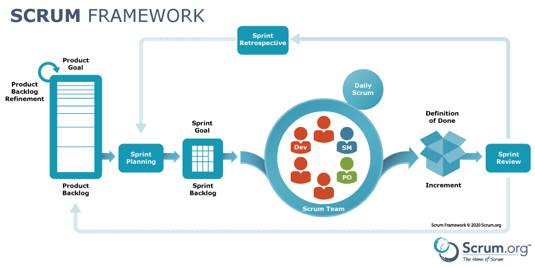

### 2.    “33355”

- 三大支柱：

> 透明：过程与工作成果对团队和利益相关者可见
>
> 检视：定期审查进展，识别偏差（通过5大事件实现
>
> 适应：根据检视结果进行调整、优化过程和产品方向

- 五个价值：

> 承诺
>
> 专注
>
> 开放
>
> 尊重
>
> 勇气

- 三个角色：

> PO：负责最大化产品价值和开发团队的工作价值，管理产品Backlog
>
> Scrum Master:按照Scrum 指南的规则建立Scrum ，服务Scrum Team、PO、组织;确保框架实施，移除障碍
>
> 开发人员:跨职能开发，交付可用增量

- 三个工件：

> 产品Backlog、Sprint Backlog、增量

- 五个事件

> Sprint :固定周期（≤1个月），不可变更目标与质
>
> Sprint 每日计划
>
> 每日Scrum 会议:  15分钟每日站会，调整当日计划
>
> Sprint 评审会议:  展示增量，调整Backlog
>
> Sprint 回顾会议:  改进流程与效能

### 3.需求——用户故事模板

> 作为 < >			——用户画像
>
> 我想 < >			——预期功能
>
> 从而 < >			——为什么用户想要这个功能

### 4.Ron Jeffries 的 3C 原则

> 卡片：在一堆卡片上写下期望的软件特性
>
> 交谈：聚在一起对要开发的软件进行深入讨论
>
> 确认：对完工条件进行确认

- DOD （完成的定义）   ——Definition of Done
- BDD    (行为驱动开发)  ——Behavior-Driven Development
  - 核心思想是通过定义软件的行为来驱动开发过程
  - 重点是增强团队对需求的理解，并确保开发的软件满足业务目标
  - 强调在开发开始之前，用自然语言描述软件应如何行为

### 5. 用户故事 INVEST原则

> 独立性
>
> 可协商性
>
> 有价值
>
> 可以估算性
>
> 短小
>
> 可测试性
>
> 每个用户故事都有应该像标准的快递箱——独立封装、地址清晰、体积适中、明确、可追踪、允许改派等

### 6. 用户故事SMART原则

> S——Specific(具体)
>
> M——Measurable(可衡量)：用户故事的结果必须能用明确的指标或验收标准验证
>
> A——Achievable(可实现)
>
> R——Relevant(相关性)：用户故事与当前项目或者用户需求相关
>
> T——Time-bound(有时限)：明确截至时间或者优先级

### 7.产品Backlog

- 产品 Backlog 是Scrum 的核心，按照重要性排序的需求或者故事的分列表

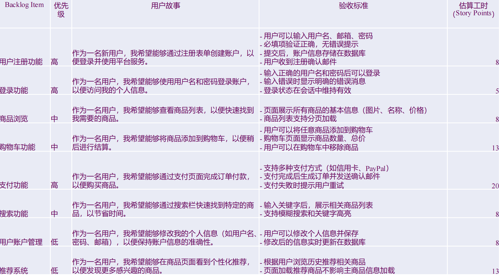

### 8.Product Backlog（动态需求池）

> 是一份涌现的和有序的清单，它列出了改进产品所需的内容。它是 Scrum Team 所承担工作的唯一来源。

### 9.用户故事地图

### 10.Sprint

- 是 Scrum 的核心，在这里创意（idea）转化为价值。
- 固定时长的事件，为期一个月或更短，以保持一致性。前一个 Sprint 结束后，下一个新的Sprint 紧接着立即开始
  - 时间短：“敏捷”，短反馈周期=频繁交付=频繁客户反馈=错误方向=持续时间短=学习改进速度快
  - 时间长：更多时间作充分准备、解决问题、达成目标，不会被接二连三的会议压的不堪重负
  - 当前，Scrum 周期通常为2个星期
- Sprint计划会议目标

> sprint目标、团队成员名单、Sprint backlog、确定好sprint演示日期、确定好时间地点,供举行每日scrum会议

### 11.估算

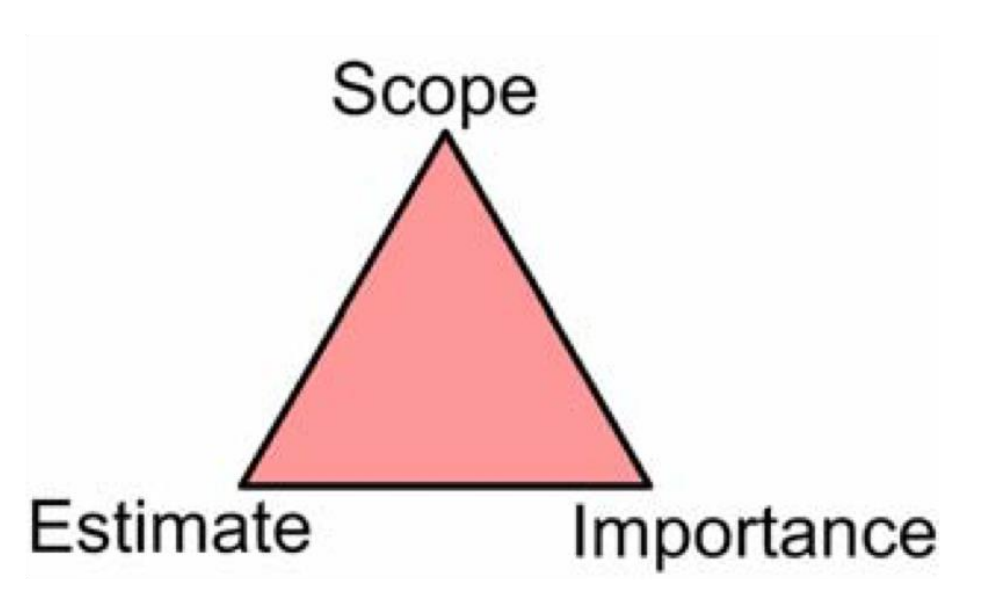

> 据收益递减原理，不应在估算上花太多的时间。可以做出一个快速但不那么准确的估计，也可以再多花一点时间做一个更准确的估计

#### 估算单位(story point)

- 计划扑克
- 卡片队列估算法

#### 故事与任务

Story是可以交付的东西，Task是不可以交付的，Product Owner对Task不关心

| **Scrum工件** | **定义**                    | **对应的承诺**           |
| ------------------- | --------------------------------- | ------------------------------ |
| Product Backlog     | 产品需求动态清单                  | Product Goal（产品愿景）       |
| Sprint Backlog      | Sprint任务计划（目标+选定的条目） | Sprint Goal（迭代目标）        |
| Increment           | 符合完成标准的可交付成果          | Definition of Done（完成标准） |

### 12.燃尽图

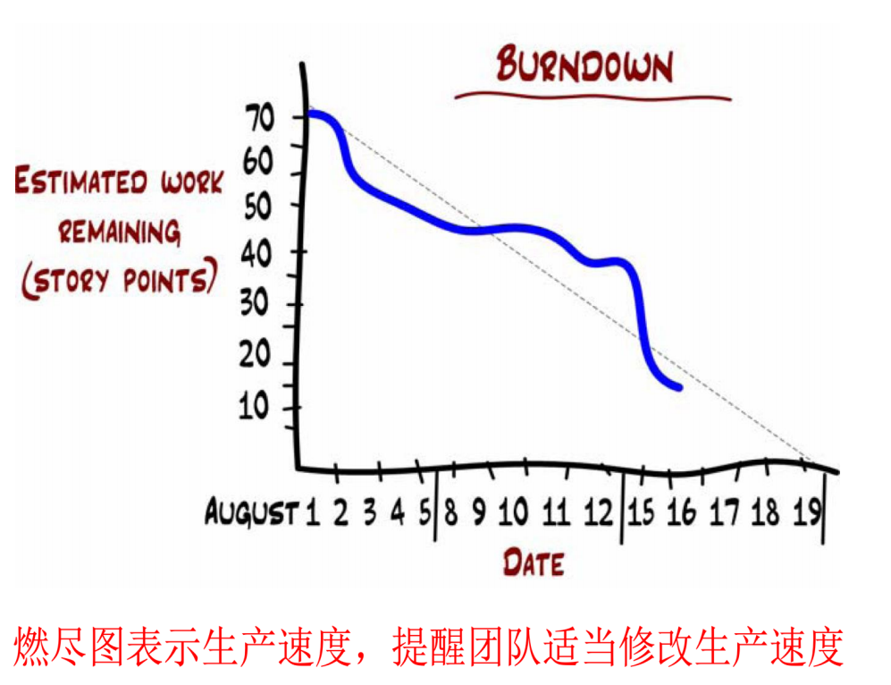

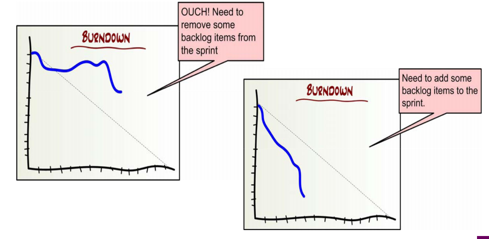

### 13.Scrum 优势与局限

> 轻量灵活：仅定义必要规则，兼容多种实践
>
> 持续改进：通过事件循环实现经验反馈
>
> 价值驱动：以Product Goal为导向，确保交付有效性
>
> 协作透明：跨角色协作，信息共享最大化

> 没有技术实践
>
> 可以使用极限编程技术实践：测试驱动开发、简单设计、重构、持续集成等等

## XP

> Extreme Programming  这一名称体现了其核心理念：把有益的实践做到极致

### 1.XP的核心——开发阶段

> 编写代码、运行所有测试用例、迭代测试用例和代码、如果需要，进行重构、集成（包括测试）

**说明**：

- 结对编程
- 测试驱动
- 让测试用例运行起来、为系统的分析、设计、实现和测试增加价值
- 开发后立即进行集成，包括集成测试

### 2.变更成本曲线

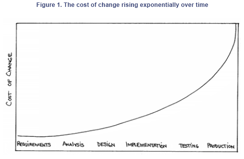

**降低变更成本的技术**

- OOP
- 自动化测试
- 重构技术
- CICD：鼓励频繁交付和持续部署
- Beck的曲线并非无视规律，只是把反馈周期从几个月缩短到几分钟，结果就没有机会让成本成指数增长
- 平坦曲线的前提是严格执行XP实践

**目标**

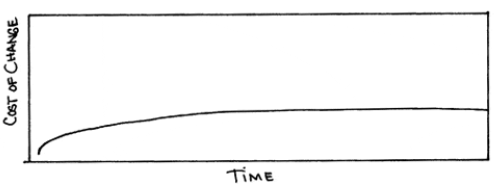

### 3.价值观

#### 交流

> 开发者  –  开发者
>
> 开发者 – 客户
>
> 开发则 – 管理层

XP强制要求的沟通方式

> 单元测试、结对编程、任务估算

#### 简单

#### 反馈

- 即使反馈
  - 程序员：单元测试
  - 客户：实时估算
  - 团队：进度跟踪反馈
- 中长期反馈
  - 客户：功能测试
  - 运行软件测试

#### 勇气

以前三个价值观支持

### 4.软件开发的基本内容

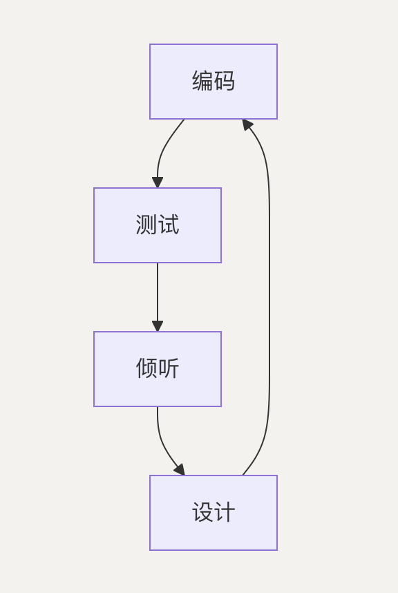

#### 测试

- 长期来看：测试被运行和维护的前提，让程序运行寿命更长
- 短期来看：信心
- 类型
  - 单元测试
  - 客户编写的功能测试？？？？

#### 倾听

> 程序员与业务人员交流、相互之间
>
> 业务人员说明项目的需求、程序员帮助业务人员了解哪些容易、哪些困难

#### 设计

> 低耦合：良好的设计会组织逻辑，以便系统的一部分发生变化并不总是需要系统的另一部分发生变化。
>
> 封装：良好的设计将逻辑放在它所操作的数据附近。
>
> 可扩展性：良好的设计允许系统扩展，且仅在一个地方进行更改。

### 5.基本实践

#### 5.1 计划游戏

> 业务人员需要决定：范围、优先级、发布的组成、发布日期

> 技术人员需要决定：估算、后果、流程、详细的日程安排

#### 5.2 小发布

> 每次发布都应尽可能小，包含最有价值的业务需求。发布必须作为一个整体有意义。

#### 5.3 隐喻

> 选择一个系统隐喻，通过一致地命名类和方法让团队保持同步
>
> 例如，克莱斯勒薪资系统被构建为一条生产线。

#### 5.4 简单设计

> 运行测试、确保没有重复的逻辑、具有尽可能少的类和方法。反对：“为今天实现，为明天设计。”

#### 5.5 测试TDD

> 程序员编写单元测试——以便他们对程序运行的信心能够成为程序本身的一部分。

> 客户编写功能测试——以便他们对程序运行的信心也能成为程序的一部分。

#### 5.6 重构 Refactoring

#### 5.7 结对编程

#### 5.8 代码集体拥有制

> 任何人若发现有机会为代码的任何部分增加价值，都应随时这么做。
>
> 个人代码所有权模式。

#### 5.9 CI

#### 5.10 40小时工作制

#### 5.11 现场客户

#### 5.12 编码标准

> 程序员极具个人主义，宁愿辞职也不愿把花括号放在别的地方。

#### XP做法可行性

### 6.TDD

**测试**

> 1. 测试是独立且自动的
> 2. 测试应当有价值

#### 6.1 程序员测试

> 程序员逐个方法地编写测试。
>
> 程序员编写的单元测试始终以 100% 的通过率运行。
>
> 由于程序员控制着单元测试的编写和执行，他们能够使测试完全保持同步。

#### 6.2 客户测试

> 客户逐个故事地编写测试。
>
> 客户通常无法自行编写功能测试。极限编程（XP）团队至少要有一名专职测试人员。

#### 6.3 其他测试

> 并行测试：新系统的运行与旧系统完全一致
>
> 压力测试：模拟可能出现的最恶劣负载情况的测试
>
> 随机测试：确保系统自面对无意义输入时能合理响应的测试

#### 6.4 TDD

**先写测试再写实现**

> 三阶段循环： 红（失败测试） –>  绿（通过实现） –>  重构（优化代码）

**目标**：创建可测试、可维护、最小化的代码

**标准流程**

> 1. 编写失败测试
> 2. 快速实现通过
> 3. 逐步泛化
> 4. 持续重构

**核心价值**

> 缺陷预防、设计引导、降低耦合、活的文档

### 7. 简单设计的四大准则

> 通过所有测试、消除重复、清晰表达意图、最小化元素数量

**YAGNI**原则的经济学

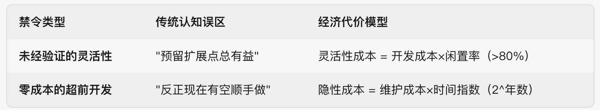

**边际成本陷阱**

> 假设开发某功能的当前成本为 $C $
>
> 若提前$N$个周期开发： 总成本 = $ C × (1 + 维护率)^N $
>
> 而实际需求出现时的成本可能仅为$C×0.7$（技术演进）

**重构的纪律性**

> 技术 ： 提升可读性、降低维护成本、支持演化式设计

> 工具 ： IDE自动化重构、测试框架、代码质量扫描

- 重构不是推到重写，而是让代码随时间越变越优雅的持续艺术

#### XP设计

> 降低流程中的不可逆性来应对复杂性
>
> 持续保持代码清晰简洁的渴望
>
> 通过重构自信改进代码的能力
>
> 精通模式：不仅理解解决方案，更懂应用时机与演进路径
>
> 预见变化的眼光：知晓今日决策终将改变
>
> 运用代码、图表及最重要的——对话，向相关人员传达设计

### 8.持续集成

> 持续集成 (Continuous Integration, CI) 是一种软件开发实践，团队成员频繁地（通常每天至少一次）将代码更改集成到共享的代码库主线中。

#### 8.1 传统集成的特点

- 一个开发者可能对代码库的某个部分做了修改，而另一个开发者基于旧版本的代码进行了开发。
- 当这些更改最终汇合时，可能会出现微妙且难以调试的错误。
- 开发者：导致尽量减少与其他部分的交互，但这往往会导致技术债的积累和代码质量的下降。
- 代码质量和重构
  - 开发者可能会避免进行重要的代码重构
  - 意识到代码结构存在问题，或者需要清理重复代码，他们也可能因为担心引入集成冲突而选择维持现状
  - 重构的回避，阻止了代码库根据需求变化和经验积累进行健康的演进

#### 8.2 CI 的解决方案

> 核心理念：持续集成旨在消除传统集成的痛苦
>
> 核心思想：让团队成员非常频繁地集成他们的工作，通常是每天多次
>
> 每次集成涉及的代码量都相对较小，从而显著降低了合并冲突的可能性和复杂性
>
> 快速反馈：任何集成引入的问题都能够被自动化构建和测试快速发现
>
> CI 鼓励使用主线开发

#### 8.3 CI 实践示例

- 获取最新代码： 确保本地环境与中央仓库同步是 CI 的基本前提
- 本地构建与开发：本地环境中运行完整的自动化构建脚本，包括编译代码和运行所有的自动化测试
- 集成前检查：推送（Push）之前，必须再次执行 git pull， 将这些最新的更改合并（Merge）到本地工作副本中，合并后我必须再次在本地运行完整的自动化构建。
- 本地构建通过与推送

#### 8.4 持续集成的好处

- 降低风险

> 减少集成风险、快速发现错误、更容易定位错误、减少集成地狱

- 促进改进与发布

> 鼓励并支持重构、提高代码质量、更频繁可靠的发布、发布成为业务决策

#### CI & CD(Continuous Deployment)

> CI 主要发生在开发环境中、CD是CI的自然延伸，CI是实现CD 的必要前提。

## Kanban

### 定义

> Kanban 是⼀种优化价值流动 (the flow of value) 的策略，其过程使⽤可视化与拉 式系统
>
> Kanban 包括以下三个协同⼯作的实践：
>
> - 定义与可视化⼯作流
> - 主动管理⼯作流中的⼯作项 (item)
> - 改进⼯作流

> Kanban已被普遍视为与Scrum、XP等并列的重要敏捷实践框架
>
> 运维、持续交付等场景倾向用Kanban；新产品开发常用Scrum

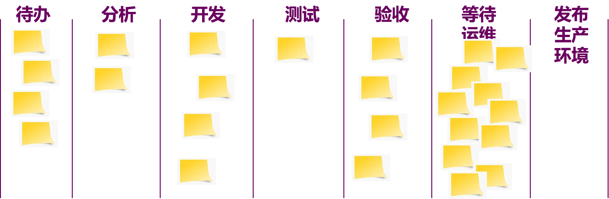

### 可视化工作流

> Kanban 系统成员对于流 的明确且共同的认知，就称为 “⼯作流的定义” (Definition of Workflow，DoW)

### WIP

> Kanban 系统成员须明确地控制在⼯作流中从开始到结束间的⼯作项数量。这种控制称为 “WIP 数量限制”

> 控制 WIP 不仅能够有助于⼯作流，也能够改进 Kanban 系统成员共同的专注、承诺及协作。任何在控制 WIP 时可接受的例外情况都应该作为 DoW 的⼀部分予以 明确说明。

### Kanban 度量

- WIP：已开始但未完成的⼯作项的数量。
- 产能 (Throughput)：每单位时间内完成的⼯作项的数量。 请注意，产能的 度量是对⼯作项的精确计数。
- ⼯作项存续时⻓ (Work Item Age)：⼀⼯作项从开始到当前时刻之间所经过 的时间⻓度。
- 周期时间 (Cycle time)：⼀⼯作项从开始到完成之间所经过的时间⻓度。

### Kanban & Scrum

#### 差异

1. 框架本质与节奏：

- Scrum: 迭代式 (Iterative)。工作被划分为固定时长（通常2-4周）的**Sprint（冲刺）**。每个Sprint开始时计划需要完成的工作（增量），并在Sprint结束时交付。强制固定节奏（如每日站会、Sprint评审、回顾等）。**优点：** 节奏明确，提供计划性和稳定性，适合有明确交付目标的项目。**限制：** Sprint中**通常拒绝范围变更**。
- Kanban: 流动式 (Flow-based)。没有固定的迭代周期或时间盒限制。工作项从“待办”队列中**持续流动**，完成后拉取下一个高优先级的项。实现**连续交付**。**优点：** 对需求变更反应**极其灵活**，新任务可随时加入队列。**注意：** 团队需**自行建立**回顾、优化等节奏。

2. 角色与职责：

- Scrum:规定三个明确角色：
  - **产品负责人 (PO):** 最大化产品价值，管理产品待办列表。
  - **Scrum Master (SM):** 确保团队遵循Scrum流程，移除障碍。
  - **开发团队：** 跨职能、自组织，负责交付Sprint目标内的增量。**优点：** 职责分工清晰。
- Kanban:不指定强制角色。通常保留团队现有组织架构，成员根据职责各司其职（如服务交付经理、服务请求经理等角色是可选项，**非强制**）。**优点：** **灵活性高**，鼓励团队成员**自行协作分配**工作。

3. 时间规划与变更处理：

- Scrum: Sprint作为核心时间盒进行计划、评估和交付。**固定节奏会议**（Sprint规划、每日站会、Sprint评审、Sprint回顾）是框架核心。在Sprint进行中，**原则不接受新需求变更**（除非极其特殊情况）。
- **Kanban:** **没有时间盒约束**，计划、交付**持续进行**。**需求变更可随时反映**在待办事项队列中，团队根据当前优先级从队列中**拉取**工作。这使其在**处理变更方面异常灵活**。

4. 流程、事件与工件：

- Scrum:强调规定的活动（事件）和产出（工件）：
  - **事件：** Sprint规划会、每日站会、Sprint评审会、Sprint回顾会。
  - **工件：** 产品待办列表、Sprint待办列表、增量。**优点：** **提供高度结构化的流程模板**。
- Kanban:没有指定强制性的事件或工件
  - 唯一核心工件是看板及相关可视化策略。
  - 虽鼓励**反馈环**（如运营评审），但频率、形式完全由团队决定。**优点：** **提供灵活的工具箱**，团队按需采用实践，适应性强。

关键

- **Scrum：** 更倾向于提供**结构化的框架和纪律**，强调固定的周期、明确的角色和清晰的事件，为团队提供可预测的节奏，但牺牲了对范围变更的即时响应。
- **Kanban：** 更侧重于**流程可视化和限制在制品 (WIP)**，核心价值是**最大化流动和响应变化**。它提供了一套灵活的实践工具，对角色、会议、时间节奏要求极低，但要求团队具备更强的自我管理和持续改进能力。

## DevOps

### 1. 发展背景

> 传统困境: 开发与运维各自为政，缺乏协作；开发专注新功能，运维负责部署维护

---

### 2. DevOps概述 与 CI / CD

> DevOps 不仅是理念: 更是一系列核心实践和技术工具的体系化应用，贯穿软件生命周期
>
> 规划、编码、构建、测试、发布、部署、运行、监控、反馈——形成持续循环的不间断流程

#### CI

> Continuous Integration:  要求开发者频繁 (每天乃至每小时) 将代码变更合并到主干分支，触发自动化构建和测试。

#### CD

> Continuous Delivery:  将 CI 产出的构件自动部署到测试或预生产环境。

#### 持续部署（进阶CD）

> 持续交付的极致，代码通过自动化流程验证后直接部署到生产环境。

---

### 3.测试自动化与 IaC

- **自动化测试**：作为“测试门禁”，只有通过测试的构建才可部署，确保缺陷前移。
- 基础设施——代码  (**IaC**- Infrastructure as Code):

  - 用代码管理基础设施（服务器、网络等），替代手动操作
  - 效果：确保环境一致性，避免配置漂移，支持版本控制与审计。

---

### 4.配置管理、容器化

- **配置管理工具**：
  Chef/Puppet统一管理服务器配置。
- **容器化（Docker）**：
  应用与依赖打包为镜像，实现“一次构建，到处运行”，解决环境差异问题。
- **容器编排（Kubernetes）**：
  自动化管理容器集群，支持微服务架构的弹性伸缩与服务发现。

---

### 5. 监控反馈

- **实时监控**：
  工具（Prometheus, Grafana）收集性能指标、日志、用户行为数据，设置告警。
- **持续反馈（CF）**：
  不仅响应故障（降低MTTR），更将运行数据用于优化（如分析部署频率与失败率关系）。
- **闭环流程**：
  形成 **CI-CD-CF** 自动化循环，核心是协作透明与文化驱动。

> DevOps 核心实践形成 CI-CD-CF (持续反馈) 闭环。
>
> 高度自动化是显著特征；协作和透明是关键。
>
> 依赖工具链支撑，将工具和实践融合成文化和流程，实现“更快地交付更可靠的软件”

---

### 6. 与其他的方法对比

#### 6.1 DevOps vs. 敏捷（Agile）

- **敏捷**：项目和产品开发方法学，提高开发过程灵活性和响应速度。
  - 关注点：开发团队内部效率 (每日站会、短迭代、用户故事驱动)，与客户持续反馈，快速响应需求变更。
  - 目标：“如何更有效地开发软件”。
- **DevOps**：扩展敏捷理念，范围从开发延伸到软件交付和运维全生命周期。
  - 关注点：开发与运维协作，打破壁垒，实现从开发到部署的持续流动。
  - 目标：“如何更快更可靠地交付软件”。
- **关系**：二者互补，敏捷强调组织结构和开发流程敏捷性，DevOps 强调跨职能协作和交付流程自动化。

#### 6.2 DevOps vs. CI/C

- **CI/CD**：是自动化技术实践（代码构建、测试、部署）。
- **DevOps**：涵盖文化、流程、工具的整体理念，CI/CD是其核心实现手段。

#### 6.3 DevOps vs. 云原生（Cloud Native）

> 云原生定义：利用云计算优势设计部署应用的架构理念 (容器化、微服务、不可变基础设施等)。强调应用如何构建运行以适应云环境弹性和分布式特性。

- **云原生**：关注架构设计（容器化、微服务、不可变基础设施）。
- **DevOps**：强调应用如何快速可靠交付。
- **协同**：云原生架构依赖DevOps实践（如微服务需CI/CD），DevOps需云资源弹性支持。云原生关注架构，DevOps 关注流程。

#### 6.4 DevOps vs. AIOps

> AIOps 定义：利用 AI 技术提升 IT 运维智能化水平 (机器学习分析监控数据、自动发现异常、定位根因等)

- **AIOps**：用AI优化运维（故障预测、自动恢复）。
- **DevOps**：提供自动化流程与文化基础，为AIOps提供数据支撑。
- **关系**：AIOps增强DevOps运维效率（如缩短MTTR），DevOps为AI落地铺路。

---

### 7. DevSecOps：安全左移实践

#### 7.1 核心理念

- **安全左移（Shift Left Security）**：
  将安全集成到开发全周期，而非发布前检查。
- **文化转变**：
  安全成为开发/运维团队的共同责任，而非独立环节。

#### 7.2. 关键实践

- **规划阶段**：需求评审纳入安全标准，团队协作定义风险。
- 开发阶段：
  - 安全编码培训 + 静态扫描（SAST）工具集成。
  - 第三方依赖漏洞扫描（SCA）。
- **CI流水线**：
  自动化安全测试（SAST/DAST）、容器镜像扫描。
- **基础设施**：
  用IaC实施安全策略（如端口限制），代码化审计。
- **运行监控**：
  WAF、入侵检测实时防护，安全事件闭环反馈至开发。

---

### 8. 核心术语表

| **术语**       | **定义与应用**                                                                       |
| :------------------- | :----------------------------------------------------------------------------------------- |
| 蓝绿部署             | 零停机策略：维护两套环境（蓝=当前生产，绿=新版），验证后瞬时切换流量，回滚快但资源成本高。 |
| **金丝雀发布** | 渐进式部署：先导流少量用户到新版，逐步扩大范围，风险最低，常结合A/B测试。                  |
| 基础设施即代码(IaC)  | 用脚本定义资源（Terraform），版本控制+自动化部署，确保环境一致性。                         |
| 微服务               | 架构拆分为独立服务，由小团队全生命周期负责，依赖DevOps实现高频部署与监控。                 |
| 持续监控             | 实时收集性能/日志数据（Prometheus, ELK），驱动优化迭代。                                   |

---

### 9. DORA效能指标

> 1. **部署频率**：生产环境成功部署频次（日/周/月）。

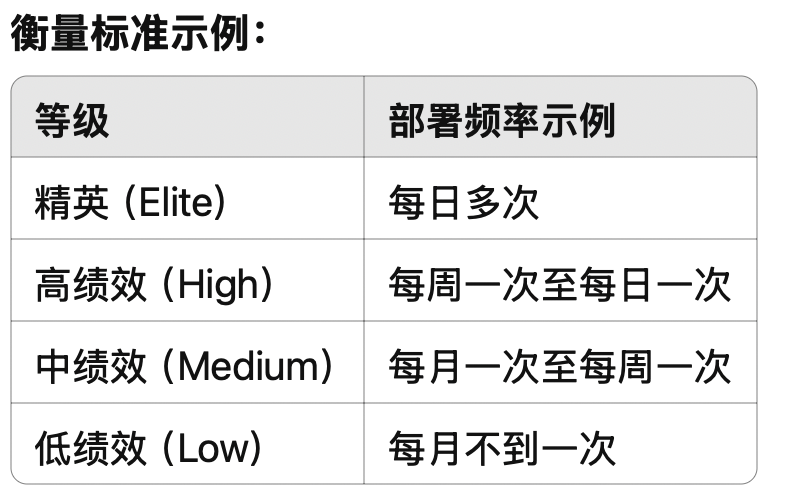

> 2. **变更前置时间**：代码提交到部署的时长。

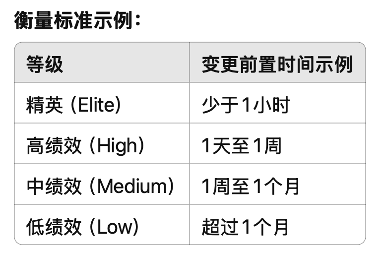

> 3. **变更失败率**：部署后引发故障的比例。

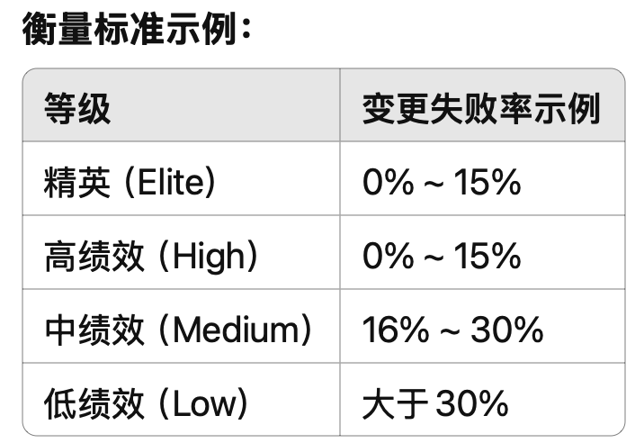

> 4. **平均恢复时间（MTTR）**：故障修复效率。

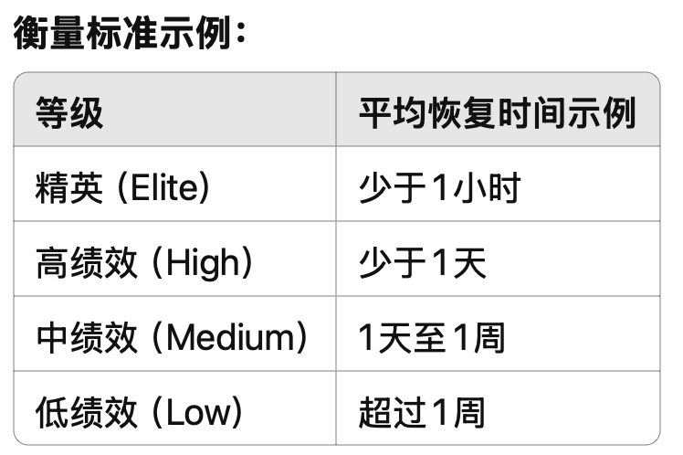

## 敏捷

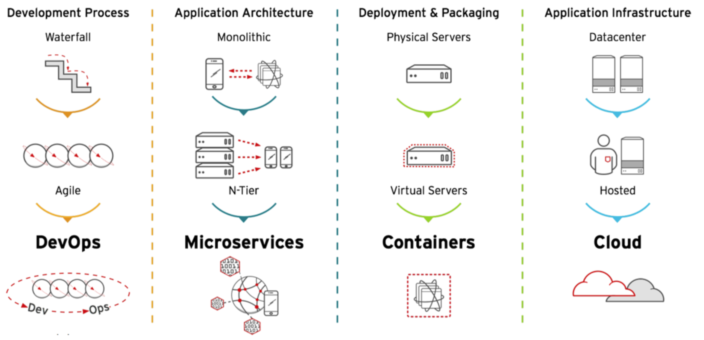

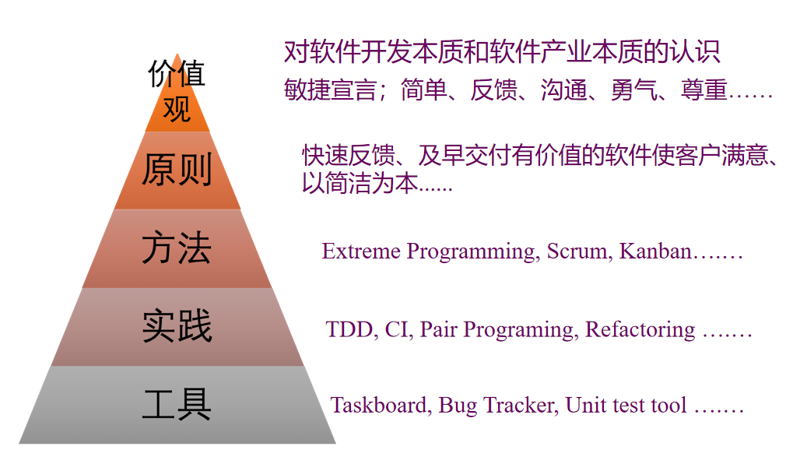

---

### 1. 敏捷的本质与目标

**1.1 核心定义**

- **应对复杂性**：承认软件开发具有天然复杂性（需求模糊、快速变化），无法通过前期充分准备消除风险。
- **价值驱动**：以**为客户创造价值**为最高成功标准，而非传统"按时按预算交付"。
- 反传统观点：
  - 传统成功标准：按时、不超预算、功能符合设计。
  - 敏捷成功标准：**项目收益最大化**（如Google Earth收益5000万＞成本100万，延期可接受）。

**1.2 适用场景**

- 需求模糊、市场快速变化的领域（互联网、移动应用等）。
- 需快速迭代验证产品的创新项目（如精益创业模式）。

---

### 2. 价值观→原则→实践

| **层级**   | **核心内容**                                   | **作用**             |
| ---------------- | ---------------------------------------------------- | -------------------------- |
| **价值观** | 沟通、简单、反馈、勇气、尊重（XP五大价值观）         | 指导决策方向，避免实践僵化 |
| **原则**   | 桥梁作用，如：快速反馈、及早交付、拥抱变化、简洁为本 | 将价值观转化为可操作指南   |
| **实践**   | TDD、持续集成、站会、看板、用户故事等                | 具体落地手段               |

> **类比说明**：
>
> - **价值观** = 园艺师对 "好花园" 的整体判断
> - **原则** = 何时剪枝/移栽的决策依据
> - **实践** = 掘土/灌溉的具体操作

---

### 3. 敏捷软件开发宣言

**3.1 个体和互动 > 流程工具**

- 强调**人的自主性**：团队自主选择实践（如计划扑克），反对强制流程。
- 工具服务于协作，而非限制创新。

**3.2 可工作软件 > 详尽文档**

- 文档需创造价值（如用户文档），拒绝形式化流程文档。
- 计划载体：用户故事、看板、验收测试等"轻量级"形式。

**3.3 客户合作 > 合同谈判**

- 开发方与客户是**价值共创伙伴**，非对立关系。
- 通过持续反馈调整需求（例：每周演示迭代成果）。

**3.4 响应变化 > 遵循计划**

- 拥抱需求变更，视变化为**竞争优势来源**。
- 反对僵化的"变更控制流程"。

---

### 4. 创新、研发、运维

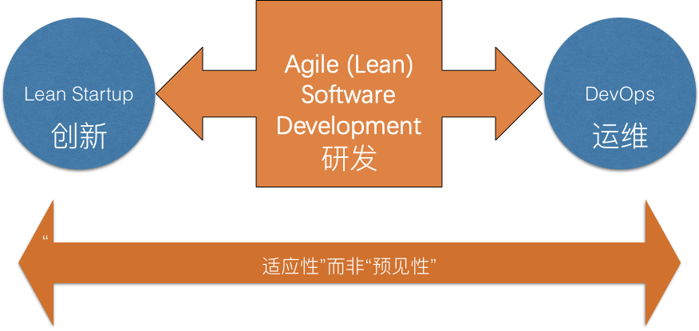

> **核心结论**：敏捷是**以价值为导向、适应复杂性的思维模式**，其生命力在于价值观引领下的持续实践优化。

## 新方法学

---

### 1. 从无、到繁重、再到敏捷

> 当系统变得越大越复杂时，要想加入新的功能就越来越困难。同时错误故障越来越多，越来越难于排除。

---

### 2. 预见性与适应性

- 将设计与建造分离开来
  - *工程误区*：假设软件可像建筑一样分离设计（文档）与建造（编码）。
  - *现实*：软件“建造”（编译）成本极低，编码本质是设计活动。
- 需求的不可预见性
- 预见性是不可能的吗？
  - 需求稳定的特殊场景（如航天系统）可保留预见性方法。
- 不可预见过程的控制 － 迭代
  - **解决方案**：短周期迭代（1-4周），持续交付可运行软件，快速反馈调整。
- 适应性的客户
  - 客户深度参与：固定时间与预算，灵活调整范围，优先高价值需求。

---

### 3. 把人放在第一位

- 可兼容性程序插件
- 程序员是负责任的专业人员
- 面向人的开发过程的管理
- 度量的困难性
  - 传统度量（如代码行数）失效，聚焦结果（可运行软件）而非过程。
- 业务专家的引领作用
- 自适应过程
- 敏捷开发的不同风格
