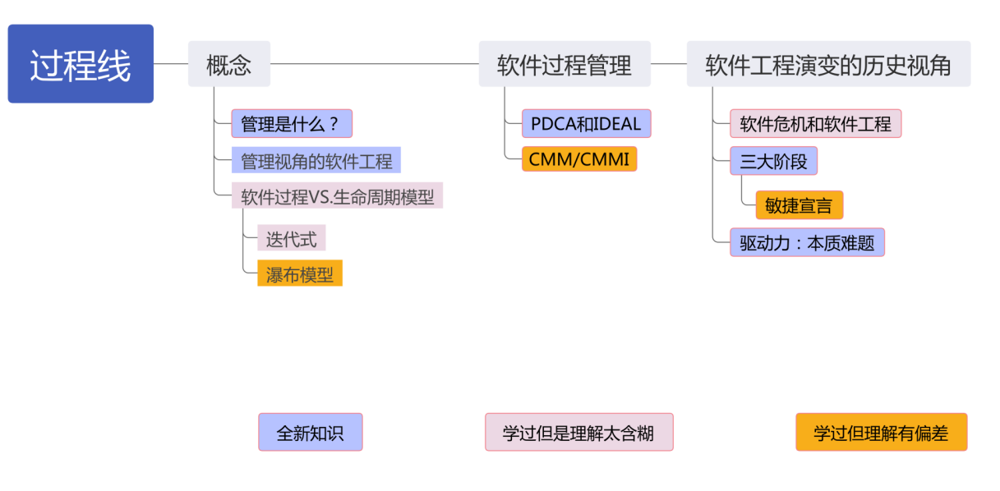
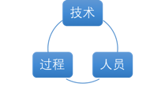
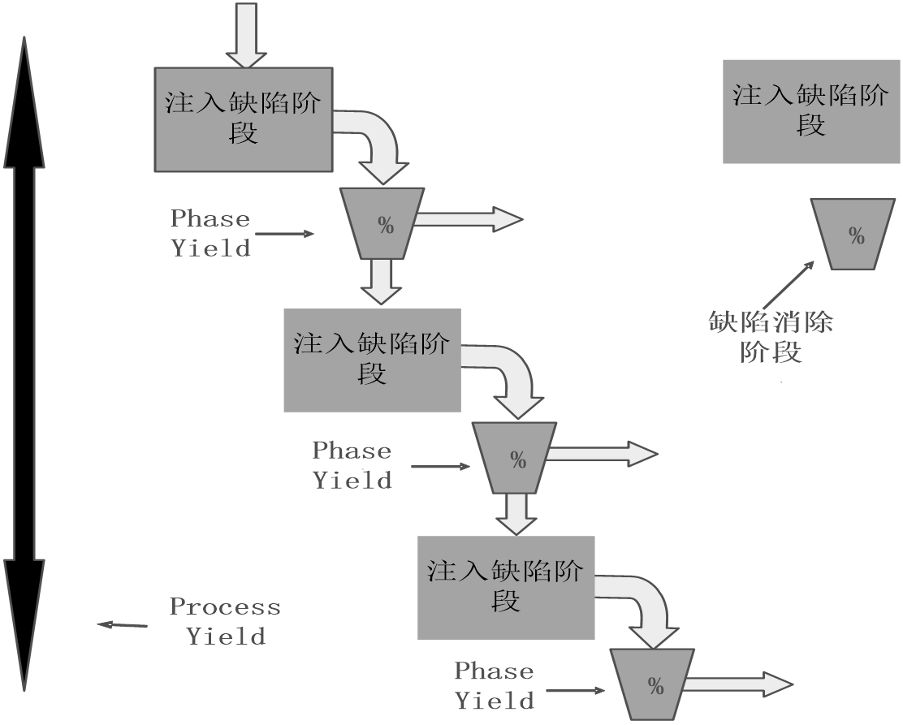

## 软件管理

---

### 1. 软件的重要性与挑战

> 本质困难与挑战：复杂性、不可见性、可变性、一致性

#### 软件危机

- **落后的软件生产方式无法满足迅速增长的计算机软件需求**，从而导致软件开发与维护过程中出现一系列严重问题的现象。

---

### 2. 软件工程的定义与目标

> 软件工程——研究用**工程化方法**构建和维护有效的、实用的和高质量的软件的学科。

#### 两大视角

- 管理视角——能否复制成功？
- 技术视角——是否可以将问题解决得更好？

---

### 3. 软件项目管理

> 应用方法、工具、技术以及人员能力来完成软件项目，实现项目目标的过程。

#### 三大关键要素

- 目标
- 状态
- 纠偏

#### 三大目标

- 成本
- 质量
- 工期

> 活动：估算、计划、跟踪、风险管理、范围管理、人员管理、沟通管理等 (参考PMBOK)。

**广义软件过程**

---

### 4. 软件过程管理

> 对象是软件过程
>
> 目的是为了让软件过程在开发效率、质量等方面有着更好性能绩效（performance）

---

### 5. 思考与讨论

以下说法是否正确？为什么？

- 软件过程管理是软件项目管理应该要实现目标。
- “在公司导入敏捷过程是我们今年过程改进的主要目标。”
- XP与CMM/CMMI是对立的两种软件开发方法。
- CMM/CMMI不适合当今互联网环境的项目管理需求。
- PDCA和IDEAL不适合在敏捷环境中使用。
- 不同的软件开发过程应该使用不同的生命周期模型，反之亦如此。

---

## 历史演变和经典工作

### 1. 三大历史阶段

---

- 阶段一：**软硬件一体化阶段**（50年代~70年代）
  - 应用特征：软件依附于特定硬件，功能单一，复杂度有限，需求几乎不变（如大型机、军事系统）。
  - 开发特征：硬件昂贵；开发者主要是硬件工程师/数学家；高级语言出现早期。

---

- 阶段二：**软件成为独立的产品**（70年代~90年代中期）
  - 应用特征： 摆脱硬件束缚（操作系统普及），功能强大，规模/复杂度剧增，个人电脑出现（普通用户），需求多变，兼容性要求，市场竞争压力。四大本质难题全面爆发（软件危机）。
  - 开发特征：需要应对大型复杂项目。

---

- 阶段三：**网络化和服务化**（90年代中期迄今）
  - 应用特征：
    - 功能更复杂，规模更大。
    - 用户数量剧增（带来可用性、可扩展性、安全性挑战）。
    - 需求快速演化且高度不确定。
    - 分发方式变革（Web, SaaS）。
    - 当前现状 (进一步演化)：
      - 移动互联网主流，服务化/网络化深入。
      - 用户需求极度多样化。
      - 软件产品/服务地位核心化。
      - 部署环境错综复杂。
      - 用户期望苛刻： 多（功能丰富）、快（更新/响应）、好（稳定安全可靠）、省（低成本/免费）。

---

### 2. 典型软件过程和实践

**瀑布模型 1**

**瀑布模型 2**

> 软件过程改进  CMMI 不是“软件过程模型”

| 理由     | 说明                                                        |
| -------- | ----------------------------------------------------------- |
| 不同层面 | CMMI 是组织层面的过程改进框架，Agile 是项目层面的开发方法论 |
| 可互补   | 两者可以结合，敏捷可以帮助实现 CMMI 的过程目标              |
| 不冲突   | CMMI 不限制你用什么开发模型，只关心你是否持续改进           |
| 错误对立 | 把二者当作对立选择，是对其本质的误解                        |

---

> 软件过程改进 PDCA  、 IDEAL

---

## 团队动力学

---

### 1. 软件开发的核心性质：知识工作

**1.1 智力劳动特征**

- 处理抽象概念，整合不可见组件形成可运行系统
- 要求工程师：**全身心投入** + **主动追求卓越**
- 管理挑战：**激励并维持知识工作者的积极性**（无法强制管理，需自我管理）

**1.2 自我管理的前提**

- 积极性（内在驱动）
- 准确估算与计划能力
- 协商承诺的意识
- 有效跟踪计划执行
- 持续交付高质量产物

---

### 2. 高效团队的核心：胶冻状团队（Jelled Team）

- **定义**

> 成员深度互信，凭直觉互助；强归属感与共同使命感

- 关键特征：

  - 自主决策（目标、角色、过程、计划）
  - 成员互相依赖，责任共担
  - 领导者角色从“管理者”转向“赋能者”

---

### 3. 知识工作者的激励理论

#### 3.1 马斯洛需求层次理论的应用

> 第一层：生理需求
>
> 第二层：安全感
>
> 第三层：爱和归属感
>
> 第四层：获得尊敬
>
> 第五层：自我实现

| **需求层次**    | **激励方式**               | 管理实践意义                         |
| --------------------- | -------------------------------- | ------------------------------------ |
| 生理/安全（低层）     | 交易型领导（威逼、利诱）         | 短期有效，但抑制创造力               |
| 尊重/自我实现（高层） | **变革型领导（鼓励承诺）** | 首选！通过成就感、责任感激发内在动力 |

#### 3.2 三大激励方式对比

| **方式** | 特点                         | 团队表现                   |
| -------------- | ---------------------------- | -------------------------- |
| **威逼** | 强制服从                     | 恐惧文化，低创新           |
| **利诱** | 物质奖励驱动                 | 寻求捷径，质量不稳定       |
| **承诺** | **基于尊重与自我实现** | **高投入、高创造力** |

#### 3.3 有效承诺的实践原则

- **自愿性**：非强制承诺
- **公开性**：团队共同承诺并互相监督
- **可行性**：基于详细计划支持承诺
- **反馈机制**：定期进度跟踪与里程碑庆祝

#### 3.4 期望理论

> 人们在下列情况下能够受到激励并且出大量成果 M = V * E
>
> 1. 相信他们的努力很可能会产生成功的结果(V)
> 2. 他们也相信自己会因为成功得到相应的回报(E)

---

### 4. 团队模型：TSP

#### 4.1 自主团队

- 特点

> 自行定义项目的目标
>
> 自行决定团队组成形式以及成员的角色
>
> 自行决定项目的开发策略
>
> 自行定义项目的开发过程
>
> 自行制定项目的开发计划
>
> 自行度量、管理和控制项目工作

- 外部环境  —— 项目启动阶段：获得管理层的支持

> 项目小组应当体现出已经尽最大的可能在满足管理层的需求的工作态度。
>
> 项目小组应当在计划中体现定期需要向管理层报告的内容。
>
> 项目小组应当向管理层证明他们所制定的工作计划是合理的。
>
> 项目小组应当在计划中体现为了追求高质量而开展的工作。
>
> 项目小组应当在工作计划中允许必要的项目变更。
>
> 项目小组应当向管理层寻求必要的帮助。

- 外部环境  —— 项目进展过程：获得管理层的支持

> 项目小组应当严格遵循定义好的开发过程开展项目开发工作。
>
> 项目小组应当维护和更新项目成员的个人计划和团队计划。
>
> 项目小组应当对产品质量进行管理。
>
> 项目小组应当跟踪项目进展，并定期向管理层报告。
>
> 项目小组应当持续地向管理层展现优异的项目表现。

#### 4.2 TSP核心角色

- 项目组长TL

> 建设和维持高效率的团队
>
> 激励团队成员积极工作
>
> 合理处理团队成员的问题
>
> 向管理层提供项目进度相关的完整信息
>
> 充当合格的会议组织者和协调者

> 激励团队成员努力工作
>
> 主持项目周例会
>
> 每周汇报项目状态
>
> 分配工作任务
>
> 维护项目资料
>
> 组织项目总结

---

- 计划经理

> 团队计划和个人计划
>
> 每周准确的报告项目小组状态

> 带领项目小组开发项目计划
>
> 带领项目小组平衡计划
>
> 跟踪项目进度
>
> 参与项目总结

---

- 开发经理

> 开发优秀的软件产品
>
> 充分利用团队成员的技能

> 带领团队制定开发策略
>
> 带领团队开展产品规模估算和所需时间资源的估算
>
> 带领团队开发需求规格说明
>
> 带领团队开发高层设计
>
> 带领团队开发设计规格说明
>
> 带领团队实现软件产品
>
> 带领团队开展集成测试和系统测试
>
> 带领团队开发用户支持文档
>
> 参与项目总结

---

- 质量经理

> 质量计划
>
> 评审工作、评审报告

> 带领团队开发和跟踪质量计划
>
> 向项目组长警示质量问题
>
> 软件产品提交配置管理之前，对其进行评审，以消除质量问题
>
> 项目小组评审的组织者和协调者
>
> 参与项目总结

---

- 过程经理

> 团队成员准确的记录、报告和跟踪过程数据
>
> 团队会议都有相应会议记录

> 带领团队定义和记录开发过程并且支持过程改进
>
> 建立和维护团队的开发标准
>
> 记录和维护项目的会议记录
>
> 参与项目总结

---

- 支持经理

> 合适的工具和环境
>
> 对于基线产品，不存在非授权的变更
>
> 风险和问题得到跟踪
>
> 开发过程中满足复用目标

> 带领团队识别开发过程中所需要的各类工具和设施
>
> 主持配置管理委员会，管理配置管理系统
>
> 维护软件项目的词汇表
>
> 维护项目风险和问题跟踪系统
>
> 支持软件开发过程中复用策略的应用
>
> 参与项目总结

---

### 5. TSP & Scrum

5.1 **共性**：

> **跨职能团队**：成员技能互补，集体担责
>
> **自主决策**：自组织制定计划/过程（非上级指令）
>
> **透明性**：计划/进度/问题可视化（TSP数据跟踪 vs. Scrum看板）
>
> **心理安全**：尊重个体，鼓励协作

5.2 **对高效团队的帮助**：

> **减少层级摩擦**：扁平结构加速决策
>
> **增强归属感**：共同承诺提升投入度
>
> **快速响应变化**：自组织机制适应不确定性

---

|   **维度**   |                   TSP                   |                 Scrum                 |     **本质差异**     |
| :----------------: | :--------------------------------------: | :------------------------------------: | :------------------------: |
| **结构设计** |         **角色精细化分工**         |  **角色极简**（PO/SM/Dev Team）  |  TSP强管控 vs Scrum轻规则  |
| **过程管理** |  **计划驱动**：详细估算、严格跟踪  | **经验驱动**：拥抱变化、迭代适应 |      预测性 vs 适应性      |
| **承诺机制** |          **团队公开承诺**          | **Sprint目标共识**（非强制承诺） |      契约式 vs 协作式      |
| **质量保障** | **质量经理**独立监督（评审、审计） | **团队内嵌**（Done标准集体定义） |    专职管控 vs 全员负责    |
| **适用场景** |       航天、金融等高可靠性系统开发       |    互联网、创新产品（需求模糊快变）    | 确定性需求 vs 不确定性需求 |

## 估算

### 1. 概述

> **目的**： 是给各类计划提供决策依据
>
> **对象**： 规模、时间、日程

### 2. 方法

- PROBE估算方法

> 尽可能划分详细一些
>
> 目标是建立对结果的信心
>
> 尽量依赖数据
>
> 估算要的是过程，而非结果；估算的过程是相关干系人达成一致共识的过程

> 度量体现着决策者对试图要实现的目标的关切程度

## 计划和跟踪

### 1. 工作分解结构 WBS

### 2. 开发策略与计划

> 开发策略是在产品组件需求基础之上，明确每个产品组件的获得方式与顺序，从而在项目团队内部建立起大家都理解的产品开发策略。

> 注意事项
>
> 1. WBS的使用
> 2. 产品组件开发顺序的考虑
> 3. 产品组件获得方式的考虑

### 3. 日程计划原理和方法

> 估算规模
>
> 估算资源
>
> 规划日程

### 4. 项目跟踪

> 意义： 目的在于了解项目进度，以便在项目实际进展与计划产生严重偏离时，可采取适当的纠正措施
>
> 项目跟踪需要管理针对偏差而采取的纠偏措施。

#### 4.1 挣值管理

> 项目的挣值管理方法(Earned Value Management，简称EVM)是用来客观度量项目进度的一种项目管理方法。
>
> EVM采用与**进度计划、成本预算和实际成本**相联系的三个独立的变量，进行项目绩效测量。

> 简单、中级、高级

> 成本差异   CV = EV - AC
>
> 成本差异指数  CPI = $\frac{EV}{AC}$
>
> 日程偏差   SV = EV – PV
>
> 日程偏差指数  SPI = $\frac{EV}{PV}$
>
> 预计完成成本  EAC = $AC + \frac{BAC - EV}{CPI} = \frac{BAC}{CPI}$

**EVM 变形**

> EVM的局限性：
>
> 1. 一般不能应用软件项目的质量管理
> 2. 需要定量化的管理机制，这就使其在一些探索型项目以及**部分敏捷开发方法**中的应用受到限制
> 3. 完全依赖项目的**准确估算**（价值体系），然而在项目早期，很难对项目进行非常准确的估算。

#### 4.2 里程碑评审

> 软件项目的里程碑往往是指某个时间点，用以标记某项工作的完成或者阶段的结束。

> 审查的内容包括：
>
> 1. 项目相关的承诺，如日期、规格、质量等等；
> 2. 项目各项计划的执行状况；
> 3. 项目当前的状态讨论；
> 4. 项目面临的风险讨论等

#### 4.3 其他

> 日程计划跟踪
>
> 承诺计划跟踪
>
> 风险计划跟踪
>
> 数据收集计划跟踪
>
> 沟通计划跟踪

---

## 质量管理

---

### 1. 质量概念

> 软件质量： “与软件产品满足规定的和隐含的需求能力有关的特征或者特性的全体”

> 软件质量为内外两部分的特性：
>
> 1. 外部质量特性面向软件产品的最终用户
> 2. 内部质量特性则不直接面向最终用户

> 从用户的角度考察软件质量，**用户满意度**是最为重要的判断标准

#### 1.1 面向用户的质量观

> 用户是谁？
>
> 用户需求的优先级？
>
> 这种用户的优先级对软件产品的开发过程产生什么样的影响？
>
> 怎样来度量这种质量观下的质量水平？

#### 1.2 典型的用户质量期望

> 必须能够工作
>
> 有较快的执行速度
>
> 在安全性、保密性、可用性、可靠性、兼容性、可维护性、可移植性等方面表现优异

---

### 2. 质量管理策略

> 1. 用缺陷管理来替代全面质量管理
> 2. 高质量产品也就意味着要求组成软件产品的各个组件基本无缺陷；

#### 2.1 消除缺陷

- 测试
  - 发现待测程序的一个异常行为
  - 理解程序的工作方式
  - 调试程序，找出出错的位置，确定出错原因
  - 确定修改方案，修改缺陷
  - 回归测试，以确认修改有效；
- 评审发现缺陷
  - 遵循评审者的逻辑来理解程序流程
  - 发现缺陷的同时，也知道了缺陷的位置和原因
  - 修正缺陷

#### 2.2 质量指标

- **Yield（缺陷消除效率）**：

---

- **A/FR（质检成本/失效成本比）**：

> A/FR的值越大，往往意味着越高的质量
>
> 过高的A/FR往往意味着做了过多的评审，反而会导致开发效率的下降
>
> PSP中A/FR的期望值就是2.0

---

- **PQI（过程质量指数）**：
  - 5维度乘积

> 设计质量：设计的时间应该大于编码的时间
>
> 设计评审质量：设计评审的时间应该大于设计时间的50%
>
> 代码评审质量：代码评审时间应该大于编码时间的50%
>
> 代码质量：代码的编译缺陷密度应当小于10个/千行
>
> 程序质量：代码单元测试缺陷密度应当小于5个/千行

---

- **Review Rate（评审速率）**：
  - 用以指导软件工程师开展有效评审的指标。
  - 代码评审速度小于200 LOC/小时，文档评审速度小于4 Page/小时

---

- **DRL（缺陷消除效率比）**：
  - 对比不同阶段每小时发现缺陷数。
  - 以某个测试阶段（一般为单元测试）每小时发现的缺陷数为基础，其他阶段每小时发现缺陷数与该测试阶段每小时发现的缺陷的比值就是DRL

| 阶段     | 缺陷个数/小时 | DRL（UT） |
| -------- | ------------- | --------- |
| 设计评审 | 3.6           | 1.03      |
| 编码评审 | 8             | 2.29      |
| 单元测试 | 3.5           | 1         |

- **其他因素**
  - 打印后评审往往效果更好
  - 评审时机选择  ——  编译（UT）之前 VS. 之后
  - 个人评审和小组评审

#### 📌2.3 质量路径——为追求高质量 Quality Journey

> Step 1：各种测试
>
> Step 2：进入测试之前的产物质量提升
>
> Step 3：评审过程度量和稳定
>
> Step 4：质量意识和主人翁态度
>
> Step 5：个体review的度量和稳定
>
> Step 6：诉诸设计
>
> Step 7：缺陷预防
>
> Step 8：用户质量观——其他质量属性

### 3. 设计

#### 3.1 设计与质量关系

> 低劣的设计是导致在软件开发中返工、不易维护以及用户不满的主要原因。
>
> 充分设计可以显著减少最终程序的规模，提升质量。
>
> 设计本身也是一种排错的过程

---

#### 3.2 典型设计过程

#### 3.3 设计内容

> 设计目标程序在整个应用系统中的位置
>
> 设计目标程序的使用方式
>
> 设计目标程序与其他组件以及模块之间的关系
>
> 设计目标程序外部可见的变量和方法
>
> 设计目标程序内部运作机制
>
> 设计目标程序内部静态逻辑

|          | 动态信息                 | 静态信息                     |
| -------- | ------------------------ | ---------------------------- |
| 外部信息 | 交互信息（服务、消息等） | 功能（继承、类结构等）       |
| 内部信息 | 行为信息（状态机）       | 结构信息（属性、业务逻辑等） |

---

#### 3.4 设计模板

|          | 动态信息 | 静态信息 |
| -------- | -------- | -------- |
| 外部信息 | OST/FST  | FST      |
| 内部信息 | SST      | LST      |

- 操作规格模板（Operational Specification Template， 简称OST）

> OST描述的是**系统与外界**的交互，是描述“用户”与待设计系统的正常情况和异常情况下的交互
>
> 用来定义测试场景和测试用例，也可以作为和系统用户讨论需求的基础

- 功能规格模板（Functional Specification Template， 简称FST）

> FST描述的是**系统对外的接口**
>
> 在FST中提供的典型信息包括类和继承关系，外部可见的属性和外部可见的方法
>
> 在使用FST模板的时候，**消除二义性**非常重要

- 状态规格模板（State Specification Template，简称SST）

> SST可以精确定义程序的**所有的状态**、**状态之间的转换**以及伴随着每次状态转换的动作。

- 逻辑规格模板（Logical Specification Template，简称LST）

> LST可以精确描述系统的**内部静态逻辑**

> 需要描述如下的信息：关键方法的静态逻辑、方法的调用、外部引用、关键数据的类型和定义；
