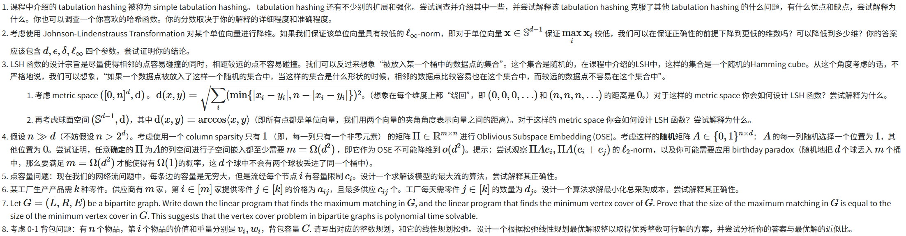

# hw2

## 0

## 1

先梳理简单制表哈希

分为三个步骤

1. 把输入的 X 按字节或者多个字节拆解 为 ${x_1, x_2,...,x_c}$ , 每个 $x_i$是 X 按顺序的 d 位的值
2. c 个随即表的初始化，每个表 有 $2^d$  个数
3. 计算 $h(x) = T₀[x₀] \oplus T₁[x₁] \oplus ... \oplus T_{c-1}[x_{c-1}]$

可能存在的问题：

（1）简单制表要求将键拆分成 c个固定位宽 d的值。对不同长度的值，需要填充或截断处理，而且是线性结构。

（2）简单制表在要求极高质量哈希的应用中，简单制表可能会存在问题。

针对问题1.

扭曲制表哈希

为了解决简单制表哈希在输入结构线性、冲突集中等问题，扭曲制表哈希引入了“扭曲”步骤打乱输入结构，提高哈希分布质量。

也是分为三个步骤

1. $X \to (x_0, x_1, \dots, x_{c-1})$，  每个 $x_i$是 X 按顺序的 d 位的值

2. c 个随即表的初始化，每个表 有 $2^d$  个数

3. 计算哈希值（扭曲操作）：

- 首先计算：$h' = T_1[x_1] \oplus T_2[x_2] \oplus \cdots \oplus T_{c-1}[x_{c-1}]$
- 然后将这个中间结果 $h'$ 视为“扰动项”加到 $x_0$ 上，  $h(x) = T_0[x_0 \oplus h'] \oplus h'$

对比简单制表,扭曲制表在高位信息和低位访问路径之间建立了依赖，避免了冲突“只集中在某一低位”的局限；

可能问题：与简单制表相比，实现复杂度略高，尤其在 SIMD 或硬件优化环境中不如后者简单。

针对问题2.

双表制表哈希

双表制表哈希想法就是再单个简单制表哈希的基础上再套一层，相同的三个步骤再走一遍，只是 c 和 d 的值在第二次的映射可以变化。

我觉得加为两层的制表哈希想法很简单，但是确实很有用，第二层提高了更多的独立性，但是引入的问题是更多的随机表初始化的消耗和计算复杂度的增加。

第一层提供基础的混合与打散；

第二层对第一层结果进一步扰动，使得整体哈希函数能达到较高的独立性；

可能问题：

额外的存储开销：需要 $c + c'$ 张随机表；

计算复杂度提升：相比简单制表哈希，增加了两倍查表和一次额外 XOR 的计算；

实际性能在某些高性能场景可能不如扭曲制表哈希，因其不具备局部扰动优化

------

## 2

定义 $A_i$ 为 $A$ 的第 $i$ 行，记：

$Y_i = \langle A_i, \mathbf{x} \rangle = \sum_{j=1}^d A_{ij} x_j$

则$
\|A \mathbf{x}\|_2^2 = \sum_{i=1}^k Y_i^2$

$A_{ij} \sim \mathcal{N}(0, 1/k)$，$\mathbf{x}$ 为单位向量，故每个 $Y_i \sim \mathcal{N}(0, 1/k)$，所以：

$\mathbb{E}[\|A \mathbf{x}\|_2^2] = \sum_{i=1}^k \mathbb{E}[Y_i^2] = k \cdot \frac{1}{k} = 1$

$\because$

$\mathbb{E}[Y_i^4] = 3 \cdot \text{Var}(Y_i)^2 = 3 \cdot \left(\frac{1}{k}\right)^2 = \frac{3}{k^2}$

$\text{Var}(Y_i^2) = \mathbb{E}[Y_i^4] - (\mathbb{E}[Y_i^2])^2 = \frac{3}{k^2} - \frac{1}{k^2} = \frac{2}{k^2}$

$\therefore$

$\text{Var}(\|A\mathbf{x}\|_2^2) = k \cdot \text{Var}(Y_i^2) = k \cdot \frac{2}{k^2} = \frac{2}{k}$

若 $\|\mathbf{x}\|_\infty \leq \alpha$，则：

$\text{Var}(Y_i) = \frac{1}{k} \sum_{j=1}^d x_j^2 \leq \frac{1}{k} \cdot d \cdot \alpha^2$

$\therefore$

$\text{Var}(Y_i^2) \leq 2 \cdot (\text{Var}(Y_i))^2 \leq 2 \cdot \left( \frac{d \alpha^2}{k} \right)^2 = \frac{2 d^2 \alpha^4}{k^2}$

总方差为：

$\text{Var}(\|A\mathbf{x}\|_2^2) \leq k \cdot \frac{2 d^2 \alpha^4}{k^2} = \frac{2 d^2 \alpha^4}{k}$

由切比雪夫不等式：

$\mathbb{P}\left[ \left| \|A\mathbf{x}\|_2^2 - 1 \right| > \epsilon \right] \leq \frac{\text{Var}(\|A\mathbf{x}\|_2^2)}{\epsilon^2} \leq \frac{2 d^2 \alpha^4}{k \epsilon^2}$

右边不超过 $\delta$，得：

$k \geq \frac{2 d^2 \alpha^4}{\delta \epsilon^2}$

$\therefore $ $\mathbf{x} \in \mathbb{S}^{d-1}$ 且 $\|\mathbf{x}\|_\infty \leq \alpha$，保证：$\mathbb{P}\left[ \left| \|A\mathbf{x}\|_2^2 - 1 \right| > \epsilon \right] < \delta$ 的前提下，可以降维到 $ O\left( \frac{d^2 \alpha^4}{\delta \epsilon^2} \right)$

------

## 3

距离定义：
$
d(x,y) = \sqrt{\sum_i \min(|x_i - y_i|, n - |x_i - y_i|)^2}
$
即每一维上的距离是模 $n$ 的圆周距离。

解法思路：

1. 映射到欧氏空间：
    将每个维度 $x_i \in [0,n]$ 映射为圆上的二维向量：
    $
    \varphi_i(x) = \left(\frac{n}{2\pi}\cos\left(\frac{2\pi x_i}{n}\right), \frac{n}{2\pi}\sin\left(\frac{2\pi x_i}{n}\right)\right)
    $
    所有维度拼接后 $\varphi(x) \in \mathbb{R}^{2d}$。

2. 使用欧氏空间的 LSH：
    对映射后的 $\varphi(x)$ 应用随机投影哈希：
    $
    h_{b,t}(x) = \left\lfloor \frac{\langle b, \varphi(x) \rangle + t}{w} \right\rfloor
    $
    其中 $b \sim \mathcal{N}(0, I)$，$t \sim \text{Unif}[0,w]$，$w$ 是桶宽。

3. 理由：

    - 映射 $\varphi$ 保留了圆周距离的相似性；
    - 随机投影在欧氏空间中满足 LSH 定义，即相近点哈希值碰撞概率大；
    - 可使用 JL 引理将维度降至 $k=O(\epsilon^{-2}\log n)$ 以提高效率。

距离定义：
$
d(x, y) = \arccos(\langle x, y \rangle)
$
即两单位向量间的夹角。

解法思路：

1. 使用 SimHash（随机超平面法）：
    对每个向量 $x \in S^{d-1}$，随机选取 $b \sim \mathcal{N}(0,I)$，定义哈希函数：
    $
    h_b(x) = \text{sign}(\langle b, x \rangle) \in \{-1, +1\}
    $

2. 碰撞概率：
    对任意 $x, y \in S^{d-1}$，有：
    $
    \Pr[h_b(x) = h_b(y)] = 1 - \frac{\theta(x,y)}{\pi}, \quad \theta(x,y) = \arccos(\langle x, y \rangle)
    $
    表明夹角越小，碰撞概率越高。

3. 扩展性与优化：

    - 串联多个 $h_{b_i}$，形成哈希签名（如 $k$ 位）；

    - 可先用 JL 投影将 $x$ 降维至 $O(\log n)$ 后再进行哈希；

    - 可构造 $(r, cr, p, q)$ LSH 满足：
        $
        \begin{aligned}
        \text{若 } d(x, y) \le r &\Rightarrow \Pr[h(x)=h(y)] \ge p \\
        \text{若 } d(x, y) > cr &\Rightarrow \Pr[h(x)=h(y)] \le q
        \end{aligned}
        $

------

## 4

假设 $n > 2^d$ .考虑使用一个 column sparsity 只有 1 （即，每一列只有一个非零元素） 的矩阵 $\prod \in \mathbb{R}^{m \times n}$ 进行 Oblivious Subspace Embedding (OSE)。考虑这样的随机矩阵 $A \in {0, 1}^{n \times d}$ : $A$ 的每一列随机选择一个位置为 1，其他位置为 0。尝试证明，任意确定的 $\prod$ 为 $A$ 的列空间 进行子空间嵌入都至少需要  $m = \Omega(d^2)$ 即它作为 OSE 不可能降维到 $o(d^2)$ .提示：尝试观察 $\prod Ae_i, \prod(Ae_i, Ae_j)$ 的

$\ell_2$-norm , 以及你可能需要应用 birthday paradox (随机地把 d 个球丢入 m 个桶中，那么要满足 $m = \Omega(d^2)$才能使得有 $\Omega(1)$的概率，这 d 个球中不会有两个球被丢进了同一个桶中）

$\prod $的列稀疏度为 1：$\prod$ 可视为映射 $\sigma: [n] \to [m]$，其中 $\prod_{i,j} = 1 $当且仅当$ \sigma(j) = i$。

$A$ 的列：每列 $a_i$ 是独立均匀选择的标准基向量 $e_{k_i}$（$k_i \in [n]$ 随机）。

对所有 $x \in \mathbb{R}^d$，需满足：$(1 - \epsilon) \|Ax\|_2^2 \leq \|\prod A x\|_2^2 \leq (1 + \epsilon) \|Ax\|_2^2.$
证明当$ m = o(d^2)$ 时，存在向量 x 使得上述条件失败（高概率）。

考虑向量$ x = e_i - e_j（$单位坐标向量差）：

原始范数：$\|A x\|_2^2 = \|a_i - a_j\|_2^2$。

嵌入范数：$\|\prod A x\|_2^2 = \|\prod a_i - \prod a_j\|_2^2$。

定义事件：$\mathcal{E}_{i,j}: \quad k_i \neq k_j \quad \text{且} \quad \sigma(k_i) = \sigma(k_j).$

若$ \mathcal{E}_{i,j}$ 发生，则：

当 $k_i \neq k_j $时，$\|A x\|_2^2 = 2$（因 $a_i \perp a_j$)。

但 $\sigma(k_i) = \sigma(k_j)$ 时，$\|\prod A x\|_2^2 = 0$（因$ \prod a_i = \prod a_j$）。

固定 $(i,j)$，$\mathcal{E}_{i,j}$ 的概率：$\mathbb{P}(\mathcal{E}_{i,j}) = \mathbb{P}(k_i \neq k_j) \cdot \mathbb{P}(\sigma(k_i) = \sigma(k_j) \mid k_i \neq k_j).$

$\mathbb{P}(k_i \neq k_j) = 1 - \frac{1}{n} \approx 1$（因 $n > 2^d$ 足够大）。

$\mathbb{P}(\sigma(k_i) = \sigma(k_j) \mid k_i \neq k_j) = \frac{1}{n^2} \sum_{i=1}^m w_i^2$（其中 $w_i = |\sigma^{-1}(i)| $是桶$ i$ 的大小）。

由 Cauchy-Schwarz 不等式：$\sum_{i=1}^m w_i^2 \geq \frac{n^2}{m} \quad \text{(因 } \sum w_i = n\text{)}.$

故: $\mathbb{P}(\mathcal{E}_{i,j}) \geq \left(1 - \frac{1}{n}\right) \frac{1}{m} \geq \frac{c}{m} \quad \text{(常数 } c > 0\text{)}.$

令 $X = \sum_{1 \leq i < j \leq d} \mathbf{1}_{\mathcal{E}_{i,j}}$（总冲突对数）。

期望：$\mathbb{E}[X] = \binom{d}{2} \mathbb{P}(\mathcal{E}_{i,j}) \geq \frac{d(d-1)}{2} \cdot \frac{c}{m} \sim \frac{c d^2}{m}.$

若  $m = o(d^2)$，则 $\mathbb{E}[X] \to \infty$。

方差：$\text{Var}(X) = \sum_{(i,j)} \sum_{(k,l)} \text{Cov}(\mathbf{1}_{\mathcal{E}_{i,j}}, \mathbf{1}_{\mathcal{E}_{k,l}}).$

不相交对$ (i,j) $与 $(k,l) $协方差为 0（独立性）。

有公共下标的对数：$O(d^3)$（如$ (i,j)$ 与$ (i,l)$）。

每对协方差上界：$O(1/m)$（因$ \mathbb{P}(\mathcal{E}_{i,j} \land \mathcal{E}_{i,l}) \leq \mathbb{P}(\sigma(k_j) = \sigma(k_l)) = O(1/m)$）。

$\text{Var}(X) = O\left(\frac{d^3}{m}\right)$

比较方差与期望：$\frac{\text{Var}(X)}{\left(\mathbb{E}[X]\right)^2} \leq \frac{C d^3 / m}{(c d^2 / m)^2} = \frac{C m}{c^2 d} \to 0 \quad \text{(因 } m = o(d^2)\text{)}.$

由 Chebyshev 不等式：$\mathbb{P}(X = 0) \leq \frac{\text{Var}(X)}{\left(\mathbb{E}[X]\right)^2} \to 0$

故当 $m = o(d^2)$ 时，$\mathbb{P}(\exists \mathcal{E}_{i,j}) \to 1$。

对任意确定的 $\prod$，若 $m = o(d^2$)，则以高概率存在 $x = e_i - e_j$ 使得：$\|\prod A x\|_2^2 = 0 \quad \text{但} \quad \|A x\|_2^2 = 2,$

违反子空间嵌入条件。因此必须有 $m = \Omega(d^2)$

桶映射模型：
- d 个球（$A$ 的列）独立随机分配至 m 个桶（$\prod$的行）。
- $\sigma$ 是固定映射，桶大小非均匀。
- 生日悖论保证：当$ m = o(d^2)$ 时，桶冲突高概率发生。

失败向量构造：
- 冲突对$ (i,j) $对应的 $x = e_i - e_j$ 是嵌入失败的显式反例。

## 5

在标准的网络流问题中，边（arc）有容量限制，而节点（vertex）没有容量限制。但在您描述的问题中，每条边的容量为无穷大（即不限制流量），而每个节点 $i$ 有容量限制 $c_i$，表示流经该节点的总流量不能超过 $c_i$（包括流入和流出的总和，对于源点和汇点，也适用类似约束：源点 $s$ 的流出量受 $c_s$ 限制，汇点 $t$ 的流入量受 $c_t$ 限制）。

为了解决这种“点容量”模型的最大流问题，我们可以使用一种经典的转换技术：节点拆分法（node splitting）。该方法将每个节点拆分为两个部分，从而将节点容量转换为边容量，将问题转化为标准的最大流问题。下面我将详细描述算法设计、步骤，并解释其正确性。

算法设计：最大流求解点容量模型

算法的主要思想是将原始图 $G$ 转化为一个新图 $G'$，其中节点容量被表示为边容量。具体来说，每个节点 $i$ 被拆分成一个“输入节点” $i_{\text{in}}$ 和一个“输出节点” $i_{\text{out}}$，并在它们之间添加一条边，容量为 $c_i$。原始图中的边（容量无穷大）则在 $G'$ 中被转化为连接输出节点到输入节点的边。然后，在 $G'$ 上运行标准最大流算法（如 Dinic 算法或 Edmonds-Karp 算法）。

输入：

- 有向图 $G = (V, E)$，其中 $V$ 是节点集，$E$ 是边集。
- 源点 $s \in V$，汇点 $t \in V$。
- 每个节点 $i \in V$ 的容量 $c_i > 0$（包括源点和汇点）。

输出：

- 最大流值（从源点 $s$ 到汇点 $t$ 的最大流量）。
- （可选）流分配方案，即每条边上的流量值（注意：原始图中的边容量为无穷大，所以流分配仅需满足节点容量和流守恒）。

算法步骤：

1. 构造新图 $G'$:

    - 对于每个节点 $i \in V$

        - 在 $G'$ 中创建两个新节点：$i_{\text{in}}$（输入节点）和 $i_{\text{out}}$（输出节点）。
        - 添加一条从 $i_{\text{in}}$ 到 $i_{\text{out}}$ 的有向边，容量为 $c_i$。这条边将节点容量限制转化为边容量。

    - 对于原始图中的每条边 $(u, v) \in E$

        - 在 $G'$ 中，添加一条从 $u_{\text{out}}$ 到 $v_{\text{in}}$ 的有向边，容量设置为一个足够大的数（如 $\sum_{i \in V} c_i$，记为 $C_{\text{sum}}$)，代表原始边的无穷大容量（实际中，使用 $C_{\text{sum}}$ 已足够，因为最大流值不会超过节点容量之和）。

    - 设置 $G'$ 的源点为 $s_{\text{in}}$（原始源点 $s$ 的输入节点）。

    - 设置 $G'$ 的汇点为 $t_{\text{out}}$（原始汇点 $t$ 的输出节点）。

    - （可选）如果图中有自环或多重边，处理方式相同（自环边 $(i, i)$ 会被转化为 $i_{\text{out}} \to i_{\text{in}}$ 边，容量无限）。

2. 在 $G'$ 上运行标准最大流算法:

    - 使用标准最大流算法（例如，Dinic 算法或 Ford-Fulkerson 的 Edmonds-Karp 实现）在 $G'$ 上计算从 $s_{\text{in}}$ 到 $t_{\text{out}}$ 的最大流。
    - 算法输出：最大流值 $f_{\text{max}}$，以及 $G'$ 中各条边上的流值。

3. 恢复原始图的流分配:

    - 对于原始图中的每条边 $(u, v) \in E$，其流值等于 $G'$ 中边 $(u_{\text{out}}, v_{\text{in}})$ 的流值（因为边容量无限，流值直接由节点容量约束）。
    - 最大流值即为 $G'$ 中的最大流值 $f_{\text{max}}$。
    - 节点 $i$ 的总流量（流经该节点的流量）等于 $G'$ 中边 $(i_{\text{in}}, i_{\text{out}})$ 的流值（此值不超过 $c_i$，保证了节点容量约束）。

复杂性分析：

- 节点数：$G'$ 有 $2|V|$ 个节点（每个原始节点拆分为两个）。
- 边数：$G'$ 有 $|E| + |V|$ 条边（原始每条边对应一条新边，加上每个节点的新边）。
- 因此，图的大小为 $O(|V| + |E|)$，算法复杂性与标准最大流算法相同（如 Dinic 算法的 $O(|V|^2 |E|)$ 或 Edmonds-Karp 的 $O(|V| |E|^2)$）。转换过程是线性时间的，整体算法为多项式时间。

节点拆分法的核心在于将节点容量转化为边容量，从而将点容量问题转化为标准最大流问题。以下通过三个方面证明正确性：可行性保持、容量约束保持和最优性保持。

1. 可行性保持（原始图可行流对应 $G'$ 可行流）

- 假设原始图 $G$ 中存在一个可行流 $f$，满足所有节点容量约束（即对于每个节点 $i$，流经 $i$ 的总流量 $\leq c_i$）和流守恒（对于中间节点，流入等于流出；对于源点，只有流出；对于汇点，只有流入）。

- 在     $    G'    $   中构造流  $ f' $ ：

    - 对于每个节点 $i$，设 $i_{\text{in}} \to i_{\text{out}}$ 边的流值为流经原始节点 $i$ 的总流量（由于节点容量约束，此值 $\leq c_i$）。
    - 对于原始边 $(u, v)$，设 $u_{\text{out}} \to v_{\text{in}}$ 边的流值为 $f(u, v)$（因为边容量无限，流值不被限制）。

- 流守恒在  $ G' $  中自动满足：

    - 在 $i_{\text{in}}$：只有输入边和输出边到 $i_{\text{out}}$，因此进入 $i_{\text{in}}$ 的总流量（来自其他节点的输出节点）等于流出到 $i_{\text{out}}$ 的流量（因为 $i_{\text{in}} \to i_{\text{out}}$ 是唯一输出边）。
    - 在 $i_{\text{out}}$：只有输入边来自 $i_{\text{in}}$ 和输出边到其他节点的输入节点，因此流入等于流出。
    - 源点 $s_{\text{in}}$ 没有输入边（是 $G'$ 的源），输出到 $s_{\text{out}}$ 的流量受 $c_s$ 限制，对应原始源点流出。
    - 汇点 $t_{\text{out}}$ 没有输出边（是 $G'$ 的汇），输入来自 $t_{\text{in}}$，流量受 $c_t$ 限制。

- 因此，$f'$ 是 $G'$ 的可行流，且流值等于原始流值。

2. 容量约束保持（点容量约束等价于拆分边容量）

- 在原始图中，节点容量约束要求流经节点 $i$ 的总流量 $\leq c_i$。
- 在 $G'$ 中，边 $i_{\text{in}} \to i_{\text{out}}$ 的容量为 $c_i$。无论流量如何通过其他边进入 $i_{\text{in}}$ 或从 $i_{\text{out}}$ 流出，流量必须经过此边，因此其流值（即流经节点 $i$ 的流量）不超过 $c_i$。
- 原始图的无限边容量在 $G'$ 中由无限容量的边（或大容量边 $u_{\text{out}} \to v_{\text{in}}$）处理，不限制流量。
- 因此，任何 $G'$ 的可行流对应于原始图的可行流，满足所有节点容量约束。

3. 最优性保持（最大流值等价）

- 由于转换是双射的（bijective），原始图的任何可行流对应 $G'$ 的一个可行流，反之亦然。
- 最大流值相同：原始图的最大流值等于 $ G' $  中从  $ s_{\text{in}} $  到  $ t_{\text{out}} $ 的最大流值。
    - 这是因为：
        - 流值定义为源点到汇点的总流量。
        - 在原始图中，源点 $s$ 的总流出量等于在 $G'$ 中 $s_{\text{in}} \to s_{\text{out}}$ 的流值（受 $c_s$ 限制）。
        - 在 $G'$ 中，最大流算法会最大化从 $s_{\text{in}}$ 到 $t_{\text{out}}$ 的流，同时受限于所有 $i_{\text{in}} \to i_{\text{out}}$ 的容量 $c_i$，这正好对应了原始问题中最大化流量的同时满足节点容量约束。

- 标准最大流算法（如 Dinic）在 $G'$ 上保证找到最大流，因此也得到原问题的最大流。

考虑一个简单例子：图中有节点 $V = \{s, a, t\}$，边 $E = \{(s, a), (a, t)\}$，节点容量 $c_s = 2, c_a = 3, c_t = 2$（边容量无穷大）。

- 原始图：
    - 节点：s（源点）、a（中间点）、t（汇点）。
    - 边：(s, a) 和 (a, t)，容量无穷大。
    - 约束：s 的总流出 ≤ 2，a 的总流量 ≤ 3，t 的总流入 ≤ 2。
- 构造 G'：
    - 创建节点：s_in, s_out, a_in, a_out, t_in, t_out。
    - 添加节点边：s_in → s_out（容量 2），a_in → a_out（容量 3），t_in → t_out（容量 2）。
    - 添加原始边对应：s_out → a_in（容量 ∞），a_out → t_in（容量 ∞）。
    - 源点为 s_in，汇点为 t_out。
- 在 G' 上运行最大流算法：
    - 最大流可能为 2（因为 s_in → s_out 容量 2，且 t_in → t_out 容量 2）。
    - 例如，流量：s_in → s_out 流值 2，s_out → a_in 流值 2，a_in → a_out 流值 2，a_out → t_in 流值 2，t_in → t_out 流值 2。
    - 恢复原始流：(s, a) 流值 2，(a, t) 流值 2，满足节点容量（s 流出 2，a 流量 2，t 流入 2）。
- 若节点容量更大，例如 c_a = 4，则最大流可达 2（受限 c_s 和 c_t）。

- 无穷大容量处理：在代码中，边 $(u_{\text{out}}, v_{\text{in}})$ 的容量设置为一个大数（如所有 $c_i$ 之和），以避免无穷大带来的问题。理论中不影响正确性。
- 算法选择：推荐使用高效的最大流算法，如 Dinic 算法（复杂度 $O(|V|^2 |E|)$），尤其当图较大时。
- 扩展性：该方法也适用于无向图（将无向边转为两个有向边）和多源多汇问题（添加超级源和超级汇）。
- 代码实现：在 Python 中，可使用 NetworkX 库或自定义实现（例如，基于 BFS 的增广路径搜索）。

这个算法高效且正确，能将点容量问题转化为标准最大流问题求解。任何标准最大流算法的正确性基础（如最大流最小割定理）在 $G'$ 上仍适用，从而确保整个方法的正确性。

------

## 6

问题描述

某工厂需要采购 K 种零件$j \in [K]$，每种零件 j 的日需求量为$ d_j$。有 m 家供应商$i \in [m]$，第 i 家供应商提供零件 j 的单位价格为 $a_{ij}$，且最多供应 $c_{ij}$ 个零件 j。目标是设计一个算法，求解最小化总采购成本的问题，并确保满足所有零件需求。如果总供应能力无法满足所有需求，算法应报告问题不可行。

算法设计

由于每个零件的采购决策相互独立（即，供应商对每种零件的供应能力 $c_{ij} $是独立的，没有共享的总供应约束），问题可以分解为 K 个独立的子问题，每个子问题针对一种零件 j，求解最小采购成本以满足需求 $d_j$。对于每个零件 j，最小成本子问题可以通过贪心策略求解：按单位价格 $a_{ij} $从低到高排序供应商，并从最低价格的供应商开始采购，直到满足需求 $d_j$。

算法步骤
初始化总成本：设 total_cost = 0。

遍历每种零件：对于每个零件$ j \in [K]$ 执行以下步骤：

检查需求：如果 $d_j $= 0（即该零件无需求），则跳过当前零件（成本为 0）。

构建可用供应商列表：收集所有能提供零件 j 的供应商，即 $c_{ij} $> 0 的供应商。列表元素为元组 $i a_{ij} c_{ij}$，其中 i 是供应商索引。

检查可行性：如果列表为空（无供应商能提供零件 j）且 $d_j $> 0，则问题不可行，算法输出“不可行”并终止。

排序供应商：对可用供应商列表按单位价格 $a_{ij} $升序排序（即价格从低到高）。

贪心采购：

设剩余需求 rem = $d_j$ 和当前零件成本$ cost_j$ = 0。

遍历排序后的供应商列表（从最低价格开始）：

计算可采购量：amount = min(rem  $ c_{ij}$)。

更新成本：$cost_j $+= amount * $a_{ij}$。

更新剩余需求：rem -= amount。

如果 rem == 0，则需求满足，跳出循环。

如果遍历结束后 rem > 0（即所有供应商的总供应能力不足），则问题不可行，输出“不可行”并终止。

累加总成本：如果需求满足，total_cost += $cost_j$。
输出结果：如果所有零件需求均满足，输出 total_cost 作为最小总采购成本。

时间复杂度
对于每个零件 j，构建供应商列表的时间为 O(m)（遍历所有供应商）。

对供应商排序的时间为 O($m \log m$)（使用快速排序或归并排序）。

贪心采购的扫描时间为 O(m)。

因此，处理一个零件 j 的总时间为 O($m + m \log m$) = O($m \log m$)。

对于所有 K 个零件，总时间为 O($K \cdot m \log m$)。

输入大小为 O($K m$)（每个供应商-零件对有价格和容量），因此算法是输入大小的多项式时间。

空间复杂度
空间主要用于存储输入数据和中间列表。每个零件 j 的供应商列表最多有 m 个元素，因此额外空间为 O($K m$)。

总体空间复杂度为 O($K m$)，与输入大小相同。

正确性解释

算法正确性基于以下两个关键点：子问题独立性和贪心策略最优性。
子问题独立性：

约束分析：供应商的供应能力$ c_{ij}$ 是特定于零件 j 的（即每个零件的供应决策不共享任何约束）。零件之间无耦合，因此总最小成本等于每个零件 j 的最小成本之和。

可行性：如果所有零件 j 的需求都能独立满足，则整个问题可行；否则，任意零件 j 无法满足需求会导致整体不可行。算法在遍历零件时立即检查可行性。
贪心策略最优性（针对单个零件 j）：

问题模型：对于固定零件 j，问题可建模为：最小化$ \sum_{i} a_{ij} x_{ij}$，满足 $\sum_{i} x_{ij} \geq d_j$ 且 $0 \leq x_{ij} \leq c_{ij}$。其中，$x_{ij}$ 是从供应商 i 采购零件 j 的数量。

贪心选择：将供应商按 $a_{ij} $升序排序，并优先从最低价格供应商采购最大可能量（即尽可能使用$ c_{ij}$），直到满足需求 $d_j$。

最优性证明（反证法）：

假设存在一个更优解（成本更低），其中某个高价格供应商（如$ a_{i_2 j} > a_{i_1 j}$）被优先使用，而低价格供应商 i_1 未被充分利用（即 $x_{i_1 j} < c_{i_1 j}$）。

则可以通过减少高价格供应商的采购量，增加低价格供应商的采购量（因为 $a_{i_2 j} > a_{i_1 j}$），构造一个新解：设$ \delta = \min(c_{i_1 j} - x_{i_1 j}, x_{i_2 j}) > 0$，更新$ x_{i_1 j} = x_{i_1 j} + \delta$ 和 $x_{i_2 j} = x_{i_2 j} - \delta$。

新解的成本变化为 $\delta \cdot (a_{i_1 j} - a_{i_2 j}) < 0$（因为$ a_{i_1 j} < a_{i_2 j}$），成本降低，与原解“更优”矛盾。

因此，任何不从最低价格供应商优先采购的策略都不是最优。贪心策略（按价格排序并顺序采购）确保了局部最优，且由于问题结构简单（线性目标函数和独立容量约束），局部最优即为全局最优。

需求满足：贪心扫描确保在供应商排序后充分利用低价资源；如果排序后总供应能力小于 $d_j$，则问题不可行。

综上，该算法高效地求解了最小采购成本问题，并保证正确性。实际实现中，若参数均为整数，采购量 $x_{ij} $自然为整数；若需求$ d_j$ 或容量$ c_{ij}$ 为实数，算法同样适用。

## 7

问题分析与解决思路

您的核心问题分为三部分：
建模：为二分图 $G=(L, R, E)$ 写出最大匹配和最小顶点覆盖的线性规划。

证明：证明最大匹配大小等于最小顶点覆盖大小（Kőnig 定理）。

推论：说明二分图顶点覆盖问题是多项式时间可解的。

文档中以下部分直接相关：
最大匹配：在 "Maximum Bipartite Matching" 部分定义了问题并通过网络流建模（见文档）。

最小顶点覆盖：在 "Vertex Cover" 部分给出了 ILP 形式及 LP 松弛。

对偶性证明：在 "Duality" 部分通过 LP 对偶性建立了最大匹配与最小顶点覆盖的关系。

线性规划建模

(a) 最大匹配的线性规划

在二分图$ G=(L, R, E) $中，定义变量$ y_e \in \{0, 1\}$ 表示边 e 是否被选入匹配。目标为最大化匹配边数：

$\max \displaystyle\sum_{e \in E} y_e$

$\text{s.t.} \quad \displaystyle\sum_{e \ni v} y_e \leq 1 \quad \forall v \in L \cup R \quad \text{(每个顶点至多关联一条边)}  y_e \geq 0 \quad \forall e \in E$

文档依据： 
"Maximum Bipartite Matching" 部分（标题及公式）：

"·Problem: Find a maximum matching of a bipartite graph."  

"Integer Linear Program (ILP) for vertex cover: ..."（注：此处虽为顶点覆盖，但最大匹配的ILP类似）

(b) 最小顶点覆盖的线性规划

定义变量$ x_v \in \{0, 1\}$ 表示顶点 $v$是否被选入覆盖集。目标为最小化覆盖集大小：

$\min \quad \sum_{v \in L \cup R} x_v$

$\text{s.t.} \quad x_u + x_v \geq 1 \quad \forall (u,v) \in E \quad \text{(每条边至少有一个端点被覆盖)} x_v \geq 0 \quad \forall v \in L \cup R$

文档依据： 
"Vertex Cover" 部分（标题及公式）：

> "Integer Linear Program (ILP) for vertex cover:  
>
> minimize$ \displaystyle\sum_{v \in V} x_v  $
>
> subject to $\displaystyle\sum_{v \in e} x_v \geq 1, \ \forall e \in E  $
>
> $x_v \in \{0, 1\}  \ \forall v \in V$

等价性证明（Kőnig 定理）

定理：在二分图中，最大匹配大小 M  等于最小顶点覆盖大小 $ C
$。  
证明思路（基于文档的 LP 对偶性 和 互补松弛条件）：

(a) 构造对偶问题
原始问题 (P)：最小顶点覆盖的 LP 松弛（去掉整数约束）：

$  \min \sum x_v \quad \text{s.t.} \quad x_u + x_v \geq 1 \ \forall (u,v) \in E, \ x_v \geq 0$

对偶问题 (D)：最大匹配的 LP 松弛：

$  \max \sum y_e \quad \text{s.t.} \quad \sum_{e \ni v} y_e \leq 1 \ \forall v \in V, \ y_e \geq 0$

  文档依据： 

>  "Duality" 部分：
>
>  "primal: $\min \displaystyle\sum x_v s.t. \displaystyle\sum_{v \in e} x_v \geq 1  $
>
>  dual: $\max \displaystyle\sum y_e s.t. \sum_{e \ni v} y_e \leq 1$

(b) 强对偶性与互补松弛
强对偶定理：若原始问题和对偶问题均有可行解，则最优值相等（即$ \min \sum x_v = \max \sum y_e$）。

互补松弛条件：最优解 ($x^*, y^*$) 满足：

$  \begin{cases}
  y_e^ > 0 \implies x_u^ + x_v^* = 1 & \forall e = (u,v) \in E \\
  x_v^ > 0 \implies \sum_{e \ni v} y_e^ = 1 & \forall v \in V
  \end{cases}$

二分图性质：二分图的关联矩阵是全单模矩阵（totally unimodular），因此 LP 松弛的最优解为整数解，且与 ILP 最优解一致。  

  文档依据： 

> "Duality" 部分的互补松弛条件：
>
> "$∀e: either \sum_{v \in e} x_v = 1$  or  $y_e = 0$"  
>
> "$∀v: either \sum_{e \ni v} y_e = 1$  or $x_v = $0"

(c) 构造顶点覆盖 C

从最大匹配 $M^*$ 出发：
在残量图中从 L 的未匹配点出发做 BFS，标记访问的顶点。

令 $C = \{\text{标记的 } R \text{ 中顶点}\} \cup \{\text{未标记的 } L \text{ 中顶点}\}$。

C 是顶点覆盖且 $C = M^*
$（详细步骤见文档 "Flow Decomposition" 和 "Augmenting Path" 部分）。

多项式时间可解性

最大匹配：可通过最大流算法（如 Ford-Fulkerson）在多项式时间求解（文档 "Network Flow" 部分）。

最小顶点覆盖：通过求解其 LP 松弛（全单模性保证整数解）或利用 Kőnig 定理转化为最大匹配问题，均在多项式时间可解。  

  文档依据：  

>  "Maximum Bipartite Matching" 部分：
>
>  "Find a maximum matching of a bipartite graph."（隐式通过最大流实现）  
>
>  "LP Relaxation & Rounding" 部分：
>
>  "linear programs are solvable in polynomial time!"

|    问题部分     |               文档锚点                |        关键内容摘要        |
| :-------------: | :-----------------------------------: | :------------------------: |
|   最大匹配 LP   |     "Maximum Bipartite Matching"      |      ILP 形式及流模型      |
| 最小顶点覆盖 LP |            "Vertex Cover"             |     ILP 形式及 LP 松弛     |
|   等价性证明    | "Duality" & "Complementary Slackness" |   LP 对偶与互补松弛条件    |
|  多项式可解性   |   "Network Flow" & "LP Relaxation"    | 最大流算法与 LP 多项式求解 |

## 8 

------

